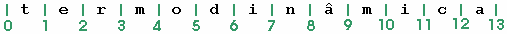
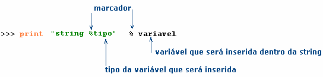
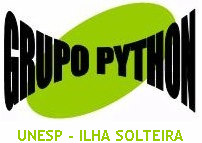

**Grupo Python apresenta:**
**Introdução a Python - Módulo A**


**Josué Labaki**
[**labaki**___turbo___**@gmail.com.**](mailto:labakiturbo@gmail.com)


# Apresentação

Este material foi desenvolvido para apoiar os cursos da série **“Introdução a Python”** ministrados pelo **Grupo Python** para nossos mais diversos tipos de audiência. O guia inteiro é composto por três volumes que correspondem aos módulos dados nos nossos cursos: Módulo A – Bem-vindo a Python!, Módulo B – Python Orientado a Objetos e Módulo C – Tkinter. Todos eles podem ser encontrados na internet, nas páginas do Grupo Python (http://grupopython.cjb.net), na página do autor (http://labaki.tk) e na página da comunidade Python no Brasil (http://www.python-brasil.com.br).

Desenvolvemos este guia pensando também nos autodidatas que não participaram dos nossos cursos e baixaram este material da internet. Se você está nesta situação, pode tirar dúvidas por e-mail.

Lembramos que o nosso objetivo não é ensinar programação, e sim guiar você nos passos básicos em Python. Se sua intenção é aprender a programar, prefira o excelente material do prof. Luciano Ramalho em (http://www.magnet.com.br).

Recomendamos que você acompanhe e implemente os exemplos, tente entender os erros que podem ocorrer e tente resolver as questões que eventualmente aparecem ao longo deste material. Ao final, há alguns exemplos e exercícios de fixação.

Mande suas dúvidas, sugestões, críticas ou comentários por e-mail! Sua opinião sobre o guia é muito importante para nós.

***Josué Labaki***

Grupo Python Departamento de Engenharia Mecânica
UNESP – Campus de Ilha Solteira
[***labakiturbo@gmail.com***](mailto:labakiturbo@gmail.com)

[========]

**Índice**

[TOCM]

[TOC]

# Parte I — Bem-vindo a Python!

# 1. Por que estudar Python?

Python é uma linguagem de programação de altíssimo nível (VHLL - Very High Level Language), criada pelo holandês Guido Van Rossum sob o ideal de “Programação de Computadores para todos”. Este ideal fez com que o desenvolvimento de Python tivesse sempre em mente a liberdade (gratuita, código aberto), disponibilidade (Python roda em Windows, Linux, Mac, Palm, em celulares, e outra infinidade de sistemas) e principalmente a clareza de sintaxe, que hoje é responsável pela alta produtividade só conseguida com Python.

Python é uma linguagem Orientada a Objetos, um paradigma que facilita entre outras coisas o controle sobre a estabilidade dos projetos quando estes começam a tomar grandes proporções. Mas como a Orientação a Objetos ainda é vista como um paradigma para “experts”, Python permite que o usuário programe na forma procedural, se desejar.

Python também é uma linguagem altamente modular. Isso significa que provavelmente alguém já fez todo ou parte do programa que você precisa desenvolver, economizando um tempo precioso do seu trabalho.

Estas e outras vantagens fizeram que grandes empresas e universidades começassem a usar Python com sucesso, como a Philips, Industrial Light and Magic (empresa de George Lucas), que usou Python para controlar efeitos especiais de Star Wars, a NASA, a Aliança Espacial Universal (USA), a Nokia que usa Python em seus celulares, a Disney, os sites Google e Yahoo, entre outros. Veja estes e mais exemplos no site Pythonology (http://www.pythonology.org).

Enfim, uma boa resposta para a pergunta-título deste capítulo pode ser a mostrada nas FAQs do portal Python brasileiro (http://www.pythonbrasil.com.br):

*“Porque Python é uma linguagem simples e elegante. Porque Python é fácil de aprender. Porque Python pode ser usado para resolver uma grande variedade de problemas. Porque Python incentiva você a escrever seus programas da maneira correta, sem que isso se torne um empecilho à produtividade.*

*Python tem uma curva de aprendizado bastante interessante, permitindo que novos programadores, mesmo os que nunca tenham programado antes, sejam imediatamente produtivos escrevendo scripts procedurais. O programador pode rodar o interpretador como um shell, vendo imediatamente o resultado da saída de cada comando e explorando os recursos da linguagem interativamente.*

*Para construir aplicações mais complexas, Python possibilita a fácil migração para a programação orientada a objetos. Um programa pode evoluir naturalmente para esse paradigma à medida que se torna mais complexo. A facilidade inicial do Python não barateia a linguagem, como é comum em linguagens que têm por objetivo expresso serem fáceis de aprender. Python é simples de aprender porque é uma linguagem bem planejada.”*

## 2. Usando o interpretador de Python.

Há várias formas de interpretar seu código em Python. A mais utilizada é a nativa da linguagem, o IDLE. Usuários Windows podem geralmente acessa-lo em **Iniciar > Programas > Python 2.3 > IDLE**. Pelo IDLE você pode executar algumas linhas de código para testar seu programa, ou mesmo rodar um programa completo para saber rapidamente o que está acontecendo com os objetos que você definiu, além de fazer de modo prático a introspecção sobre estes objetos e outros recursos de Python.

Usuários Linux podem usar um interpretador interativo como o IDLE, porém sem    as   cores,   simplesmente   digitando   `python'   na   linha   de   comandos.   Muitas distribuições Linux já trazem Python nativamente.

## 3. Usando Python como uma calculadora.

Observe como é fácil usar o IDLE como uma calculadora. Além de poder ver todos os cálculos anteriores, você também pode usar os resultados deles em cálculos futuros, simplesmente copiando e colando os resultados. Os operadores algébricos usados no interpretador são os mesmos que você já usava em outros programas do seu sistema operacional: +, -, \* e /. Os operadores booleanos são os seguintes:

```Python
>>> a=1

>>> b=2

>>> a == b # == testa se a é igual a b 
False

>>> a != b # != testa se a é diferente de b
True

>>> a <> b # <> também testa se a é diferente de b
True

>>> a > b # > testa se a é maior que b
False

>>> a < b # < testa se a é menor que b 
True

>>> 2*a >= b # testa se o dobro de a é maior ou igual a b 
True
```

O símbolo # é usado em Python para adicionar comentários aos códigos. Tudo o que estiver escrito após esse sinal, é enxergado como comentário e não é executado com o código.

O sinal usado por Python para potências algébricas é \*\*:

```Python
>>> 2**3 # É o mesmo que 23 (dois ao cubo).
8

>>> 2**(3+6) # Dois elevado a 9 
512
````

Há um último operador que retorna o resto da divisão entre dois números:

```Python
>>> 7 % 2 # O resto da divisão entre 7 e 2
1
```

>*✎	Quanto deve ser o resultado de 2\*\*(3+6) % 7?*

## 4. Variáveis — nada a declarar!

Python é uma linguagem dinamicamente tipada. Isso quer dizer que não é necessário tipar as variáveis para usa-las. Por um processo chamado “binding”, atribui- se um objeto a um nome e este nome incorpora o tipo do objeto. Assim, para atribuirmos o valor 2, que é um inteiro, ao nome “valor1”, só precisamos fazer valor1=2, e “valor1” será automaticamente tipado por Python como inteiro.

Para saber qual o tipo de determinado objeto, usamos a função `type(x)`, que retorna o tipo do objeto x:

```Python
>>> valor1=2

>>> valor1
2

>>> type(valor1)
<type 'int'>
```

Perceba que não precisamos “declarar” a variável “valor1” antes de utiliza-la. Se agora você quiser atribuir o valor “Boa tarde!” ao nome “valor1”, pode fazer isso naturalmente. Desta vez, o objeto “valor1” irá incorporar o tipo de “Boa tarde!” (que é uma string – o que talvez você conheça de FORTRAN como “character”):

```Python
>>> valor1='Boa tarde!'

>>> valor1
'Boa tarde!'

>>> type(valor1)
<type 'str'>
```

Os principais tipos de objetos em Python são **inteiros, floats** (números reais, que o computador representa da melhor maneira possível por meio de variações na posição do separador decimal), **strings** (texto), **listas, tuplas** e **dicionários**. Pode-se transformar o tipo original de um objeto para inteiro, float ou string por meio das funções `int`, `float` e `str`, respectivamente, como veremos melhor adiante.

# Parte II — Tipos de Objetos

## 1. Strings

Strings são os objetos que Python oferece para trabalhos com texto. As strings em Python são seqüências, e por isso podemos trabalhar com elas com muito mais eficiência do que em outras linguagens.

```Python	
>>> palavra='termodinâmica'

>>> palavra
'termodin\xe2mica'
```

Este estranho `‘termodin\xe2mica’` é a maneira como Python salvou o valor do objeto “palavra” na memória, já que o computador não conhece caracteres estranhos como acentos. Mas não se preocupe, isso só faz sentido para a máquina. Para o usuário, o valor salvo continua sendo “termodinâmica”. Para ver isso,

```Python	
>>> print palavra
'termodinâmica'
```

Em Python, uma string é uma seqüência de letras, endereçada de tal forma que você possa requisitar um valor qualquer desta seqüência e fazer o que quiser com ele. Como qualquer seqüência em Python, os endereçamentos começam a ser contados do zero. A sintaxe para requisitar o valor atribuído a um endereço X de uma seqüência S é S[X].

```Python	
>>> palavra[2]
'r'

>>> 2*palavra[0]
'tt'
```

Você também pode solicitar um intervalo de uma seqüência. Por exemplo, para solicitar os valores da seqüência “palavra” que estão entre os endereços 9 e 12, fazemos

```Python
>>> palavra[9:12]
'mic'
```

Para entender melhor o que aconteceu aqui, lembre-se de que os endereços em Python se referem aos intervalos entre os itens, e não ao item em si. Isto é, o endereçamento usado no objeto `palavra' é o seguinte:



Assim fica fácil entender porque `palavra[9:12]` retorna os itens **m, i** e **c**! Podemos omitir o endereço da direita, se ele for o último da seqüência:

```
>>> palavra[9:]
'mica'
```

Da mesma forma, os valores entre o primeiro endereço (0) e o 9 são

```Python
>>> palavra[0:9]
'termodin\xe2'
```

Ou, como estamos falando do primeiro endereço,

```Python
>>> palavra[:9]
'termodin\xe2'
```

Perceba a diferença:

```Python
>>> print palavra[:9]
'termodinâ'
```

>✎ *O que obteremos de* `print palavra[:]`*?*

Se você não deseja recolher todos os valores da seqüência contidos no intervalo, pode determinar um incremento:

```Python
>>> palavra[1:8]
'ermodin'

>>> palavra[1:8:2]
'emdn'
```

Assim são retornados os valores de palavra entre os endereços 1 e 8, com incremento 2 (ou seja, os elementos dos endereços 1, 3, 5 e 7). Veja um exemplo com incremento 3:

```Python
>>> palavra[1:8:3]
'eon'
```
Ou seja, os elementos dos endereços 1, 4 e 7. Com incremento negativo, é possível varrer uma seqüência de trás para frente, assim:

```Python
>>> palavra[7:0:-1]
'nidomre'
```

Na última sentença conseguimos capturar os valores do endereço 7 até 0, exceto o próximo zero, vasculhando a seqüência “palavra” de trás para frente.

Como estamos falando do primeiro endereço (zero), podemos omitir esta informação:

```Python
>>> palavra[7::-1]
'nidomret'
```

Igualmente se a varredura começa do último endereço:

```Python
>>> palavra[:4:-2]
'ai\xe2i'
```

(Você já está acostumado a enxergar `\xe2` como “â”, não é?).

Ora, se podemos omitir o último e o primeiro endereços, então fica fácil inverter uma seqüência qualquer:

```Python
>>> palavra[::-1]
'acim\xe2nidomret'
```

Talvez você já tenha pensado como isso deve ser interessante para verificar se uma palavra é um *palíndromo*[^1]...

```Python
>>> palindromo='socorram me subi no onibus em marrocos'

>>> palindromo[::-1]
'socorram me subino on ibus em marrocos'
```

A varredura de strings ao contrário não é tão usada, mas este conceito é importante e será bem mais útil quando aplicado a outros tipos de seqüências que veremos adiante.

Quando executado sobre strings, o operador “+” significa “concatenação”, isto é, adição ao final da string anterior.

[^1]: Palíndromos são palavras ou sentenças que são iguais tanto se lidas de trás para frente quanto no sentido normal.

```Python
>>> palavra=palavra+' aplicada'

>>> print palavra
'termodinâmica aplicada'

>>> palavra[14:]
'aplicada'
```

Outra função que podemos executar sobre qualquer seqüência em Python é `len(x)`, que retorna o tamanho da seqüência x.

```Python
>>> len(palavra) 22
```

## 2. Listas

Um dos tipos de objeto mais úteis em Python é a lista. A lista também é uma seqüência, e sua sintaxe é:

```Python
>>> lista=[1,2,3]

>>> lista
[1, 2, 3]
```

Neste exemplo, temos uma lista de inteiros, mas uma lista pode conter floats, strings, outras listas ou outros objetos quaisquer.

Como qualquer seqüência, a lista segue o mesmo sistema de endereçamento que já vimos em strings:

```Python
>>> lista[0] 
1

>>> lista[0]+lista[2] 
4
```

O operador “+” também representa concatenação em listas. A seguir estamos concatenando ***a lista*** [1,2,3] com a lista [4] (que é uma lista de único elemento). Fazer lista+4 dá erro, porque estamos tentando concatenar ***o inteiro 4*** à lista [1,2,3].

```Python
>>> lista=lista+[4]

>>> lista
[1, 2, 3, 4]

>>> lista+4

Traceback (most recent call last):
File "<pyshell#1>", line 1, in -toplevel- lista+4
TypeError: can only concatenate list (not "int") to list

>>> lista=lista+[0,0,0]

>>> lista
[1, 2, 3, 4, 0, 0, 0]
```

Também podemos solicitar um valor atribuído aos endereços de uma seqüência de trás para frente. O último endereço é também chamado de [-1], o penúltimo de [-2], e assim por diante:

```Python
>>> lista[-1]
0

>>> lista[2:-2]
[3, 4, 0]
```
Aqui, questionamos sobre o tamanho da seqüência “lista”:

```Python
>>> len(lista)
7
```

Uma característica importante das listas é que elas são seqüências mutáveis, ao contrario das strings. Isso quer dizer que podemos alterar o valor atribuído a um determinado endereço de uma lista, mas não podemos fazer isso com strings.

```Python
>>> lista[0] = 'zero'

>>> lista
['zero', 2, 3, 4, 0, 0, 0]

>>> lista[1] = lista[1]+lista[2]

>>> lista
['zero', 5, 3, 4, 0, 0, 0]

>>> lista[2] = lista[0]

>>> lista
['zero', 5, 'zero', 4, 0, 0, 0]
```

Mas com strings...

```Python
>>> a='Boa tarde!'

>>> a[0]='N'

Traceback (most recent call last):
    File "<pyshell#3>", line 1, in -toplevel- a[0]='N'
TypeError: object doesn't support item assignment
```

Não tenha medo destas mensagens de erro! Elas nos ajudam a entender o que está havendo de errado. A linha fundamental é a última, que diz que tipo de erro ocorreu. Neste caso, a mensagem `object doesn't support item assignment` (o objeto não suporta atribuição aos itens), confirma o que dissemos sobre as strings serem imutáveis.

Observe uma aplicação interessante para listas de listas:

```Python
>>> linha1=[1,2,3]

>>> linha2=[0,-1,1]

>>> linha3=[3,3,3]

>>> matriz=[linha1,linha2,linha3]

>>> matriz
[[1, 2, 3], [0, -1, 1], [3, 3, 3]]

>>>matriz[1]
[0, -1, 1]
```

>✎ *Por que* `matriz[1]` *retorna esta lista em vez do inteiro 2?*

Chamando um elemento dessa pseudo-matriz:

```Python
>>> matriz[1][2]
1
```

## 3. Tuplas

Tuplas são objetos como as listas, com a diferença de que tuplas são imutáveis como strings. Uma vez criadas, não podem ser modificadas. A sintaxe de tuplas é:

```Python
>>> tupl=(1,2,3)

>>> tupl
(1, 2, 3)

>>> tupl[0]=0
Traceback (most recent call last):
    File "<pyshell#10>", line 1, in -toplevel-
tupl[0]=0
TypeError: object doesn't support item assignment
```
As tuplas podem também conter quaisquer objetos; inteiros, floats, listas, outras tuplas, etc.

Com as tuplas podemos fazer algo bem comum nos programas em Python, chamado “packing-unpacking”:

```Python
>>> a,b = 0,'Deu certo?'

>>> a 
0

>>> b
'Deu certo?'
```

É   como   se   estivéssemos   dizendo   *“a   e   b   são   iguais   a   0   e   'Deu   certo?´, respectivamente”*.

Mais fantástico ainda, podemos trocar o valor de dois objetos facilmente:

```Python
>>> a,b=b,a

>>> a
'Deu certo?'

>>> b
0
```

## 4. Dicionários

Dicionários também são contêineres, mas não são seqüências porque não são indexados seqüencialmente da forma que strings, listas e tuplas são. Seu sistema de endereçamento é por chaves. Cada chave tem um valor atribuído. Se você quer saber um valor de um dicionário, deve perguntar pelas chaves, não pelos endereços. A sintaxe de dicionários é:

```Python
>>> aurelio={'denomiação':'ilha solteira','população':23000,'renda':1500}

>>> aurelio
{'popula\xe7\xe3o':	23000,	'denomia\xe7\xe3o':	'ilha	solteira', 'renda':1500}
```

Neste exemplo, temos o inteiro 23000 atribuído à chave “população”. Para adicionar novos valores a outras chaves, fazemos

```Python
>>> aurelio['vocação']='turismo'
```

atribuindo assim a string “turismo” à nova chave “vocação”.

```Python
>>> aurelio
{'popula\xe7\xe3o':	23000,	'voca\xe7\xe3o':	'turismo', 'denomia\xe7\xe3o': 'ilha solteira', 'renda': 1500}
```

E para requisitar o valor atribuído a alguma chave,

```Python
>>> aurelio['renda']
1500
```

Dicionários são mutáveis. É fácil alterar o valor contido em uma chave:

```Python
>>> aurelio['renda']=aurelio['renda']+200

>>> aurelio['renda']
1700
```

Podemos verificar quais chaves um dicionário possui ou perguntar se ele contém alguma chave em especial:

```Python
>>> aurelio.keys()
['popula\xe7\xe3o', 'voca\xe7\xe3o', 'denomia\xe7\xe3o', 'renda']

>>> aurelio.has_key('idade')
False

>>> aurelio['idade']=33

>>> aurelio.has_key('idade')
True
```

A sentença `dicionario.items()` retorna uma lista de tuplas contendo o par (chave,valor atribuído):

```Python
>>> aurelio.items()
[('idade', 33), ('popula\xe7\xe3o', 23000), ('voca\xe7\xe3o', 'turismo'), ('denomia\xe7\xe3o', 'ilha solteira'), ('renda', 1700)]
```

# Parte III — Formatando objetos

## 1. Formatação de strings

Podemos formatar alguma string usando a sintaxe



Vejamos alguns exemplos:

```Python
>>> constante=3.14

>>> print 'O valor de pi é %f' %constante
O valor de pi é 3.14
```

Observe a consistência do código com o esquema mostrado acima: O marcador % é colocado no lugar onde será inserido o valor contido no nome “constante”. Como o valor de “constante” é um float (3.14), logo depois do marcador vem a indicação do tipo da variável, “f”.

Novos exemplos com outros tipos de variáveis:

```Python
>>> nome='abacaxi'

>>> caracteristica='amarelo'

>>> print '%s é uma fruta' %nome 
abacaxi é uma fruta

>>> print '%s é %s' %(nome,caracteristica) 
abacaxi é amarelo
```

É assim que inserimos vários valores dentro de uma string: usando uma tupla contendo os valores, na ordem em que aparecerão.

```Python
>>> print '%f %ss também são %ss' %(constante,nome,caracteristica)
3.14 abacaxis também são amarelos
```

Desta vez três valores foram inseridos na string. Eles aparecem na string na mesma ordem em que foram dispostos na tupla. Os tipos acompanham: primeiro “f”, que indica que “constante” é um float, e depois “s” e “s”, que indica que “nome” e “característica” são strings. Observe: no segundo e no terceiro marcadores temos %ss com dois “s”. O primeiro “s” indica o tipo da variável, string, e o terceiro faz parte da string – neste caso está fazendo o plural de “abacaxi” e “amarelo”.

>✎ *O que seria impresso se a string começasse com* `'%fs 	´`*?*

Inserindo .x depois de um marcador de floats dizemos que o valor aparecerá com somente x casas decimais:

```Python
>>> valor = 3.1415926535897931

>>> print 'O valor é %.2f' %valor
O valor é 3.14

>>> print 'O valor é %.3f' %valor
O valor é 3.141

>>> print 'O valor é %f' %valor
O valor é 3.1415926535897931
```

Inserindo y. depois de um marcador qualquer, dizemos que o valor que for inserido no lugar do marcador deverá ter exatamente y caracteres:

```Python
>>> print 'O valor é %8.2f' %valor
O valor é	3.14
```

Somando o inteiro 3, o marcador decimal e as duas casas decimais, todo o float inserido no marcador tem 4 caracteres. Então são adicionados mais 4 espaços em branco antes do valor, para completar os 8 caracteres exigidos.

```Python
>>> print 'O valor é %12.4f' %valor
O valor é	3.1416
```

O inteiro 3, o marcador decimal e quatro casas decimais exigem mais 6 espaços em branco para completar 12 caracteres.

## 2. Recursos de manipulação de listas

```Python
>>> a=[1,2,3]

>>> a
[1, 2, 3]
```

O método append adiciona um valor ao final da lista. *Extend* faz a mesma coisa, mas adiciona uma lista inteira de uma vez.

```Python
>>> a.append('poncan')

>>> a
[1, 2, 3, 'poncan']

>>> a.extend([0,0,-3])

>>> a
[1, 2, 3, 'poncan', 0, 0, -3]
```

Veja a diferença se fizermos *append* de uma lista inteira: a lista será adicionada como um único valor, num único endereço:

```Python
>>> b=[1,2,3]

>>> b.append([1,2,3])

>>> b
[1, 2, 3,[1, 2, 3]]
```

Se em vez de adicionar um valor ao final da lista você quiser inserir num endereço específico, pode usar *insert(endereço,valor)*. Aqui inserimos o valor “start” no endereço zero da lista a.

```Python
>>> a.insert(0,'start')

>>> a
['start',1,2,3,'poncan',0,0,-3]
```

Também há algumas ferramentas para retirar valores de listas. *Remove* é uma delas. Fazendo `remove(0)` sobre a lista *a*, retiramos dela o primeiro valor 0 que apareceu. Depois fazemos o mesmo com “poncan”:

```Python
>>> a.remove(0)

>>> a
['start', 1, 2, 3, 'poncan', 0, -3

>>> a.remove('poncan')

>>> a
['start', 1, 2, 3, 0, -3]
```

Um pouco parecido com *remove* é o método *pop. objeto1.pop(i)* remove de  *objeto1* o valor armazenado no endereço *i*:

```Python
>>> a.pop(0)
'start'

>>> a
[1, 2, 3, 0, -3]
```

Já o método *count* retorna o número de vezes que seu argumento aparece na lista. Para saber o número de vezes (uma vez) que o valor “3” aparece na lista “a”, fazemos:

```Python
>>> a.count(3)
1
```

Já vimos que a varredura ao contrário, por meio de incremento negativo, poderia ser aplicada a qualquer seqüência, não somente a strings. Vamos aproveitar que estamos falando de manipulação de listas para verificar isso. Veja como é fácil obter a Escala de Dureza de Mohs em ordem decrescente de dureza:

```Python
>>>	Mohs=['Talco',	'Gipsita',	'Calcita',	'Fluorita',	'Apatita', 'Ortoclásio', 'Quartzo', 'Topázio', 'Coríndon', 'Diamante']

>>> Mohs[::-1]
['Diamante', 'Cor\xedndon', 'Top\xe1zio', 'Quartzo', 'Ortocl\xe1sio', 'Apatita', 'Fluorita', 'Calcita', 'Gipsita', 'Talco']
```

# Parte IV — Testes, Loops, Varreduras e Erros

## 1. Enquanto...

No código abaixo, o loop “while” testa se o valor de *b* é menor que 5. Se isso for verdade, são executados os procedimentos depois dos dois pontos (:)`. Neste caso, imprimimos o valor de *b* e depois fazemos uma reatribuição: chamamos de “b” o valor anterior atribuído a “b” somado a 1.

```Python
>>> b=0

>>> while b < 5:
        print b
        b=b+1
0
1
2
3
4
```

Perceba o alinhamento de todos os procedimentos que devem ser executados caso *b* seja menor que 5. Este é um conceito muito importante em Python: *indentação*[^2]. Quando fizermos um programa completo, você perceberá que quando não quiser que um loop faça mais nada, basta retornar o alinhamento. Uma característica do IDLE é que ele percebe onde o código deve ser indentado e faz isso automaticamente. Você percebe esta característica quando pressioa ENTER depois de `... b < 5:`. A linha inferior já é automaticamente alinhada debaixo do while. Ao pressionar ENTER novamente depois de `print b` e `b=b+1`, acontece a mesma coisa, isso porque o IDLE espera que você informe mais um procedimento. Pressionando ENTER mais uma vez, o Shell perceberá que não há mais procedimentos a serem adicionados e só então executa o código.

[^2]: Você também pode encontrar na literatura de Python o termo “endentação”, que significa a mesma coisa. No entanto, “indentação” é mais utilizado, embora seja um neologismo (já incorporado por alguns dicionários da língua portuguesa).

Vejamos um loop mais elaborado; desta vez, com string formatada.

```Python
>>> b=1

>>> while b < 5:
    print '%i dólares valem %.2f reais' %(b,b\*2.98)
    b=b+1
1. dólares valem 2.98 reais
2. dólares valem 5.96 reais
3. dólares valem 8.94 reais
4. dólares valem 11.92 reais
```

Se não for incluída a última linha que “incrementa” o valor de b, este valor permanecerá sempre 1, e o loop testará sempre 1 < 5. Como isso é sempre verdade, será impressa eternamente a linha

```Python
1 dólares valem 2.98 reais
```

Se você fizer este teste, basta pressionar CTRL+C (se estiver usando o IDLE) para cancelar o loop.

Ao estudar o script de outras pessoas, pode ser que você encontre algo como `b+=1`, ou `b*=2`. Escrever `b+=n` é o mesmo que `b=b+n`, e escrever `b*=n` é o mesmo que `b=b*n`.

## 2. Entrada de dados

Veja como ler uma entrada do usuário em Python:

```Python
>>> x = raw_input('Informe a fase: ')
Informe a fase: vapor

>>> x
'vapor'
```

A função *raw_input(s)* mostra a string *s* para o usuário e espera que ele forneça algum dado. Então, a função transforma este dado numa string e a retorna para o código.

Para salvar esta entrada e usa-la posteriormente, basta salvar o resultado da função sob um nome qualquer, como fizemos acima com “x”.

Todo mundo, ao menos uma vez na vida, se esquece de que *raw_input()*

retorna *sempre* uma string e perde tempo com isso. Veja um clássico:

```Python
>>> a = raw_input('Tamanho do lado do quadrado: ')
Tamanho do lado do quadrado: 23

>>> print 'O perímetro deste quadrado é', 4*a 
O perímetro deste quadrado é 23232323

>>> type(a)
<type 'str'>
```

Obviamente, o perímetro de um quadrado de lado 23 não é `23232323`. Este é o resultado da multiplicação da string *a* pelo inteiro 4: quatro vezes a string.

Se você quer solicitar um inteiro ou um float do usuário, deve converter o resultado de *raw_input()* para o tipo de objeto desejado usando as funções *int* ou *float*:

```Python
>>> a = raw_input('Tamanho do lado do quadrado: ')
Tamanho do lado do quadrado: 23

>>> a = int(a)

>>> type(a)
<type 'int'>

>>> print 'O perímetro deste quadrado é', 4*a
O perímetro deste quadrado é 92
```

Ou mais diretamente,

```Python
>>> a = int(raw_input('Tamanho do lado do quadrado: '))
Tamanho do lado do quadrado: 23

>>> type(a)
<type 'int'>
```

Analogamente, a função para transformar o tipo de um objeto em float é *float(x)*:

```Python
>>> r = float(raw_input('Raio: '))
Raio: 4.5

>>> type(r)
<type 'float'>
```

## 3. If... Elif... Else...

No pseudocódigo abaixo, testamos se o nome “x” contém a string “líquido”.

**IF**

        Se isto for verdade, o código imprime “Menos de 100º C”.

**ELIF**

        Senão, se “x” não é “líquido”, mas “vapor”, o código imprime “Mais de 100º C”.

**ELSE**

        Caso “x” não seja nem “líquido” nem “vapor”, o resultado é “Menos de 0º C”.

Atenção para a indentação: tudo que desejamos que seja feito caso *x* seja “líquido” está alinhado. O mesmo com *elif* e *else*.

```Python
>>> x = raw_input('Informe a fase: ') 
Informe a fase: vapor

>>> if x == 'líquido':
        print 'Menos de 100º C'       
    elif x == 'vapor' :
        print 'Mais de 100º C'
    else:
        print 'Menos de 0º C'
Mais de 100º C
```

Vamos dar uma melhorada no código da página 30, já que a impressão que fizemos lá deu uma escorregada gramatical (“1 dólares valem...”):

```Python
>>> b = 1

>>> while b < 4:
        if b==1:
            print '%i dólar vale %.2f reais' %(b,b*2.98)
        else:
            print '%i dólares valem %.2f reais' %(b,b*2.98)
        b+=1
1. dólar vale 2.98 reais
1. dólares valem 5.96 reais
1. dólares valem 8.94 reais
```


## 4. For

O *for* de Python é uma ferramenta poderosa e muito característica desta linguagem. Com *for*, podemos “varrer” qualquer seqüência (strings, listas, tuplas) ou dicionário.

```Python
>>> a = ['João', 'Rafael', 'Douglas']

>>> a
['Jo\xe3o', 'Rafael', 'Douglas']

>>> for i in a:
        print i
João
Rafael
Douglas

>>> for x in a:
        print '%s tem %i letras' %(x,len(x))
João tem 4 letras
Rafael tem 6 letras
Douglas tem 7 letras
```

“Para x em a:” - “x” é o nome que demos a cada um dos elementos da seqüência ***a*** neste exemplo. Desta forma, quando falamos em *x* estamos falando do elemento da seqüência a que está sendo estudado no momento. Primeiro, “x” é “João” (o primeiro elemento de a). É por isso que quando imprimimos `x` e `len(x)` imprimimos na  verdade  “João”  e  len(`João').  Simples,  não?  Poderíamos  ter  usado  qualquer  nome no lugar de x.

Uma função importante para usarmos o *for* é a função *range(ni,nf,i)*, que cria uma lista começando do inteiro *ni* até o inteiro *nf-1*, com incremento *i* entre os números:

```Python
>>> range(1,11,2)
[1, 3, 5, 7, 9]
````

Os valores de *ni, nf* e *i* precisam ser números inteiros. Podemos omitir *ni* e *i* se estes valores forem zero e 1, respectivamente:

```Python
>>> range(10)
[0, 1, 2, 3, 4, 5, 6, 7, 8, 9]

>>> range(1,11)
[1, 2, 3, 4, 5, 6, 7, 8, 9, 10]

>>> for elefante in range(5):
        print elefante**2
0
1
4
9
16
```

Assim é o *for* sobre a seqüência *range(5)*. Para você perceber que podemos chamar os elementos da seqüência de *qualquer* coisa, usamos o (bizarro) nome “elefante”.

O tamanho da seqüência *a* (tamanho 3) é um número inteiro, então não há problema em aplicar a função *range* sobre len(*a*). Na verdade, isso é o mesmo que *range(3)*:

```Python
>>> for i in range(len(a)):
        print i
0
1
2
```

E aqui vemos porque é interessante que *range* gere uma lista de números inteiros – o endereçamento das seqüências em Python também é feito por números inteiros:

```Python
>>> for i in range(len(a)):
        print i,a[i]
0. João
1. Rafael
2. Douglas
```

Nesta altura do campeonato você já deve ter percebido que a indentação também é o mecanismo que regula quais ações fazem parte do raio de ação do bloco de *for*.

E assim encadeamos alguns blocos de for:

```Python
>>> matriz = ((1,0,0),(0,1,0),(0,0,1))

>>> for i in range(len(matriz)): # é o mesmo que range(3), ok?
        print '\n'
        for j in range(len(matriz)): # idem
            print matriz[i][j],
1 0 0
0 1 0
0 0 1
```
O código `print '\n'` imprime uma linha em branco. Podemos fazer `print '\n'*k` para imprimir k linhas em branco...

Neste exemplo e no anterior, aparece uma vírgula na linha de `print`. Ela serve para imprimir os termos todos na mesma linha.

Ao aplicar uma varredura de *for* sobre um dicionário, o nome dado aos elementos é interpretado como sendo a chave do dicionário. Melhor mostrar com exemplos:

```Python
>>> orçamento = {'asa':1200,'combustível':200,'motor':4500}

>>> for qualquer in orcamento:
        print qualquer
combustível
asa
motor
```

O nome *qualquer* assume o valor das chaves do dicionário *orcamento*. Sendo assim,

```Python
>>> for teste123 in orcamento:
        print teste123,'custa R$',orcamento[teste123]
combustível custa R$ 200
asa custa R$ 1200
motor custa R$ 4500
```

Por exemplo: já que *teste123* assume o valor das chaves de *orcamento*, seu primeiro valor assumido é 'combustível', a primeira chave deste dicionário. Assim, fazer `orcamento[teste123]` é o mesmo que fazer `orcamento['combustível']`, que retornará o valor associado a esta chave.

>✎ *Você sabe que* `dicionario.items()` *retorna uma lista de tuplas contendo o par (chave, valor). Usando este método, como você faria para imprimir os mesmos resultados do último bloco de for? Lembre-se que o for pode vasculhar <u>qualquer</u> seqüência, inclusive uma lista de tuplas.*

## 5. Break

O comando *break* serve para abortar um bloco de *while* ou *for*.

Você se lembra do operador “%”? Ele retorna o resto da divisão entre dois inteiros. O código abaixo faz uma varredura na lista [2,3,4,5,6,...,n-1] e testa se *n* é divisível por algum destes valores. Se for divisível (ou seja, se n % i == 0), então *n* não é um número primo e a varredura do *for* é cancelada com *break*.

```Python
>>> n = int(raw_input('Número a testar: '))
Número a testar: 28

>>> for i in range(2,n):
        if n % i == 0: print 'Número não primo'; break
Número não primo
```

**Nota:** Se o código a ser executado após um sinal de dois pontos contém poucas linhas, você pode coloca-lo na frente dos dois pontos e separar os procedimentos com ponto e vírgula, como fizemos acima no bloco de *if*. O mesmo sinal de dois pontos aparece em blocos de *for, while* e em definições de funções.

A seguir demonstramos o *break* abortando um bloco de *while*:


```Python
>>> b=10

>>> while 1:
        b=b-1
        print b
        if b<7: break
9
8
7
6
```

Observação: `while 1`: é um loop infinito. Use isto sempre que quiser executar um código indefinidamente. Você pode cancela-lo com um *break*. O código *break* cancela somente o loop a que está submetido, se houver vários loops encadeados:

```Python
loop1:
    blablabla
    blebleble
    loop2:
        bliblibli
        blobloblo
        break2** # Cancela somente o loop2
    break1 # Está alinhado com o loop1, portanto cancela somente loop1.
```

## 6. Tratamento de erros

Nem sempre podemos garantir que as operações que efetuamos sobre uma seqüência ou ao longo de um loop são válidas, principalmente se a seqüência for muito grande ou for fornecida pelo usuário.

Num exemplo simples, vamos recolher uma lista de 3 inteiros fornecidos pelo usuário. O que nos garante que o usuário não tentará inserir uma string na lista?

```Python
>>> lst=[]

>>> for nome in range(3):
        lst.append(int(raw_input('Digite um valor: ')))
Digite um valor: 33
Digite um valor: -4
Digite um valor: a
Traceback (most recent call last):
    File "<pyshell#26>", line 2, in -toplevel- lst.append(int(raw_input('Digite um valor: '))) 
ValueError: invalid literal for int(): a
```

A  função  int(*qualquercoisa*)  não  pôde  transformar  a  string  `a'  em  um  inteiro (claro!). Como evitar então que o usuário forneça uma string ou outro valor qualquer que não possa ser transformado em inteiro? Uma das formas é:

```Python
>>> lst=[]

>>> for i in range(3):
        while 1:
            try:
                lst.append(int(raw_input('Digite um valor: '))) break
            except:
                print 'Digite somente números!!!'
Digite um valor: 2 
Digite um valor: a
Digite somente números!!! 
Digite um valor: r
Digite somente números!!! 
Digite um valor: t
Digite somente números!!! 
Digite um valor: 33 
Digite um valor: e
Digite somente números!!! 
Digite um valor: w
Digite somente números!!! 
Digite um valor: -4.99

>>> lst
[2, 33, -4]
```

A sintaxe de try é:
**try:**

    primeiro tenta fazer isso
    
    e tudo que esteja neste alinhamento (indentação, lembra?)
    
    isso também
    e isso

**except:**

    se qualquer linha dentro do bloco try der erro, então serão executadas estas linhas.

No exemplo anterior, tentamos concatenar à lista *lst* o valor coletado pelo *raw_input*, porém transformado em número inteiro pela função *int()*. Se fornecermos uma string, a função não conseguirá transformá-la em inteiro. Aí entra em ação o bloco “except:”, com o qual imprimimos um aviso para que o usuário informe um número. Como estamos dentro de um bloco de loop infinito, voltamos novamente ao try para recolher um valor do usuário e transforma-lo em inteiro. Se não houver erro desta vez, iremos para a próxima linha, “break”, que cancelará o loop infinito.

Acaba por aí? Não. Ainda estamos fazendo a varredura do for, então iremos para o próximo valor da seqüência *range(3)*, e assim por diante.

A seguir, recolhemos um inteiro do usuário e tentamos calcular seu inverso. Se o usuário digitar um inteiro menor que zero, teremos problemas quando x for igual a zero, já que não há inverso de zero. Assim, simplesmente *tentamos* calcular o inverso de x; se não for possível, informamos que não foi possível.

```Python
>>> x = int(raw_input('Digite um número inteiro: '))
Digite um número inteiro: -3

>>> while x<3:
        try:
            print 1./x
        except:
            print 'Não é possível dividir 1 por %i' %x x=x+1 # Também pode ser x+=1
-0.333333333333
-0.5
-1.0
Não é possível dividir 1 por 0 1.0
0.5
```

>✎ *Podemos evitar este problema se pularmos a divisão 1./x quando x for igual a zero. Como você faria isso?*

Observe também a diferença entre 1/3 e 1./3: no primeiro, temos uma divisão de dois inteiros que gera um resultado inteiro, 0. No segundo, temos uma divisão entre o float 1. (que é o mesmo que 1.0) e o inteiro 3, que gera um resultado float, 0.33333333333333331. Se quisermos o resultado em float, basta que um dos termos da operação seja um float:

```Python
>>> 1+2
3

>>> 1+2.0
3.0

>>> 2*9
18

>>> 2*9.
18.0

>>> 1/3.
0.33333333333333331
```
# Parte V — Nosso primeiro programa completo

Você pode escrever programas em Python até mesmo no bloco de notas; basta que salve o arquivo com extensão *.py* e que não se esqueça da indentação.

Uma das formas mais práticas é no editor do IDLE, que além de mostrar com cores diferentes as diversas partes do código como no IDLE, também indenta o código automaticamente onde necessário e facilita os testes do programa.

Para usar este editor para escrever um programa completo, vá a **File > New window** no IDLE, ou simplesmente CTRL+N.

Assim que você salvar o programa (não se esqueça da extensão *.py*!), as strings vão aparecer em verde, algums códigos como *if, for* e *while* aparecerão em laranja e os  comentários em vermelho.  Acostume-se a salvar o  programa antes mesmo de começar a escrevê-lo, assim você poderá contar desde o início com o auxílio das cores.

Quando quiser testar um programa, vá a *Run > Run Module*, ou simplesmente F5.

Vamos fazer um programa que teste se um número fornecido pelo usuário é perfeito. Dizemos que um número é perfeito se ele for igual à soma dos seus divisores menores que ele próprio. O menor número perfeito, por exemplo, é 6 (6=1+2+3).

```Python
# perfeitos.py
n = int(raw_input('Digite o número a ser testado: '))
teste = 0
for i in range(1,n):
    if n % i == 0:
        teste=teste+i
if teste == n:
    print n, 'é um número perfeito'
else:
    print n, 'não é um número perfeito'
```

Vamos analisar este programa:

<u>*Linha 1:*</u> aqui lemos do usuário o valor de n. Inicialmente o valor é uma string, como qualquer valor recebido pela função *raw_input*, e depois o transformamos em inteiro pela função *int*, para só então atribuir o resultado ao nome *n*.

<u>*Linha 2:*</u> Uma forma de fazer o teste se *n* é perfeito ou não é criar uma variável inicialmente valendo zero e ir somando a ela todos os divisores de *n* que encontrarmos. Ao final, testamos se o valor desta variável é igual a *n*. Se for, *n* é um número perfeito.

<u>*Linha 3:*</u> Ok, então vamos procurar os divisores de *n*. Sabemos que todos os inteiros candidatos a divisores de *n* estão na seqüência range(1,n) (agora você já enxerga essa seqüência como [1,2,3,4,...,n-1], não é?). Então basta fazer uma varredura (isto é, um *for*) sobre *range(1,n)* testando quais destes são divisores de n.

<u>*Linha 4:*</u> Se o termo atual da seqüência é divisor de *n*, então...

<u>*Linha 5:*</u> ...adicione-o a *teste!*

<u>*Linha 6:*</u> Terminamos a busca dos divisores. Perceba que voltamos ao alinhamento do *for*. Segundo a indentação, tudo o que escrevermos agora não será mais executado para cada um dos valores da seqüência. Basta então testar se a soma dos divisores de *n*, agora salvo sob o nome “teste”, corresponde a *n*.

<u>*Linha 7:*</u> Isto é o que será executado caso o valor de “teste” seja igual ao de *n* (ou seja, se n for igual à soma dos seus divisores – um número perfeito, portanto).

<u>*Linha 8:*</u> Senão, (se “teste” não é igual à soma dos divisores de *n*)... 

<u>*Linha 9:*</u> ...*n* não é um número perfeito.

Executando o programa (pressionar F5 é o jeito mais rápido),

```Python
>>>
Digite o número a ser testado: 6
6. é um número perfeito
```

Voltando à janela onde está o programa e pressionando F5 novamente para testar outro valor,

```Python
>>>
Digite o número a ser testado: 7
6. não é um número perfeito
```

Chato pressionar F5 toda hora, não é? Encapsulando todo este código num loop infinito (`while 1:`, por exemplo), você pode executar isso infinitas vezes:

```Python
while 1:
    o código aqui (indentado corretamente)
```

>✎ *Encapsulando o programa todo num loop infinito, o problema passa a ser outro: é preciso pressionar CTRL+C para cancelar o teste. Como você faria para o programa parar os testes de forma mais elegante, de preferência perguntando ao usuário se ele deseja testar mais algum número?*

>✎ *Como bom curioso, você não está se perguntando que outros números são perfeitos além do 6? Agora você tem o poder em suas mãos (Python)! Tente fazer um programa para descobrir quais são os 3 números perfeitos que existem até 10000 além do 6.*

Você também pode executar seu programa clicando em seu ícone, na pasta em que o programa foi salvo. Desta forma, o programa não será executado no IDLE, e sim num ambiente mais veloz. Um detalhe quando se usa esta forma de execução é que a janela que é aberta enquanto o programa roda se fecha imediatamente após o término do programa, não permitindo ao usuário estudar os dados de saída. Uma forma simples de mantê-la aberta até que o usuário deseje é incluir uma linha

```Python
raw_input(‘Pressione ENTER’)
```

ao final do programa, já que `raw_input` espera por uma entrada do usuário. Se o usuário vai pressionar ENTER ou outra tecla qualquer, não importa, já que esta informação não será usada para nada.

Para editar o programa no IDLE, clique sobre o ícone com o botão da direita e escolher “Editar com IDLE”.

**Observação:** se você estiver usando Linux (meus parabéns!), é necessário adicionar uma linha no começo do seu programa especificando a localização do Python:

```Python
#!/usr/bin/python
```

A   linha   acima   informa   ao   sistema   para   procurar   pelo   programa `/usr/bin/python` e transmitir o resto do arquivo a este programa. Note que o diretório onde se encontra o Python varia de sistema para sistema. O diretório acima é válido para o Conectiva Linux 10.0.

Agradecimentos ao parceiro Carlos Mota Castro, fervoroso defensor de Linux, por esta observação. O Carlos adaptou esta nota de uma apostila de Perl que ele estava aprendendo. <U>*Estava*</U> aprendendo, porque agora ele já ouviu falar de Python...

# Parte VI — Funções e Módulos

## 1. Definindo funções

Assim como os módulos, as funções podem ser muito úteis para executar um bloco de código que será repetido várias vezes, economizando linhas de código. Quando ocorrer um erro nestes procedimentos que serão muito repetidos, basta alterar a função, sem a necessidade de vasculhar todo o programa corrigindo todas as repetições. A sintaxe para definir funções em Python é:

```Python
def nome_da_funcao(parametro1,parametro2,...):
    operacoes sobre os n parametros
```

Imagine que seja necessário calcular o quadrado de um número várias vezes ao longo do programa. Podemos criar uma função para isso do seguinte modo:

```Python
>>> def f(x):
        return x**2

>>> f(3)
9
```

Outra função, desta vez com dois argumentos:

```Python
>>> def elevar(x,y):
        return x**y

>>> elevar(9,9)
387420489
```

Há meios de definir funções que trabalham com um número indefinido de argumentos, de acordo com a sintaxe:

```Python
def nome_da_função(*nome1):
        procedimentos...
```

Esta sintaxe toma todos os elementos inseridos dentro dos parênteses como sendo uma tupla. Observe:

```Python
>>> def impressora(*argumentos):
        return argumentos

>>> impressora(1,2,3)
(1, 2, 3)
```

Assim fica claro como os argumentos fornecidos pelo usuário – 1, 2 e 3 – são admitidos como argumentos da função em forma de tupla. Considerando isso, podemos trabalhar estes argumentos facilmente, já que temos um certo traquejo em manipular tuplas:

```Python
>>> def somatoria(*argumentos):
        soma = 0
        for i in argumentos:
            soma+=i # Você já sabe: soma+=i é o mesmo que soma=soma+i
            return soma

>>> somatoria(1,2,3,4,5)
15
```

A função recém-definida assume quantos argumentos o usuário desejar. Apesar disso, alguns argumentos podem não ser admitidos pelos procedimentos definidos dentro da função, por exemplo,

```Python
>>> somatoria(1,2,3,4,'teste')
Traceback (most recent call last):
    File "<pyshell#27>", line 1, in -toplevel- somatoria(1,2,3,4,'teste')   
        File "<pyshell#25>", line 4, in somatoria soma+=i
TypeError: unsupported operand type(s) for +=: 'int' and 'str'
```

Isso porque a função somatoria não é capaz de somar inteiros com a string 'teste'.

>✎ *Usando o que aprendemos sobre tratamentos de erros, como você reescreveria a função somatoria para informar ao usuário que um de seus argumentos foi inválido? Evolua este código para mostrar também qual dos argumentos é inválido (o primeiro, o segundo, etc.).*

As funções não precisam ser limitadas a operações algébricas:

```Python
>>> def testa_primo(n):
        teste=1
        for i in range(2,n):
            if n % i == 0:
                teste=teste+1
        if teste != 1:
            print 'Número não primo'
        else:
            print 'Número primo'

>>> testa_primo(28)
Número não primo

>>> testa_primo(7)
Número primo
```

Não há problema algum em usar o resultado da função para outra operação. Assim, podemos usar diretamente f(3) – que é igual a 9 – como parâmetro da função *elevar*:

```Python
>>> elevar(f(3),4)
6561
```

Você pode colocar um default para um argumento, para ser admitido pela função caso o usuário da função não forneça este argumento.

```Python
>>> def user(nome='Labaki'):
        print 'Meu nome é',nome

>>> user('Mamute')
Meu nome é Mamute

>>> user()
Meu nome é Labaki
```

Outro exemplo:

```Python
>>> cadastro=[]

>>> def add(x,y='Casado',z=3):
        cadastro.append([x,y,z])

>>> add('Mozart','Solteiro','sem filhos')

>>> cadastro
[['Mozart', 'Solteiro', 'sem filhos']]

>>> add('Beethoven')

>>> cadastro
[['Mozart', 'Solteiro', 'sem filhos'], ['Beethoven', 'Casado', 3]]

>>> add('Bach','Viúvo')

>>> cadastro
[['Mozart', 'Solteiro', 'sem filhos'], ['Beethoven', 'Casado', 3], ['Bach', 'Vi\xfavo', 3]]
```

Se você quer usar o default de y mas não o de z, pode indicar isso assim:

```Python
>>> add('Salieri',z=4)

>>> cadastro
[['Mozart', 'Solteiro', 'sem filhos'], ['Beethoven', 'Casado', 3],

['Bach', 'Vi\xfavo', 3], ['Salieri', 'Casado', 4]]
```

Para facilitar a vida de quem usará seus programas, e talvez a sua própria quando tiver que fazer manutenção nos seus programas, pode-se inserir pequenas informações sobre as funções dentro delas. São as chamadas “doc strings”.

```Python
>>> def f(x):
        """Esta função retorna o quadrado de um número"""
        return x**2

>>> f(2)
4

>>> print f.__doc__
Esta função retorna o quadrado de um número
```

## 2. Funções sobre Seqüências

Se você possui uma seqüência e precisa aplicar uma função sobre cada um dos seus termos, há meios bem práticos de fazer isso. Um deles é a função *map*, que aplica uma função sobre uma seqüência e retorna uma lista contendo os resultados. Na sintaxe mostrada abaixo, cada um dos elementos de *seqüência1* é tomado como argumento de *função1*:

```Python
map(função1, seqüência1)

>>> def quadrado(termo):
        return termo**2

>>> elementos=[1,2,3,4,5,6]

>>> map(quadrado,elementos)
[1, 4, 9, 16, 25, 36]
```

Obtemos assim a lista com os quadrados dos termos da lista *elementos*. Isso também funciona com operações não algébricas:

```Python
>>> orcamento={'asa':1200, 'combustível':200, 'motor':4500}

>>> def cambio(componente):
        print componente[0],'R$ ',componente[1]
        print componente[0],'US$ ',componente[1]/3.
        print '\n'

>>> map(cambio,orcamento.items())
combustível R$ 200
combustível US$ 66.6666666667

asa R$ 1200
asa US$ 400.0

motor R$ 4500
motor US$ 1500.0

[None, None, None]
```

Breve explicação sobre o código acima: já vimos que `orcamento.items()` é uma lista de tuplas,

```Python
>>> orcamento.items()
[('combust\xedvel', 200), ('asa', 1200), ('motor', 4500)]
```

assim podemos aplicar a função *map* sobre esta seqüência como sobre qualquer outra. Neste caso, a função *map* tomará a primeira tupla, `('combust\xedvel', 200)` como o argumento *componente* da função *cambio*. Ao fazer `componente[0]`, estamos fazendo `('combust\xedvel', 200)[0]`, que correspondente a 'combustível', enquanto `componente[1]` correspondente a '200'. E assim com todos os termos da seqüência.

Aquele estranho `[None, None, None]` ao final da execução é um resultado importantíssimo e vai alimentar uma discussão posterior sobre *return* versus *side effects*.

Outra interação função-seqüência interessante é *reduce*, que toma uma função e uma seqüência e retorna um único valor, com a sintaxe *reduce(função, seqüência)*:


```Python
>>> def soma(alfa,beta):
        return alfa+beta

>>> reduce(soma,[1,2,3])
6
```

Primeiro, *reduce* assume o primeiro item da lista [1,2,3] (o inteiro 1) como sendo o argumento *alfa* da função *soma*, e o segundo item (o inteiro 2) como sendo o argumento *beta*. Resultado: 1+2 = 3. Este inteiro 3 é tomado então como o argumento *alfa* e o próximo item da lista (o inteiro 3) é assumido como *beta*. Resultado: 3+3 = 6. O processo é repetido até o final da seqüência.

>✎ *Este recurso parece ideal para o nosso algoritmo anterior de verificar se um número é perfeito, não parece? Como você reescreveria aquele algoritmo usando reduce?*

Mais um exemplo:

```Python
>>> def eleva(base,expoente):
        return base**expoente

>>> elementos=[4,3,2,1]

>>> reduce(eleva,elementos)
4096
```

Da mesma forma, o que acontece aqui é:

||base|expoente|base\*\*expoente|Resultado|
| :-: | :-: | :-: | :-: | :-: |
|Primeiro Passo|4|3|4\*\*3|64|
|Segundo Passo|64|2|64\*\*2|4096|
|Terceiro Passo|4096|1|4096\*\*1|4096|
|Resultado|||| 4096|

Um recurso de trabalho com funções e seqüências muito característico de Python são as *list comprehensions*, que permitem gerar uma lista a partir de funções simples.

```Python
>>> [x**2 for x in [1,2,3]]
[1, 4, 9]
```

Com última sentença dizemos: retorne-me uma lista contendo os quadrados de *x*, sendo *x* cada um dos elementos da seqüência [1,2,3]. E abaixo, conseguimos uma lista de tuplas contendo o par (valor, quadrado do valor), sendo valor cada um dos itens da seqüência [0, 1, 2, 3, 4].

```Python
>>> [(x,x**2) for x in range(5)]
[(0, 0), (1, 1), (2, 4), (3, 9), (4, 16)]
```

A seguir, usamos list comprehensions para operações não algébricas. Esta é também uma boa ocasião para você se convencer de que formatação de strings não serve só quando a string está após um *print*, mas sim em qualquer lugar onde haja uma string.

```Python
>>> ['%ss' %nome for nome in ['Proclise','Jilo','Bozo','Cauchy']] 
['Proclises', 'Jilos', 'Bozos', 'Cauchys']
```

Também é simples usar list comprehensions com seqüência de seqüências.
Com uma tupla de tuplas fica assim:

```Python
>>> valores=((4,5,6),(7,8,9),(5,6,-7))

>>> [a+b+c for (a,b,c) in valores]
[15, 24, 4]
```

Aqui, 15 = 4+5+6, 24 = 7+8+9 e 4 = 5+6-7.

Os resultados das *list comprehensions* podem ser usados naturalmente como qualquer lista, inclusive em blocos de *for* e funções como *reduce* e *map*.

```Python
>>> def metade(t):
        return t/2.

>>> map(metade,[rrr*2 for rrr in [66,77,88,99]])
[66.0, 77.0, 88.0, 99.0]
```

Neste exemplo, `[rrr\*2 for rrr in [66,77,88,99]]` gera a lista [132, 154, 176, 198]. Então a função *map* aplica a função *metade* que divide cada um destes termos por 2, voltando à lista original. Mais fácil ainda, você pode usar as *list comprehensions* para fazer mapeamentos, aplicando a função *metade* diretamente sobre os termos *rrr*:

```Python
>>> [metade(rrr*2) for rrr in [66,77,88,99]]
[66.0, 77.0, 88.0, 99.0]
```

## 3. Return versus Side Effects

```Python
[None, None, None]
```

O que será que é isso???

Lá da Matemática Elementar já sabemos que uma função é uma relação que associa a cada elemento de um conjunto A um único elemento de outro conjunto B. Pode haver funções que não têm correspondentes em B para alguns valores de A (um caso clássico, f(x) = 1/x não existe quando x=0), mas podemos garantir que uma função nunca retornará dois valores em B para um único valor em A.

Os mesmos princípios se aplicam às funções em Python. Nossas funções podem tomar um ou mais argumentos e sempre retornarão um – e somente um – resultado, definido pelo código *return*:

```Python
def nome_da_função(argumento_1,argumento_2,...,argumento_n):
    return parâmetro
```

Nesta função genérica, o (único) valor de retorno é *parâmetro*. Observe uma função já conhecida, em que o parâmetro de retorno é o quadrado do argumento de entrada:

```Python
>>> def f(x):
    return x**2

>>> f(3)
9
```

Qualquer outra coisa que a função imprima, concatene, modifique, etc., não é considerada valor de retorno, e sim *side effect* (efeito colateral).

```Python
>>> lista=[]

>>> def f(x):
    lista.append(x)
    print x
    return x**2

>>> f(2)
2
4

>>> lista
[2]
```

Aqui, o 2 impresso e o 2 concatenado à lista são *side effects* e o 4 impresso é o valor de retorno da função. Isso pode ser percebido facilmente quando o resultado de execução da função é usado para outra finalidade, como no exemplo abaixo:

```Python
>>> 2*f(9)
9
162

>>> lista [2, 9]
```

Multiplicar f(9) por um número só terá efeito sobre seu valor de retorno, 81 = 9\*\*2. Somente o valor de retorno dessa função *f* (o 89) é multiplicado por 2, resultando em 162. Os *side effects* não sofrem alteração alguma – o argumento 9 foi impresso e concatenado à lista.

Quando não é definido nenhum valor de retorno com o comando *return*, a função entende que seu valor de retorno é *None*. Neste caso, qualquer operação sobre os resultados de execução da função gera erros:

```Python
>>> def h(t):
        print t**3

>>> h(7)
343

>>> 2*h(7)
343

Traceback (most recent call last):
    File "<pyshell#38>", line 1, in -toplevel- 2\*h(7)
TypeError: unsupported operand type(s) for *: 'int' and 'NoneType'
```

O erro era previsível, já que não faz sentido multiplicar *None* por 2.

O famigerado `[None, None, None]`, portanto, se refere aos valores de retorno da função *cambio* da página 58, quando aplicados sobre os argumentos da lista *orcamento.items().*

Nas páginas de exercícios há um teste bem interessante e famoso que ilustra muito bem a diferença entre *returns* e side *effects*. Tente prever o resultado da execução do script sem executá-lo.

>✎ *Quaisquer resultados obtidos com as funções builtins de Python, como map, reduce, raw_input, type, também são valores de retorno e/ou side effects. A função map, por exemplo, gera uma lista a partir da execução de uma função sobre uma seqüência. Sugira uma forma simples de descobrir se a lista gerada por map é um valor de retorno ou um side effect desta função.*

## 4. Módulos

Em algumas ocasiões, você poderá precisar das mesmas funções várias vezes em programas diferentes. Quando isso ocorrer, pode usar módulos, que são como “pacotes” de funções.

Vamos criar nosso primeiro módulo, contendo quatro funções: uma que calcula a circunferência de um círculo, outra que calcula a área do círculo, outra que eleva uma base qualquer a uma potência qualquer e uma função inútil.

O procedimento para criar um módulo é o mesmo para escrever um programa completo: abra uma nova janela. No IDLE, vá a **File > New Window**, ou simplesente CTRL+N. Digite as funções neste programa e salve-o com a extensão *.py* – é necessário que seja num diretório que esteja no *path*[^3]. Para saber quais diretórios do seu computador estão no path, você pode usar este pequeno script (que você entenderá melhor como funciona ao final deste capítulo):

[^3]: Sem muito rigor, o *path* é uma relação de todos os diretórios em que Python vai procurar pelo seu módulo. Se você quiser, pode salvar seu módulo na pasta Python23, em C:, que certamente estará no path. No entanto, evite salvar *todos* os seus módulo lá, para não sobrecarregar este diretório.

```Python
>>> import sys
>>> for i in sys.path: print i
```

Chamaremos nosso módulo atual de *circulos.py*.

```Python
#circulos.py

def perimetro(r):
    """Esta funcao calcula o perimetro de um circulo de raio r."""
    try:
        r=float(r) return 2*3.14*r
    except:
        print 'O argumento da funcao deve ser um numero.'

def area(r):
    """Esta funcao calcula a area de um circulo de raio r."""
    try:
        r=float(r)
        return 3.14*(r**2)
    except:
        print 'O argumento da funcao deve ser um numero.'

def potencia(x,y=2):
    """potencia(x,y) eleva x a potencia y. Default: y=2."""
    try:
        return x**y
    except:
        print 'Argumentos invalidos'

def nada():
    """Esta funcao nao faz nada.
    So serve para mostrar doc strings."""
    pass
```

**Não** pressione F5 para executar este programa! Pode fechar a janela, inclusive. Abra uma nova janela de IDLE (você pode fazer isso pela janela do programa, em **Run > Python Shell**) e tente usar alguma das funções recém criadas.

```Python
>>> potencia(2,3)
Traceback (most recent call last):
    File "<pyshell#9>", line 1, in -toplevel- potencia(2,3)
NameError: name 'potencia' is not defined
```

A função ainda não está definida no escopo deste programa. Uma das formas de usar as funções é importando o módulo:

```Python
>>> import circulos
```

Se você salvou o módulo na pasta C:/Python23 ou em qualquer outra que esteja no path, a importação do módulo deve dar certo. Uma vez importado o módulo, a sintaxe para utiliza-lo é

*modulo.função(parâmetros)*

Agora sim, podemos utilizar a função *potencia*:

```Python
>>> circulos.potencia(2,3)
8

>>> print circulos.potencia.__doc__
potencia(x,y) eleva x a potencia y.
Default: y=2.

>>> print circulos.nada.__doc__
Esta funcao nao faz nada.
So serve para mostrar doc strings.

>>> circulos.perimetro(33.) 207.
24000000000001

>>> circulos.outrafuncao(1,2)
Traceback (most recent call last):
    File "<pyshell#6>", line 1, in -toplevel- circulos.outrafuncao(1,2)
AttributeError: 'module' object has no attribute 'outrafuncao'
```

Este erro ocorre porque não existe a função *outrafuncao* no módulo *circulos*.

Outra forma de usar as funções é importa-las diretamente, em vez de importar o módulo que as contém. Para evitar problemas, abra outra janela do IDLE. A forma agora é:

```Python
from módulo import função1, função2, ...
```

Se usarei as funções *potencia* e *nada*,

```Python
>>> from circulos import potencia,nada

>>> potencia(2,3)
8

>>> potencia(3)
9

>>> print potencia.__doc__
potencia(x,y) eleva x a potencia y. 
Default: y=2.

>>> nada()
```

Usando a sintaxe

```Python
from modulo import *
```

são importadas todas as funções do módulo.

```Python
>>> from circulos import *

>>> perimetro(4.2)
26.376000000000001

>>> area(-1.)
3.1400000000000001

>>> print area.__doc__
Esta funcao calcula a area de um circulo de raio r.
```

Uma das preciosidades de Python é que esta linguagem possui milhares de módulos para resolver muitos dos seus problemas. Por isso em Python deve-se ter cuidado para não “reinventar a roda”, isto é, talvez você perca um tempo precioso para desenvolver um programa que faça algo quando já existe um módulo pronto que o faça. Antes de começar a escrever seu script, se você suspeitar que alguém talvez já tenha feito algo parecido, procure no Google – ele é seu amigo! (*Nosso* amigo: o Google é escrito em Python!).

Nas funções *perimetro* e *area* acima, usamos o valor aproximado de pi, 3.14.

O valor preciso de pi é uma das coisas que pode ser obtido do módulo nativo ***math***:

```Python
>>> import math

>>> pi
Traceback (most recent call last):
    File "<pyshell#1>", line 1, in -toplevel- pi
NameError: name 'pi' is not defined

>>> math.pi
3.1415926535897931

>>> from math import pi

>>> pi
3.1415926535897931
```

Assim como as principais relações matemáticas:

```Python
>>> from math import sin,cos

>>> sin(pi)
1.2246063538223773e-016

>>> cos(pi)
-1.0

>>> sin(cos(sin(pi)))
0.8414709848078965

>>> from math import *

>>> log(1)	# o “log” usado aqui é o logaritmo neperiano (base **e**)
0.0

>>> log10(2)	# log10, por sua vez, é o logaritmo de base 10. 0.
3010299956639812

>>> pow(2,4)
16.0

>>> print pow.__doc__
pow(x,y)

Return x**y (x to the power of y).
```

Também há um similar *cmath* muito eficiente para trabalhar com números complexos, e diversos outros. No endereço <http://docs.python.org/modindex.html> você pode consultar a relação e descrição de todos os módulos que já estão disponíveis quando você instala o interpretador de Python. No início deste capítulo usamos outro deles, o módulo *sys*. Este módulo contém uma função *path* que retorna uma lista contendo todos os diretórios do seu computador que estão no path. Dê uma olhada novamente naquele pequeno código da página 66 que agora você entenderá melhor.

## 5. Um pouco de teoria: Escopo

Em algumas ocasiões, um programador pode, acidentalmente ou de propósito, nomear seus objetos com nomes que já estão sendo usados ao longo do programa. Neste caso, qual é a hierarquia reconhecida pelo interpretador? Qual é a importância do cuidado na definição de nomes?

A hierarquia reconhecida pelo interpretador é (em ordem decrescente): **locais — globais — builtins**, sendo locais os nomes definidos dentro de funções, classes e módulos, *globais* os nomes definidos ao longo do programa e *builtins* os nomes já utilizados nativamente por Python.

Veja um caso simples:

```Python
>>> x=1000

>>> def f(x):
    return x**2

>>> x
1000

>>> f(9)
81

>>> x
1000
```

O nome *x* definido na primeira linha do script é global, enquanto o *x* dentro da função *f* é local. Quando executamos *f(argumento1)*, o interpretador tem que lidar com dois valores associados ao mesmo nome *x: argumento1* e *1000*. Qual deles o interpretador escolherá vai depender da hierarquia. Neste caso, o nome x = *argumento1* é local (definido dentro da função), enquanto x = 1000 é global (definido ao longo do script). A hierarquia faz com que o interpretador reconheça *argumento1* como sendo o valor associado ao nome *x* naquele momento e faz finalmente *(argumento1)\*\*2*. Depois disso, o usuário consulta o valor de *x*. Agora só existe o valor global de *x* definido, que vale 1000.

Outro exemplo, agora com nomes *builtins*:

```Python
>>> type(12)
<type 'int'>

>>> def type(m):
print 'Digitastes',m

>>> type(12) 
Digitastes 12

>>> def tipologia(x):
        def type(y):
            print 'Você digitou',y
        type(x)

>>> tipologia(12)
Você digitou 12

>>> type(12)
Digitastes 12
```


Aqui, tínhamos o objeto *<u>builtin</u> type*, que nos retorna o tipo do objeto fornecido como argumento. Definimos <u>globalmente</u> uma nova função *type* que executa um procedimento diferente e, dentro da função *tipologia* (quer dizer, <u>localmente</u>), este nome foi redefinido para um terceiro procedimento, que só vale no escopo da função. Ao usar a função *tipologia*, sua função interna *type* não se torna global. Globalmente, continua valendo a *type* que imprime “Digitastes tal”, em sobreposição à *builtin* de mesmo nome.

Sempre que aparece algum nome no programa que não foi definido localmente, o interpretador procura por ele entre os nomes globais. Se ele também não foi definido globalmente, o último local de busca é entre os nomes builtins. Só então é informado o erro de que o nome não foi definido. Veja o exemplo. Dentro da função, usamos um nome global e um builtin, além dos nomes locais (argumentos da função). Na segunda função, usamos o nome não definido t, que gera um erro. Observe a última linha da mensagem de erro - “O nome global 't' não é definido”.

```Python
>>> from math import pi

>>> r=2.3

>>> def area(incremento):
        return pi*(r+incremento)**2

>>> area(.7)
28.274333882308138

>>> def volume(inc):
        return (pi*(t+inc)**3)/3.

>>> volume(.4)
Traceback (most recent call last):
    File "<pyshell#108>", line 1, in -toplevel- volume(.4)
        File "<pyshell#107>", line 2, in volume return (pi*(t+inc)**3)/3.
NameError: global name 't' is not defined
```
Por outro lado – como já vimos, não é possível contar globalmente com os nomes definidos localmente. A seguir, define-se um nome *t* dentro do escopo da função *volume*, que só existe localmente à função. Tentar acessar este nome globalmente também dá erro.

```Python
>>> def volume(inc):
        t=0.6
        return (pi*(t+inc)**3)/3.

>>> volume(.4)
1.0471975511965976

>>> t
Traceback (most recent call last):
    File "<pyshell#112>", line 1, in -toplevel- t
NameError: name 't' is not defined
```

Se for necessário tomar um nome local de uma função para uso no restante do script, é possível torná-lo global assim:

```Python
>>> def volume(inc):
        global t t=0.6
        return (pi*(t+inc)**3)/3.

>>> volume(0.4)
1.0471975511965976

>>> t
0.59999999999999998
```

Deve-se usar este recurso com cautela e somente quando indispensável. Transformar nomes locais em globais pode gerar conflitos com os nomes globais e builtins já existentes. Pelos mesmos motivos, evite usar a sintaxe

```Python
from modulo import *
```

para usar funções de qualquer módulo, principalmente os que não foram criados por você. Os módulos podem conter dezenas de funções e valores, inclusive com nomes que você desconhece, o que pode gerar conflitos com os nomes que você definiu ao longo do script. Imagine o caso hipotético do sujeito que resolve definir uma função *sin* (uma abreviação inocente de “sintaxe”), e ao final do programa resolve calcular um cosseno qualquer, importando para isso todo o pacote *math*.

```Python
>>> def sin(pronome):
        print 'Dê-%s ajuda!' %pronome

>>> sin('lhe')
Dê-lhe ajuda!

>>> from math import *

>>> cos(pi)
-1.0

>>> sin('me')
Traceback (most recent call last):
    File "<pyshell#131>", line 1, in -toplevel- sin('me')
TypeError: a float is required
```

E assim se perde uma função definida com tanto carinho... A perda da função *sin* poderia ser evitada se o usuário tivesse importado o módulo math e usado a sintaxe *math.cos(math.pi)* para calcular o cosseno de pi.

# Parte VII — Alguns truques...

## 1. Manipulação de arquivos

Sempre que o resultado da execução de um programa for importante demais para ser simplesmente impressa na tela, é interessante salvá-lo num arquivo. A função usada para abrir um arquivo é open. A sintaxe utilizada por esta função é __`open(`__*`‘endereço/nome_do_arquivo.extensão’,’modo_de_abertura’`*__`)`__. Os modos de abertura são os seguintes:

**r** – abrir o arquivo somente para ler (“r” de *read*, ler);

**a** – abrir o arquivo somente para escrever (“a” de *append*, porque o texto é concatenado ao final do arquivo);

**w** – abre o arquivo somente para escrever (“w” de *write*, escrever - sem concatenar). Cuidado que este modo apaga o conteúdo anterior do arquivo! Por isso ele serve também para criar um arquivo novo.

Para facilitar o trabalho com o arquivo, salvamos o resultado da função *open* sob um nome. Assim, ao trabalhar com o nome, estamos trabalhando com o resultado da função. Por exemplo, o método *close* serve para fechar o arquivo. Assim, `abertura.close()` é o mesmo que `open('c:/tabela.txt','w').close()`, se tivermos feito

```Python	
>>> abertura=open('c:/tabela.txt','w')
```

**Cuidado!** Antes de executar a linha acima, vá até sua pasta C: e verifique se você já não tem um arquivo chamado tabela.txt. Se tiver, seu conteúdo será apagado pelo código anterior! Copie o arquivo para outra pasta.

Vá à sua pasta C e veja: acabou de ser criado um arquivo tabela.txt. Para fechar o arquivo, usa-se o método *close*:

```Python
>>> abertura.close()
```

Não se esqueça: sempre que acabar de trabalhar com um arquivo, você precisa fecha-lo antes de fazer qualquer coisa com ele. Se não for fechado, o arquivo continua como um objeto sendo usado por Python. Se você tentar deletar o arquivo tabela.txt antes de executar `abertura.close()`, seu sistema operacional dará uma mensagem de violação de compartilhamento por causa disso. Se simplesmente abri-lo sem ter executado *close*, não conseguirá ver o que acabou de ser escrito nele.

Vamos digitar novamente a tabela de dólares, porém desta vez num arquivo que poderemos usar várias vezes, imprimir, mandar por e-mail, etc.

```Python
>>> abrindo=open('c:/tabela.txt','a')
```	

Podemos abrir no modo *append* porque este arquivo agora já existe, não é?

Para escrever no arquivo aberto, usamos o método *write(s)*, sendo s uma string:

```Python
>>> abrindo.write('Tabela de dólares\n')
```

Usando os conceitos de formatação de strings fica assim:

```Python
>>> abrindo.write('%s\n' %'Tabela de dólares')
```

Isto serve ainda para reforçar o que já vimos antes, que a formatação de strings não se aplica somente após um `print`, mas também em qualquer lugar onde houver uma string. Dentro das funções *write* e *raw_input*, por exemplo. Ah! É bom lembrar que a string `'\n'` corresponde a pular uma linha.

>✎ *Estranho... Abrindo o arquivo tabela.txt que está em C:, não consigo ver o texto que acabei de escrever nele, “Tabela de dólares”. Você sabe o que aconteceu? A resposta está na página anterior.*

```Python	
>>> abrindo.close()

>>> vamosdigitar=open('c:/tabela.txt','a')

>>> for i in range(100):
        vamosdigitar.write('%i dólares valem %f reais\n' %(i,i\*2.98))

>>> vamosdigitar.close()
```

Dê uma olhada do conteúdo do arquivo `tabela.txt' em C:...
Usamos agora o modo **r** para ler o conteúdo de um arquivo.

```Python
>>> abertura=open('c:/tabela.txt','r')
```

Há dois métodos para ler o conteúdo do arquivo recém-aberto: *readline* lê o conteúdo do arquivo linha por linha. Quanto acabar o arquivo, retorna ``''``, uma string vazia.

```Python
>>> abertura.readline()
'Tabela de d\xf3lares0'

>>> abertura.readline()
'0 dólares valem 0.00 reais'

>>> abertura.close()
```

O outro método, *readlines*, retorna todo o conteúdo do arquivo em uma lista; cada termo da lista é uma linha do arquivo. Readlines é interessante porque gera uma lista, com a qual já sabemos trabalhar muito bem.

```Python
>>> w=open('c:/tabela.txt','r')

>>> lst=w.readlines()

>>> print lst[0]
Tabela de dólares


>>> print lst[-1]
44 dólares valem 131.1
```

Você pode escrever em diversos formatos além de *txt*, mas alguns podem apresentar formatação insatisfatória. Se você escrever num arquivo do MsExcel, por exemplo, todo o texto será empacotado na primeira célula do arquivo.

Entre os formatos interessantes para se escrever, está o *.bat*, em que você pode escrever um código de execução do DOS, o *.scr*, em que você pode escrever um script de AutoCAD, como veremos adiante, etc.

## 2. Módulo OS — Mexendo no Sistema Operacional

Que tal se, além de escrever o resultado do seu programa num arquivo, após a execução do seu programa o arquivo com os dados de saída fosse aberto para o usuário? O módulo *os*, especialmente desenvolvido para manipulações no seu sistema operacional, qualquer que seja ele, possui uma função que faz isso: *startfile*.

```Python
>>> import os

>>> atalho=os.startfile

>>> atalho('c:/tabela.txt')
```

Na segunda linha, criamos o que chamamos de “alias” – atribuímos um módulo, método(s) e/ou funções a um nome para facilitar sua utilização. O que escrevemos na terceira linha corresponde então a `os.startfile('c:/tabela.txt')`.

Se o arquivo for um executável (como um *.bat* ou *.exe* por exemplo), o aplicativo será executado.

Outro método interessante do módulo *os* é *system*. Este método executa uma string como se ela estivesse sendo digitada no prompt do MsDOS, ou na linha de comando, se você é um usuário Linux.

```Python
>>> import os

>>> a=os.system
```

Você também pode usar este recurso para abrir arquivos ou executar programas:

```Python
>>> a('c:/tabela.txt')
0
```

E também pode usa-lo para causar problemas (cuidado!):

```Python
>>> a('format c:')
```

Deixando o terrorismo de lado, digamos que você desenvolveu um programa com vários módulos que devem ser copiados para a pasta C:/Python23, alguns arquivos de dados em texto que devem ser copiados diretamente para C: e outros que ficariam melhor se estivessem bem à vista, em **INICIAR > PROGRAMAS**, por exemplo, e salvou todos eles em um disquete para distribuir para seu cliente.

Neste exemplo, temos:
- meumodulo.py – deve ser copiado para C:/Python23, senão não funcionará;

- meuprograma.py – o programa que supostamente vai usar o módulo meumodulo.py. Este programa deverá ficar na pasta C:/Python-NOME, onde “NOME” é o nome do seu cliente;

- leiame.txt – deve ser aberto para o usuário depois da instalação dos itens acima.

Crie estes arquivos num disquete. Não importa o que eles façam; podem ser arquivos vazios. Neste exemplo, importará somente *o que faremos com eles*.

Agora precisamos criar um novo programa (este com conteúdo) que instalará todos os itens acima nos seus devidos lugares. Podemos chama-lo de “instalar”, ou “setup”, algo assim:

```Python
#instalar.py
import os
comando=os.system
comando('copy a:\meumodulo.py c:\Python23')
NOME=raw_input('Seu nome: ')	# Linha 4
NOME='Python-'+NOME
comando('md c:\''+NOME)	# Linha 6 
comando('copy a:\meuprograma.py c:\''+NOME) 
abrir=os.startfile
abrir('a:/leiame.txt')
```

Cabe uma pequena explicação sobre a linha 6 do programa. O comando DOS “md” serve para criar um novo diretório. Neste caso criamos um novo em *C* chamado “Python-NOME”; “NOME” é o valor informado pelo usuário na quarta linha do programa.

Com os recursos que você viu neste último capítulo, já dá pra criar um pequeno instalador, que espalha seus programas, módulos e leia-me's nas pastas adequadas, inclusive abrindo para o usuário os arquivos de instrução de uso.

>✎ *Agora   é   com   você!   Escreva   um   'desintalar.py´   que apague todos os diretórios e programas que você espalhou pelo computador do cliente!*

## 3. Time e Random

Você pode inserir a hora certa ou calcular o tempo de execução do seu programa com o módulo *time*. O método *asctime* mostra a data e hora locais como uma string, enquanto *localtime* mostra esta informação em forma de tupla.

```Python
>>> import time

>>> time.asctime()
'Thu May 20 11:35:40 2004'

>>> time.localtime()
(2004, 5, 20, 11, 36, 45, 3, 141, 0)
```	

Já temos certo traquejo com endereçamento, então podemos, entre outras coisas, fazer:

```Python
>>> salve=time.localtime()

>>> print 'Hoje é',salve[2],'do',salve[1],'de',salve[0]
Hoje é 20 do 5 de 2004
```

Já o método *time* mostra o tempo em segundos a partir de uma referência meio estranha, não muito legível para nós, terráqueos, mas é interessante quanto trabalhamos com ele para medir *variações* de tempo. Para medir quanto tempo demorou a execução do seu programa, você pode salvar o tempo inicial nas primeiras linhas de código com

```Python
>>> from time import time

>>> t0=time()
```

e ao final do programa,

```Python
>>> print 'A execução durou', time()-t0, 'segundos'
A execução durou 50.6560001373 segundos
```

O módulo *random* pode ser útil para fazer jogos e sorteios diversos. Dois métodos muito interessantes são *choice* e *random*. O primeiro sorteia um elemento de uma seqüência, enquanto o segundo escolhe um número aleatório entre 0 e 1.

```Python
>>> import random

>>> sorteio=random.choice

>>> a=[]

>>> for i in range(10):
        a.append(raw_input('Nome dos candidatos: '))
Nome dos candidatos: Woiski
Nome dos candidatos: Barata
Nome dos candidatos: Labaki
Nome dos candidatos: Bestinha
Nome dos candidatos: Osvaldo
Nome dos candidatos: Fred
Nome dos candidatos: Thiago

>>> a
['Woiski', 'Barata', 'Labaki', 'Bestinha', 'Osvaldo', 'Fred', 'Thiago']

>>> sorteio(a) 'Fred'

>>> sorteio(a) 'Ricardo'

>>> sorteio(a) 'Labaki'
```	

Estou com sorte hoje...

Vejamos o método *random*. O resultado gerado (ℜ ∈ [0,1]) pode ser trabalhado normalmente – multiplicado por um inteiro, transformado em inteiro, etc.:

```Python
>>> import random

>>> num=random.random

>>> num()
0.8077947641664176

>>> num()
0.23901444156442075

>>> int(100*num())
43

>>> for i in range(5):
        print int(10*num()),
0 5 3 9 4
```

## 4. Python e AutoCAD: bons amigos

Há um recurso interessante do AutoCAD – a execução de scripts – que permite que você crie um código simples num arquivo e execute uma série de comandos de uma vez. O arquivo precisa ter extensão *.scr* e conter os comandos do AutoCAD como se você os estivesse digitando na linha de comandos do programa. Assim, o script abaixo desenha um quadrado. Digite este código no bloco de notas e salve-o como *.scr*, vá ao AutoCAD em __Tools > Run Script...__, procure por este arquivo onde você o salvou e confirme OK.

```scr
Line
0,0
10,0
10,10
0,10
0,0
↩
```

Por falta de algo mais representativo, uso o símbolo **↩** para representar linha em branco. Se você não der esta linha em branco no seu script, ao terminar o desenho do quadrado, a linha vai continuar à espera do próximo ponto. Por outro lado, inserindo uma linha em branco a mais, é como se você estivesse dado outro ENTER na linha de comandos após o término do desenho do quadrado, ou seja, chamou o comando “line” de novo.

Para ver melhor o quadrado, execute o Zoom Extents (ou simplesmente **z ENTER e ENTER**).

Um script para fazer o mesmo desenho de maneira mais simples pode ser:

```scr
rectangle
0,0
10,10
```

É necessário que você pressione ENTER após “10,10”. É como se estivesse pressionando ENTER na linha de comandos para confirmar este ponto final do retângulo.

Já imaginou como deve dar trabalho para desenvolver um script para desenhar 50 quadrados “concêntricos” tendo cada um o dobro da área de seu interno? Você teria que calcular o incremento de área de cada um e converter isso em termos de pontos coordenados; o script ficaria imenso.

Aí entra nosso bom e velho Python: já sabemos como escrever o resultado de um programa num arquivo, inclusive *.scr*. Basta então desenvolver um programa que calcule os pontos dos retângulos e escreva o script para nós.

Uma das soluções é o programa abaixo:

```Python
#retangulos.py
import math
raiz=math.sqrt
A=float(raw_input('Area inicial: '))
w=open('c:/nosso_script.scr','w')
for i in range(1,51):
    a=raiz(A)
    w.write('rectangle\n')
    pontoi=str(-a/2)+','+str(-a/2)+'\n'
    pontof=str(a/2)+','+str(a/2)+'\n'
    w.write(pontoi)
    w.write(pontof)
    A=2*A
w.write('Zoom\n')
w.write('Extents\n')
w.close()
```

Analisemos o programa:

<u>*Linha 4:*</u> assim criamos o arquivo nosso_script.scr em C:.

<u>*Linha 6:*</u> “a” é o comprimento da aresta do quadrado, igual à raiz quadrada da sua área. A área do quadrado inicial é informada pelo usuário.

<u>*Linha 7:*</u> escrevemos o comando a ser interpretado pelo AutoCAD, “rectangle” e pulamos uma linha.

<u>*Linha 8:*</u> escrevemos o ponto inicial do retângulo. A função str transforma – a/2 em uma string. Concatenamos a vírgula a essa string, concatenamos a coordenada y do ponto inicial, e concatenamos por fim o caracter para pular uma  linha  (`\n').  Faça  um  teste  interativo  usando  o  IDLE  que  você  entenderá melhor. Para uma área inicial (A) igual a 20, a string resultante é:

`'-2.2360679775,-2.2360679775\n'`

<u>*Linha 9:*</u> escrevemos o ponto final da mesma forma, porém as coordenadas agora são (a/2,a/2).

<u>*Linha 10:*</u> escrevemos o ponto inicial do retângulo no arquivo (já com o comando para pular linha) e

<u>*Linha 11:*</u> a mesma coisa com o ponto final.

<u>*Linha 12:*</u> Duplicamos a área para que no próximo item da varredura *for* o retângulo desenhado tenha o dobro da área.

<u>*Linha 13 e 14:*</u> Nestas linhas, ajustamos os retângulos desenhados à tela, para facilitar sua visualização.


>✎	*Reescreva	o	programa	para	desenhar <u>círculos</u> concêntricos. Tente faze-los com o dobro da área do anterior, depois com o dobro do raio.*

## 5. Música, maestro!

Tá certo, não é lá um concerto sinfônico, mas seria interessante inserir uns sons do PC nos programas, não é?

O módulo é `winsound`, e o método, __`Beep(`__*`freqüência,duração`*__)__, sendo *freqüência* a freqüência do som, em Hertz, no intervalo 37 – 32767, e a duração em milissegundos. Ambos os parâmetros devem ser números inteiros.

```Python	
>>> import winsound

>>> b=winsound.Beep

>>> b(1000,1000)

>>> b(500,500)
```	

Ouviu?

Pode ser útil a função *sleep(s)* do módulo *time*, que dá uma pausa de *s* segundos no programa. Para uma volta nostálgica aos tempos de SuperNintendo,

```Python
>>> import time

>>> s=time.sleep

>>> for i in range(1,5):
        for j in range(1,5):
            b(100*j*i,50)
            s(0.01)
        s(0.01)
```	

> ✎ *Que tipo de erro ocorrerá se em vez de range(1,5) colocássemos range(4)? Tente descobrir sem executar o código.*

## 6. Calendar

E para trabalhar com datas, o módulo *calendar* é mais eficiente que o *time*. O método *isleap(y)*, por exemplo, testa se o ano *y* é bissexto[^4]:

```Python
>>> import calendar

>>> calendar.isleap(2004)
True

>>> calendar.isleap(2055)
False
```

[^4]: Leap year: Ano Bissexto.

O método *monthrange(x,y)* retorna uma tupla contendo em que dia da semana (segunda-feira=1, terça-feira=2, etc.) começa o mês y do ano x e quantos dias tem esse mês.

```Python
>>> calendar.monthrange(2004,5)
(5, 31)
```

E um muito útil, *prmonth(x,y)*, que imprime de forma bem comportada o calendário do mês *y* do ano *x*. Para você não se esquecer de quando aconteceu a Semana de Arte Moderna, aí vai:

```Python
>>> calendar.prmonth(1922,2)
   February 1922
Mo Tu We Th Fr Sa Su
       1  2  3  4  5
 6  7  8  9 10 11 12
13 14 15 16 17 18 19
20 21 22 23 24 25 26
27 28
```

# Parte VIII — Exemplos[^5]

Tente entender como estes programas funcionam, implementando-os se necessário. Tente também sugerir melhorias nestes códigos de forma a torná-los mais eficientes. Há comentários oportunos sobre algumas linhas mais interessantes.

## 10.1. *numanalise.py* − Trabalhando com funções

Este programinha recebe um número inteiro do usuário e faz uma análise completa sobre ele: testa se é par ou ímpar, se é primo ou não, se é perfeito ou não, imprime seus divisores e de quebra calcula qual é a soma dos seus algarismos. Ele foi desenvolvido com base em funções, embora não fora necessário.

[^5]: Não perca tempo digitando estes exemplos: eles estão disponíveis para download em [*http://labaki.tk*](http://labaki.tk/)

```Python
def testa_par(x):
    if x % 2 == 0:
        print x,'é um número par'
    else:
        print x,'é um número ímpar'

def testa_primo(valor):
    teste=0
    for individuo in range(2,valor):
        if valor % individuo == 0:
            teste=teste+1
    if teste <> 0:
        print valor,'não é primo'
    else:
        print valor,'é primo'

def testa_perfeito(gretagarbo):
    verifica=1
    for qualquerum in range(1,gretagarbo):
        if gretagarbo % qualquerum == 0:
            verifica=verifica+qualquerum
    if verifica == gretagarbo:
        print gretagarbo,'é perfeito'
    else:
        print gretagarbo,'não é perfeito'

def procura_divisores(n):
    lista_de_divisores=[]
    for i in range(1,n):
        if n % i == 0:
            lista_de_divisores.append(i)
    if len(lista_de_divisores)==0:
        print n,'Não tem divisores'
    else:
        print 'Divisores de',n,':'
        for i in lista_de_divisores:
            print i,
            
def soma_algarismos(n):
    n=str(n)
    while len(n)>1:
        m=0
        for i in n:
            m=m+int(i)
            n=str(m)
    print n

n=int(raw_input('Digite o número a ser analisado: '))
testa_par(n)
testa_primo(n)
testa_perfeito(n)
procura_divisores(n)
soma_algarismos(n)
```

Alguns comentários sobre a função `soma_algarismos:` na primeira linha da função, transformamos *n* em uma string porque é mais simples somar os termos de uma seqüência. Até que *n* tenha somente um algarismo (`while len(n) > 1`), somamos os termos da string *n* (quarta e quinta linhas da função) e salvamos esta soma novamente no nome *n*.

>✎ *É necessário encapsular o programa inteiro dentro de um* `while 1:` *para que sejam testados vários números diferentes?*

## 10.2. catch_mail.py − Trabalhando com strings

Este programa serve também para mostrar como é fácil a vida de um *spammer* com milhares de colaboradores que mandam e-mail para todos seus amigos no campo “Para:” e não em “Cco:”, ou encaminham mensagens empacotando para o destinatário uma leva enorme de endereços de e-mail. Este programa recebe um texto do usuário e recolhe dele todos os endereços de e-mail, imprimindo-os na tela já no formato certinho para que você recorte e cole no seu programa de mensagens e mande algo para todos eles. Uma cópia destes endereços também é adicionada a um arquivo *mailcollection.txt* em C: para que você vá colecionando os endereços que conseguiu com a execução deste programa.

```Python
try:
    w=open('c:/mailcollection.txt','a')
except:
    w=open('c:/mailcollection.txt','w') 
lista=raw_input('Mail: ')
lista=lista.split()
for i in range(len(lista)):
    lista[i]=lista[i].replace('<','').replace('>','').replace(',','')
mail=[]
for i in range(len(lista)):
    if lista[i].__contains__('@'):
        mail.append(lista[i])
for i in range(len(mail)):
    mail[i]=mail[i]+','
print 'Enderecos capturados:\n'
for i in mail:
    print i,
    w.write(i)
w.close()
```

Teste o programa: escolha algum e-mail que você recebeu encaminhado (aqueles com subject repleto de Fwd, Re, etc.), pressione CTRL+A no seu navegador para selecionar tudo e CTRL+C para copiar e cole isto quando o programa pedir “Mail:”. Viu só quantos endereços são capturados?

Valem alguns comentários: o bloco de *try* tenta abrir o arquivo *mailcollection.txt*, que estará em C: se você já usou este programa alguma vez. Se der errado (dará, se o arquivo ainda não existir), então um novo arquivo com este nome é criado.

Na sexta linha vemos um método de strings, *split(w)*, que serve para separar uma string nos caracteres w e colocar os termos separados numa lista. O caracter *w* é o espaço em branco por default.

```Python
>>> 'araraquara'.split('a')
['', 'r', 'r', 'qu', 'r', '']
```

Assim    cortamos    a    string    `'araraquara'`    em    todos    os    caracteres    `a'    que aparecem, e colocamos os termos separados em uma lista.

```Python
>>> a='Boa tarde!'

>>> a.split()
['Boa', 'tarde!']
```

Já na oitava linha usamos o método *a.replace(b,c)* que substitui todos os valores `b' da string *a* por 'c':

```Python
>>> a='Boa tarde!'

>>> a.replace('Boa','Péssima') 
'P\xe9ssima tarde!'
```	

Finalmente, na linha 11 aparece *`sequencia1.__contains__(termo1)`*. Contains serve para verificar se há *termo1* em *sequencia1*.

```Python
>>> a='Good Night Vietnam'

>>> a.__contains__('Vie')
True

>>> a.split().__contains__('Vie')
False

>>> a.split()
['Good', 'Night', 'Vietnam']

>>> a.split().__contains__('Vietnam')
True
```

## 10.3. matrizes.py − Cadeias de for e listas

Este programa lê uma matriz de ordem *n* pedindo qual termo o usuário deve inserir (Termo a11, Termo a12, ..., Termo a**nn**) e a imprime na tela de forma comportada – as colunas alinhadas, as linhas espaçadas, mesmo número de casas decimais dos valores, etc.

```Python
ordem=int(raw_input('Ordem da matriz: '))
matriz=[]
print 'Digite os termos da matriz A'
for i in range(ordem):
    matriz.append([])
    for j in range(ordem):
        termo='A'+str(i+1)+str(j+1)
        matriz[i].append(float(raw_input('Termo'+termo+': ')))
    print '\n'
print 'Matriz A\n'
for k in range(ordem):
    for w in range(ordem):
        print '%7.2f' %matriz[k][w],
    print '\n'
```

Neste programa temos um bloco de *for* dentro de outro. Para cada valor de i, `for i` insere na lista *matriz* uma linha vazia (na verdade, uma *lista* vazia). O `for j` (que é executado para cada valor de *i* por causa da indentação!) adiciona os *n* termos a esta linha e o `for i` ainda imprime uma linha em branco (o `print '\n'` também está indentado sob o `for i`). Já a linha `print 'Matriz A\n'` <u>não</u> será impressa para cada valor de *i* porque não está mais na indentação de *for*.

A indentação também acontece no último bloco de *for*. As três últimas linhas do programa são executadas para cada valor de k: o bloco de `for w` imprime uma linha da matriz (fixa o valor de *k* e varia *w* de *0* a *ordem-1*). Então é terminado o `for w`, uma linha em branco é impressa e o processo se repete para o próximo valor de *k*.

## 10.4. morse_code.py − Dicionários e sons

Mais um exemplo interessante. Tente descobrir o que ele faz.

```Python
from winsound import Beep
from time import sleep
print 'Escolha a velocidade de tradução'
print 'Rápido (1)'
print 'Lento (2)'
if int(raw_input('Velocidade: '))==1:
    vel=0.4
else:
    vel=1
texto=raw_input('Texto a ser traduzido (minúsculas, sem acentos): ')
morse = {'m': '--', ',': '--..--', '.': '.-.-.-', '1': '.----', '0': '-----', '3': '...--', '2': '..---', '5': '.....', '4': '....-', '7': '--...', '6': '-....', '9': '----.', '8': '---..', '?': '..--..', 'a': '.-', 'c': '-.-.', 'b': '-...', 'e': '.', 'd': '-..',
         'g': '--.', 'f': '..-.', 'i': '..', 'h': '....', 'k': '-.-', 'j': '.---', 'l': '.-..', 'o': '---', 'n': '-.', 'q': '--.-', 'p': '.--.', 's': '...', 'r': '.-.', 'u': '..-', 't': '-', 'w': '.--', 'v': '...-', 'y': '-.--', 'x': '-..-', 'z': '--..', '': '\n'}
for i in texto:
    print i,morse[i]
    for j in range(len(morse[i])):
        if morse[i][j]=='.':
            Beep(500,50*vel)
            sleep(0.1*vel)
        elif morse[i][j]=='-':
            Beep(500,150*vel)
            sleep(0.1*vel)
        else:
            sleep(0.3*vel)
    sleep(0.3*vel)
```

Conseguiu descobrir? Este programa é um gerador de código Morse. Ele traduz o texto do usuário para traços e pontos, e também *toca* a tradução. O processamento de verdade está todo neste bloco de *for*. Toda a parte anterior, que ocupa mais da metade do programa, é só pré-processamento, quando recebemos os dados do usuário e informamos ao programa o dicionário *morse*, que é o alfabeto Morse retirado do site WikiPedia.

O primeiro *for* varre a string informada pelo usuário e executa os procedimentos indentados debaixo dele para cada letra dessa string. O primeiro procedimento é imprimir esta letra (representada por *i*) e o valor associado à chave *i* no dicionário *morse*. Por exemplo, se o texto do usuário é *amerindio*, o primeiro valor assumido  por  *i*  é  “a”.  Então  será  impresso  “a”  e  morse['a'],  que  vale  “.-“  (veja  o dicionário). O bloco `for j` varrerá o valor associado à chave *i* transformando pontos (.) em sons curtos e hífens (-) em sons com o triplo da duração, todos eles com 500 Hz. A última linha, `sleep(0.3*vel)`, é uma pausa de 0.3\*vel segundos dada ao final do bloco de `for j`, ou seja, entre uma letra e outra do texto. O *else* do bloco de if identifica os valores do dicionário que não são nem pontos nem hífens (os espaços) e também dá a mesma pausa que é dada entre uma letra e outra. Certamente é mais fácil entender o código olhando pra ele do que lendo este parágrafo... É, comparado com Python, até o Português é difícil!

## 10.5. newton-raphson.py − Escrevendo em arquivos

Eis um programa simples para encontrarmos a raiz de uma função qualquer tendo como dados de entrada a função, sua derivada e um ponto inicial. Como saída, é aberto um arquivo com os resultados das 10 iterações e outros dados numa forma elegante, pronta para ser impressa, além de um script para plotar no AutoCAD um esboço da função, em vermelho.

Esta é uma implementação simples do Método Iterativo de Newton-Raphson. Voltando um pouco ao Cálculo Numérico, uma aproximação da raiz da função, dada pela iteração n+1 é calculada por Newton-Raphson pela fórmula:

$$x_{k + 1} =x_k -\frac{f(x_k)}{f'(x_n)}$$

```Python
from math import *
from os import startfile
from time import time,localtime
print 'Operadores especiais disponíveis:'
print 'sin, cos, log (neperiano),'
print 'log10 (base 10), e sqrt (raiz quadrada).\n' 
funcao=raw_input('Função: ') 
derivada=raw_input('Derivada: ') 
x0=float(raw_input('Valor inicial: '))
t0=time()
```

Aqui começa o processamento de verdade, por isso imediatamente antes marcamos o tempo para conferir depois quanto tempo levou a resolução do problema.

```Python
f='x-(('+funcao+')/('+derivada+'))'
```

Esta string f contém a equação geral de Newton-Raphson, já mostrada.

```Python
w=open('c:/newton-raphson.txt','w')
w.write(' Newton-Raphson\n\n')
if localtime()[3]<=12:
    w.write(' Bom dia!\n\n')
elif 12<localtime()[3]<18:
    w.write(' Boa tarde!\n\n')
else:
    w.write(' Boa noite!\n\n')
```

As linhas anteriores abrem o arquivo *newton-raphson.txt* em C:, que conterá os nossos dados de saída, e escreve nele o título e um pequeno cumprimento ao usuário. Você se lembra, o método *localtime()* retorna uma tupla, cujo endereço 3 contém a hora local.

```Python
w.write('Procedimentos para encontrar a raiz de '+funcao+'\n\n')
w.write('Valor inicial: '+str(x0)+'\n\n')
```

Aqui escrevemos com que função estamos trabalhando e também o valor inicial escolhido. Como *x0* é um float, precisamos transforma-lo numa string antes de concatena-lo à string “Valor inicial:” e por fim à string `'\n\n'` (duas linhas em branco).

```Python
x=x0
for p in range(10):
    w.write('Iteração '+str(p+1)+':\n')
    x=eval(f)
    w.write(str(x)+'\n')
    w.write('\n')
```

E assim escrevemos os valores obtidos em 10 iterações sobre a equação de Newton-Raphson. A função *eval(f)* avalia a string f desde que ela contenha o termo “x” e se anteriormente tivermos definido um valor para x. Veja um exemplo (as próximas cinco linhas <u>não</u> fazem parte do programa newton-raphson!):

```Python
>>> string='2+a+b'

>>> a=1

>>> b=5

>>> eval(string)
8
```

Continuando o programa...

O valor atual de *x* corresponde a *x~10~* obtido pelo Método e <u>é um float</u>. Se quisermos escreve-lo no arquivo, devemos transforma-lo também em string. Perceba que sempre somamos `'\n'` ao final das strings usadas pelo método *write*. Se não fizermos isso, o próximo texto será empilhado ao final deste e o arquivo ficará ilegível.

```Python
w.write('Valor aproximado da raiz: '+str(x)+'\n\n')
```

E como *time()* retorna o tempo atual, `time()-t0` nos dará o tempo decorrido deste que definimos t0:

```Python
w.write('Tempo para cálculos: '+str(time()-t0)+'\n')
```

Não há mais nada para escrevermos no arquivo, então o fechamos usando o método *close()*, e o abrimos para o usuário usando *startfile*.

```Python
w.close()
startfile('c:/newton-raphson.txt')
```

Façamos o script para plotar o gráfico da função. Para facilitar sua busca pelo script, já salvaremos este arquivo na pasta que é aberta por default quando você executa *Run Script* no AutoCAD. Se você estiver usando uma versão do AutoCAD ou do Windows que não seja a 2000, pode haver pequenas variações neste endereço.

```Python
t=open('c:/Arquivos de Programas/ACAD2000/graficos.scr','w')
```

Já que a função *range* só gera uma lista de inteiros, criamos uma nova função *arange* que gera uma lista de floats, por motivos que veremos adiante.

```Python
def arange(xi,xf,i):
    a=[]
    while xi<=xf:
        a.append(xi)
        xi=xi+i
    return a
```

O  script  `color'  serve  para  mudar  a  cor  usada  pelo  AutoCAD.  A  cor  20,  por exemplo, é o vermelho.

```Python
t.write('color\n')
t.write('20\n')
```

Escrevemos então o comando que desenhará o gráfico, e logo depois os pontos que a linha terá que percorrer, exatamente *(x,f(x))*, para *x* variando do valor aproximado da raiz até o valor inicial *x0*. Depois um Zoom e pronto!

```Python
t.write('line\n') funcao=funcao.replace('x','elemento') for elemento in arange(x,x0,0.1):
t.write(str(elemento)+','+str(eval(funcao))+'\n') t.write('\n')
t.write('Zoom\n') t.write('Extents\n') t.close()
```	

Após executar o programa, no AutoCAD vá a **Tools > Run** Script e execute *graficos.scr*.

## 10.6. memoria.py − Um joguinho simples de memória

Este programa sorteia um número entre 0 e 9. O usuário tem que informar todos os números que o programa escolheu até o momento, sem errar nenhum da seqüência. Um jogo-exemplo:

Programa: 0
Jogador: 0
Programa: 4
Jogador: 04
Programa: 7
Jogador: 047
Programa: 3
Jogador: 0453 – **Errou!**

```Python
import random
r=random.random print 'Memoria\n'
print 'Nao joque usando IDLE\n'
print 'Digite todos os numeros que forem' 
print 'informados pelo programa'
```	

Aqui começa o processamento. O objeto “escolha” é um inteiro entre 0 e 9.

```Python
escolha=int(10*r())
print escolha
a=str(escolha)
user=str(int(raw_input('Tente: ')))
```

Após receber a primeira tentativa do usuário, o programa testa se ele acertou e começa o jogo de memória até que o jogador erre.

```Python
while user==a:
    escolha=int(10*r())
    print escolha
    a=a+str(escolha)
    user=str(int(raw_input('Tente: ')))
    print '\n'*100
```

A linha ``print '\n'*100`` imprime 100 linhas em branco que limpam a tela de forma que o usuário não consegue ver as escolhas feitas anteriormente pelo jogo. Assim, terá que recorrer à memória mesmo. É por isso que este jogo não pode ser executado no IDLE, porque rolando a tela o jogador poderia ver os números sorteados anteriormente.

Se a condição do *while* não for mais satisfeita, quer dizer que a última resposta dada pelo usuário tem ao menos um termo não correspondente à série de números que o computador escolheu até o momento, ou seja,

```Python
print 'Voce perdeu!'
```

E o usuário pode saber quanto foi seu último acerto:

```Python
print 'Seu saldo:',len(a)
```

Como este programa será rodado no prompt do DOS e não pelo IDLE, assim que terminar toda a impressão anterior a janela será fechada, e o usuário não saberá seu saldo. Assim, para manter a janela aberta podemos fazer

```Python
raw_input('Pressione ENTER para sair')
```
# Parte IX — Exercícios

> 👍	Fáceis  👉	Médios

👍	Por que no exemplo *numanalise*, a função testa_primo faz uma varredura sobre range(2,...) e testa_perfeito faz uma varredura sobre range(1,...)? Por que ambas não fazem os testes sobre range(x), por exemplo?

👍	Aproveitando os recursos do módulo *calendar*, desenvolva um programa para calcular quantos dias de vida um usuário está completando hoje, se informado o dia de nascimento.

👉	Em vez de imprimir números, modifique o exemplo *memoria* para tocar o número sorteado. Se o computador escolher 4, serão tocados 4 bips, e assim por diante. E o usuário continua informando números. Faça também com que seja salvo um ranking de jogadores num arquivo de texto e com que o jogador seja informado sempre que bater um recorde. Melhor ainda se o recorde for acompanhado com música (veja o som da pág. 53).

👉	Desenvolva um banco de dados simples de forma que o usuário possa inserir um produto e seu preço, além de poder consultar o preço de um produto, tudo isso sem ter que acessar o arquivo de texto.

👉	“Leitura instrumental” é a técnica com a qual se pode compreender uma leitura em um idioma desconhecido aprendendo apenas as palavras mais utilizadas do idioma. O rol das palavras mais utilizadas é feito por pesquisa em centenas de livros famosos no idioma, que obviamente não é feita manualmente. Desenvolva um programa que vasculhe a obra “Os Lusíadas” e retorne um arquivo com o ranking das 200 palavras mais utilizadas neste livro. Você pode encontrar um e-book de “Os Lusíadas” facilmente na internet.

👉	Tente prever que resultados serão gerados pelo seguinte script, sem executá-lo:

```Python
x, y = 5, 3
print x
print y
def one():
    x = 1
    print x
    two(x)
    print x
def two(y):
    print y 
    y = 2
    print y
z = one
y = z()
print x
print y
```	

# Vem aí...

Como dissemos na primeira parte deste módulo, Python é uma linguagem orientada a objetos, mas que permite a programação procedural. O que você viu até agora é a parte mais básica, em que Python se assemelha um pouco às outras linguagens de script. É agora, no *Módulo B – Python Orientado a Objetos*, que vem o pulo do gato. Principalmente se você já programa usando este paradigma, vai se surpreender com a facilidade com que a *nossa* linguagem (agora é sua também!) se integra com a Orientação a Objetos (OO). Programar orientado a objetos, em Python, é como respirar!

Quando seus projetos começarem a tomar grandes proporções, a OO é importante para garantir a estabilidade e facilidade de manutenção do código, por exemplo. A OO também evita as montanhas de variáveis globais que causam conflitos como os que vimos na nossa discussão sobre escopo.

No próximo módulo você também entenderá o que significam aquelas sintaxes do tipo *modulo.função, lista.append, string.split,* etc.

E finalmente, a Orientação a Objetos será uma introdução indispensável para o Módulo C – a tão esperada programação de interfaces gráficas.

Nos vemos no Módulo B!

***Sua participação é muito importante para a constante melhoria deste material. Ficarei muito honrado em conhecer suas opiniões, sugestões, críticas ou dúvidas sobre ele. Para isso, posso ser encontrado em***  [***labaki***__turbo@__***gmail.com.***](mailto:labakiturbo@gmail.com)

***Agradeço a todos que já colaboraram, em especial ao Prof. E. R. Woiski, Ph.D, pelas observações e a toda a lista python-brasil por diversas mensagens que ajudaram a melhorar muitos pontos ao longo do texto.***



***J. Labaki***
[***labaki***__turbo@__***gmail.com.***](mailto:labakiturbo@gmail.com)
***[http://labaki.tk](http://labaki.tk/)***

**Este documento pode ser distribuído livremente, desde que mantidos os créditos do autor.**
