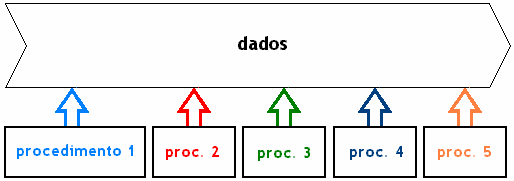
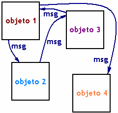
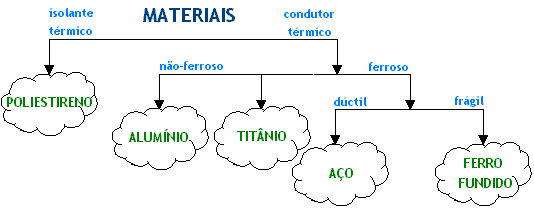
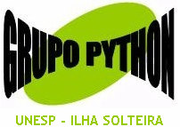

**Grupo Python apresenta:**

**Introdução a Python - Módulo B**


**Josué Labaki <labakiturbo@gmail.com> E. R. Woiski    <woiski@dem.feis.unesp.br>**


# Apresentação

Este material foi desenvolvido para apoiar os cursos da série **“Introdução a Python”** ministrados pelo **Grupo Python** para nossos mais diversos tipos de audiência. O guia inteiro é composto por três volumes que correspondem aos módulos dados nos nossos cursos: Módulo A – *Bem-vindo a Python!*, Módulo B – *Python Orientado a Objetos* e Módulo C – *Tkinter*. Todos eles podem ser encontrados na internet, nas páginas do Grupo Python (http://grupopython.cjb.net), na página do autor (http://labaki.tk) e na página da comunidade Python no Brasil (http://www.python-brasil.com.br).

Desenvolvemos este guia pensando também nos autodidatas que não participaram dos nossos cursos e baixaram este material da internet. Se você está nesta situação, pode tirar dúvidas por e-mail.

Lembramos que o nosso objetivo não é ensinar *programação*, e sim guiar você nos passos básicos em Python. Se sua intenção é aprender a programar, prefira o excelente material do prof. Luciano Ramalho em (http://www.magnet.com.br).

Recomendamos que você acompanhe e implemente os exemplos, tente entender os erros que podem ocorrer e tente resolver as questões que eventualmente aparecem ao longo deste material. Ao final, há alguns exemplos e exercícios de fixação.

Mande suas dúvidas, sugestões, críticas ou comentários por e-mail! Sua opinião sobre o guia é muito importante para nós.

***Josué Labaki & Emanuel R. Woiski***
Grupo Python

Departamento de Engenharia Mecânica

UNESP – Campus de Ilha Solteira

[***labakiturbo@gmail.com***](mailto:labakiturbo@gmail.com)

[***woiski@dem.feis.unesp.br***](mailto:woiski@dem.feis.unesp.br)

[========]

**Índice**

[TOCM]

[TOC]

# Parte I — Python Orientado a Objetos

## 1. Habemus[^1] OO!

Você se lembra da introdução do Módulo A, quando dissemos que Python é uma linguagem Orientada a Objetos – um paradigma que facilita entre outras coisas o controle sobre a estabilidade dos projetos quando eles começam a tomar grandes proporções, etc?

Lá dissemos que, como a Orientação a Objetos (OO) ainda é vista como um paradigma de experts, resolveram possibilitar ao programador de Python também programar de forma imperativa (procedural), se quisesse. Dessa forma, a curva de aprendizado da linguagem fica bem suave; não é necessário que se comece a escrever código orientado a objetos logo de início, como acontece com linguagens exclusivamente OO. A forma imperativa de Python é o que você viu ao longo de todo o módulo anterior, que deve ter aprendido sem grandes problemas.

Agora veremos porque a OO permite desenvolver projetos mais estáveis, de manutenção mais fácil, mais reutilizáveis, mais extensíveis e mais compatíveis. Este módulo também dará a base indispensável para o desenvolvimento de interfaces gráficas com Tkinter (o Módulo C do presente curso).

Já adiantando: é mais fácil programar orientado a objetos em Python do que definir Orientação a Objetos. Mas prometemos que tentaremos...

[^1]: Alusão à célebre frase “Habemus Papa!”, proclamada por um cardeal na basílica de São Pedro (Vaticano) sempre que um novo papa acaba de ser eleito.

## 2. Primeira tentativa: usando desenhos.

Paradigmas são formas de enxergar o mundo, os problemas, a vida, um código de um programa. Sendo a Orientação a Objetos um paradigma de programação (tal como a programação imperativa – ou Orientada a procedimentos), pode-se encara-la como *uma forma de pensar* o seu projeto, deste a arquitetura até a implementação.

O paradigma Orientado a Procedimentos a que você está acostumado encara o código de maneira que os dados possuem um estado que é compartilhado pelas funções ou subrotinas que operam sobre eles, como simplificado na figura abaixo:



Neste fluxo de dados estão todas as variáveis. Uma função toma um conjunto delas como argumento e retorna o resultado para o fluxo de dados, para ser usado por outra função ou simplesmente para ser visto pelo usuário.

Já a Orientação a Objetos vê o problema de outra forma. Não existem funções nem dados da forma mostrada acima, e sim objetos que se comunicam entre si por meio de *mensagens* trocadas em suas *interfaces*, como na figura adiante. Cada objeto responde às mensagens recebidas de uma maneira própria, os chamados *métodos*, de acordo com procedimentos internos, a *implementação*, que só ele conhece. Não interessa ao objeto 2 a maneira como uma determinada mensagem foi tratada pelo objeto 1 nem como ele fez para chegar à resposta. Ele simplesmente recebe a mensagem e cumpre seu papel de responder ao objeto 3. Note que os objetos podem ser criados e destruídos a qualquer momento por força do programa.

Na programação imperativa, o usuário manipula os dados através de uma seqüência de procedimentos que levam a um estado final dos dados. Na programação orientada a objetos, o que interessa não é o estado final dos dados, e sim o estado (e a existência ou não) dos objetos num dado momento.



## 3. Segunda tentativa: exemplos do mundo real.

Digamos que você tenha que desenvolver um código que faça a alimentação em um zoológico. Seu algoritmo *procedural* fica assim:

> **Procedimento 1:** comprar uma banana;
>
>**Procedimento 2:** aguardar meio-dia;
>
>**Procedimento 3:** servir a banana.

Se suas variáveis são macacos, ótimo. Macacos comem bananas e ao meio- dia. No entanto, este código não vale para todas as variáveis do zoológico, já que elefantes não se contentam com somente uma banana, leões não comem bananas, corujas não comem ao meio-dia, etc.

O mesmo algoritmo, agora orientado a objetos, poderia ficar assim:

> **Mensagem:** alimente-se!

Desta vez, cada objeto, que conhece seus *atributos* (se é herbívoro, carnívoro, se está com fome ou não) e *métodos* (se prefere caçar ou esperar a fruta cair do pé, se é um animal noturno ou não), vai se virar para se alimentar do seu jeito, seja como for (talvez alguns objetos comam uns aos outros...) ou se fosse uma pedra, talvez emitisse uma exceção, já que pedras não se alimentam.

Outra forma de perceber o que é orientação a objetos é pensar em como seria um programa para calcular o perímetro de uma figura geométrica plana usando os dois paradigmas. *Proceduralmente*, talvez se pensasse em `somar os lados da figura`. Isso funciona perfeitamente para qualquer figura geométrica que tenha um número finito de lados. O procedimento de somar os infinitos lados de um círculo, por exemplo, geraria um erro ou não retornaria um resultado satisfatório. Neste caso seria melhor usar a fórmula conhecida 2πr. O mesmo programa orientado a objetos simplesmente enviaria uma mensagem ao objeto *figura geométrica plana*: `Calcule seu perímetro`. Os pentágonos irregulares somariam seus lados enquanto os círculos usariam a fórmula, e talvez os quadrados fizessem um bom uso do seu *atributo* de ter quatro lados iguais para simplesmente multiplicar o comprimento de um lado por quatro...

## 4. Terceira tentativa: OO no código.

Vamos colocar a mão na massa e escrever um código que, a partir de um valor *b*, calcule a raiz quadrada de *b* e salve o resultado em *a*. O código procedural fica assim:

`a = sqrt(b)`

Isto é, aplique a função *sqrt* tomando *b* como argumento e salve o resultado na variável *a*. Foi esta sintaxe que usamos no Módulo A, a partir da função sqrt do módulo *math*.

Agora, usando orientação a objetos, surge uma nova forma totalmente estranha. Será que dá pra calcular raiz quadrada desse jeito em Python?

`a = b.sqrt()`

O código acima está dizendo: *b* aplica sobre si seu método sqrt e retorna o resultado para o objeto *a*. Esta sintaxe não soa familiar? Veja este trecho do Módulo A:


```Python
>>> a='araraquara'

>>> a.split('a')
['', 'r', 'r', 'qu', 'r', '']
```


No código acima, como em muitos outros em todo o módulo anterior, você esteve usando orientação a objetos! Em particular neste exemplo, dissemos ao objeto a, um objeto da *classe* (cuja definição veremos depois) das strings, para aplicar sobre si o seu método *split*, tendo como argumento `'a'`. A resposta a esta mensagem é a lista `['', 'r', 'r', 'qu', 'r', '']`.

Através de uma das nossas mais poderosas ferramentas de introspecção em Python, a função *dir*, podemos conhecer todos os atributos de um objeto da classe de strings, como o objeto a:

```Python
>>> dir(a)
['__add__','__class__','__contains__','__delattr__','__doc__','__eq__', '__ge__', '__getattribute__','__getitem__', '__getnewargs__','__getslice__', '__gt__', '__hash__', '__init__', '__le__', '__len__','__lt__','__mod__','__mul__','__ne__','__new__','__reduce__','__reduce_ex__','__repr__','__rmod__','__rmul__','__setattr__','__str__','capitalize','center','count','decode','encode','endswith','expandtabs','find','index','isalnum','isalpha','isdigit', 'islower','isspace', 'istitle', 'isupper', 'join', 'ljust','lower', 'lstrip', 'replace', 'rfind', 'rindex', 'rjust', 'rstrip','split','splitlines','startswith','strip','swapcase','title','translate', 'upper', 'zfill']
```

Use sempre a função *dir* para conhecer os métodos de um objeto. Com uma simples checagem sobre o objeto *a*, descobrimos 62 métodos cuja maioria você certamente desconhece, embora muitos deles possam ajuda-lo a economizar várias linhas de código nos seus projetos. Aproveite a deixa e use o IDLE para descobrir quantas manipulações interessantes se pode fazer sobre uma string usando seus métodos!

## 5. Quarta tentativa: O que é OO afinal?

Enfim, Orientação a Objetos é um paradigma que considera que um programa é um grande e animado diálogo entre entidades chamadas *objetos*, produzidas e destruídas a todo momento. Os objetos conhecem muito bem a si mesmos e respondem às mensagens de acordo com seus *atributos* (suas características) e com seus próprios *métodos*.

Daí você já percebe como um código orientado a objetos é mais flexível. Se você não gosta da reação de um objeto a uma mensagem, basta trocá-lo por outro ou corrigi-lo – somente o indivíduo em questão; não é necessário reescrever o programa todo.

Por esta introdução você foi posto a par de algumas palavras-chave da OO, como *objetos, atributos, interfaces e métodos*. Na *Parte II* veremos na prática o que elas querem dizer.


*✎ Sejam dois objetos* `a='araraquara'` *e* `b=[1,2,3]`*. Quando fazemos* `b.reverse()`*, o objeto b é modificado (cheque isso!), mas se aplicarmos por exemplo* `a.upper()`*, um valor é retornado mas o objeto a não sofre alterações. Você consegue se lembrar por que isso acontece? Isto ocorre somente com upper e reverse ou mais métodos (ou todos os métodos) apresentam este comportamento?*

# Parte II — Classe: o Objeto Elementar

Os objetos isoladamente não têm muita utilidade, pois teríamos que definir todos os atributos e métodos de cada um. Além disso, em um programa OO típico, como já dissemos, objetos são criados e destruídos durante a execução do programa. As *classes*, que representam coleções de objetos com características e métodos semelhantes (mas não necessariamente iguais), resolvem a questão de criação de objetos: por meio das *classes* podemos definir os *atributos* e *métodos* comuns a todos os objetos e, também por meio delas, produzir os seus representantes - *as instâncias*. As classes podem então ser consideradas uma espécie de fôrma (*template*) para a produção de instâncias.

As classes, como tudo o mais em Python, são *objetos de primeira classe*, isto é, classes podem ser fornecidas como argumento de funções, ser elementos de tuplas, se tornar chaves de dicionários, ser atributo de objetos, etc. Vejamos como é fácil em Python a criação destes objetos tão preciosos...

## 1. Sintaxe.

A criação de classes em Python se dá através da palavra reservada `class`. A seguir, definimos uma classe que não faz nada por meio da palavra também reservada `pass:`

```Python
>>> class Cachorros:
        pass
```

Pronto, basta isso e está criada a classe dos Cachorros! Veja:
    
```Python
>>> Cachorros
<class __main__.Cachorros at 0x00B04360>
```

Usamos nossa velha técnica de introspecção (*dir*) e descobrimos que a classe recém-criada *Cachorros* já possui dois atributos:

```Python
>>> dir(Cachorros)

['__doc__', '__module__']
```

Você já sabe que os objetos instâncias são definidos a partir de suas classes. Em geral não são as classes que usamos na execução um programa, e sim suas instâncias. Pois bem, a sintaxe necessária para produzir uma instância é algo como *Nome_da_classe(parâmetros)*. Nossa recém-criada classe de Cachorros pode ser instanciada assim: `Cachorros()`, visto que esta classe não contém “parâmetros” (veremos adiante o motivo). Não perca os dois parênteses de vista:

```Python
>>> Cachorros ()
<__main__+.Cachorros **instance** at 0x00CF3D50>
```

Entretanto:

```Python   
>>> id(Cachorros()) == id(Cachorros())
False
```

A função *id(obj1)* retorna um inteiro particular (hexadecimal) que identifica o *obj1* e permite compará-lo com outros objetos. Usamos esta função acima sobre duas instanciações da classe Cachorros para que você perceba que cada vez que usamos a expressão *Nome_da_classe(parâmetros)* invocamos uma ***nova*** instância. Sabemos ainda que, em nosso caso as instâncias criadas são gêmeas idênticas umas às outras, pois, embora sejam **distintas**, não há como distingui-las... Em Python, para que possamos fazer referência a uma dada instância criada, atribuímos a instância a um nome (*uma variável*), no momento de sua criação. Veja um exemplo deste tipo de atribuição, no qual o nome *d* aponta para uma instância da classe Cachorros.

```Python
d = Cachorros ()
```

Dissemos anteriormente que classes são objetos de primeira classe, e por isso poderiam ser utilizadas como argumento de funções, chaves de dicionários, etc. Crie seus próprios exemplos para verificar isso; será um teste muito instrutivo e, garantimos, você se surpreenderá mais uma vez com Python. De qualquer forma, aqui vai o nosso exemplo, ainda usando a classe *Cachorros*:

```Python
>>> Dogs = Cachorros

>>> Dogs

<class __main__.Cachorros at 0x00B04360> # O mesmo id de Cachorros!

>>> Dogs.__name__
'Cachorros'
```


O atributo interno *`__name__`* , se existir, retorna o nome do objeto sobre o qual é aplicado. Classes, módulos e funções são alguns dos objetos que respondem a este atributo. Desenvolveremos a seguir uma função que nos informa se o objeto passado como argumento tem ou não um *`__name__`* , fornecendo-o, se tiver, bem como seu *id*.

```Python
>>> def nome_do_objeto(c): Você sabe dizer qual é o tipo de c?
    try:
        print 'Nome do objeto: %s. Id: %d.' % (c.__name__, id(c))
    except:        
        print """O objeto " %s " não tem atributo __name__ mas seu id é %d.""" % (str(c), id(c))

>>> ndo=nome_do_objeto

>>> ndo(Dogs)
Nome do objeto: Cachorros. Id: 10756032.

>>> ndo('abacaxi')
O objeto " abacaxi " não tem atributo __name__ mas seu id é 10738400.
```

Perceba que passamos naturalmente uma classe (não uma instância, *a própria classe*) como argumento da função *ndo*. Em Python, os métodos, funções, módulos, etc., não tentarão descobrir o tipo do objeto para saber se o procedimento é permitido. Eles simplesmente tentarão executar suas rotinas, retornando erro caso não seja possível. Aqui você viu que a função *ndo* não checa se o objeto c possui o atributo `__name__` . Simplesmente tenta executar o que foi solicitado. Quando isto não é possível, ela retorna o erro prescrito no bloco *except*.

>✎	*Funções também são objeto de primeira classe, então também é permitido fazer `ndo(ndo)`. Que resposta o interpretador	daria	a	isto?	Procure	descobrir sem implementar.*
>
>✎	*Se em vez do nome do objeto, a função tivesse que
retornar o seu tipo, seria necessário o uso do try? Por quê?*

## 2. Atributos e métodos.

Atributos são objetos inerentes às classes, ou seja, comuns a todas as suas instâncias. Imagine que queiramos agrupar cachorros e galinhas em classes conforme suas características. As características que todas as instâncias destas classes possuem são seus atributos. Veja o exemplo:

```Python
>>> class Cachorros:
    cobertura='pelos'
    alimento='carne'
    patas=4
    habitat='domestico'
    nome='Rex'


>>> class Galinhas:
    cobertura='penas'
    alimento='graos'
    patas=2
    habitat='domestico'
    bico='pequeno'


>>> dir(Cachorros)
['__doc__', '__module__', 'alimento', 'cobertura', 'habitat', 'nome', 'patas']


>>> dir(Galinhas)
['__doc__', '__module__', 'alimento', 'bico', 'cobertura', 'habitat', 'patas']
```
Como vemos, as classes *Cachorros* e *Galinhas* possuem quatro atributos em comum: *cobertura, alimento, patas* e *habitat*. *Cachorros* possui ainda o atributo *nome* enquanto *Galinhas* possui o atributo *bico*, além de *`__doc__`* e *`__module__`* que ainda discutiremos. Vamos definir instâncias para elas e você vai começar a perceber que instâncias podem ser vistas como indivíduos de uma classe, possuindo os atributos de sua classe, etc.

```Python
>>> Snoopy=Cachorros()

>>> Lala=Galinhas()

>>> Snoopy.alimento 
'carne'

>>> Lala.alimento 
'graos'

>>> Lala.bico 
'pequeno'

>>> Snoopy.bico
Traceback (most recent call last):
    File "<pyshell#28>", line 1, in -toplevel- Snoopy.bico
AttributeError: Cachorros instance has no attribute 'bico'
```

*Snoopy*, como membro da classe Cachorros, não possui o atributo bico.

Claro que os atributos podem ser usados em qualquer parte do programa:

```Python
>>> print '%s late sem parar!' % Snoopy.nome
Rex late sem parar!
```

Ué! O nome não era Snoopy? Fique atento para distinguir o nome (ou variável)  atribuído  à  instância  –  Snoopy  -  e  o  atributo  de  classe  *'nome'*,  que  é  “Rex”! Para  verificar  que  `nome'  é  mesmo  um  atributo  da  classe  *Cachorros*,  você  pode  dar uma olhada na definição da classe, ou simplesmente requisitar:

```Python
>>> Cachorros.nome 'Rex'
```

Métodos são funções definidas dentro da classe e, em geral, ligadas (bound) a cada instância da classe, como veremos. Eles são usados para definir que ações que serão executadas por uma instância dessa classe. No próximo exemplo, *Circulos* possui como atributo somente o raio de um círculo, além de dois métodos: & e *calcula_Volume*:

```Python
>>> class Circulos:
        raio = 25.4
        def calcula_Area(self):
            self.area = 3.14*(self.raio**2)
        def calcula_Volume(self,altura):            
            self.volume = 3.14*(self.raio**2)*altura
```

A seguir, atribuímos uma instância da classe Circulos ao nome C1. Inicialmente, só o atributo *raio* existe. Por outro lado, se aplicarmos o método *calcula_Area* sobre C1, então esta instância terá mais um atributo, que é *area*:

```Python
>>> C1=Circulos()

>>> C1.raio
    25.399999999999999

>>> C1.area
    Traceback (most recent call last):
        File "<pyshell#44>", line 1, in -toplevel- C1.area
    AttributeError: Circulos instance has no attribute 'area'

>>> dir(C1)
['__doc__', '__module__', 'calcula_Area', 'calcula_Volume', 'raio']


>>> C1.calcula_Area()

>>> C1.area
    2025.8024

>>> dir(C1)
['__doc__', '__module__', 'area', 'calcula_Area', 'calcula_Volume', 'raio']
```

Aí pergunta você: “Mas o que aconteceu com aquele argumento *self* que deveria ser passado ao método Calcula_Area???” (você pergunta com três interrogações mesmo, porque está espantado com este aparente absurdo).

O argumento *self* – que não é uma palavra reservada – aparece como primeiro argumento na **definição** da maioria dos métodos de classes e é uma maneira muito apropriada de fazer referência *à própria instância* a qual o método se aplica. Quando invocamos o método, o argumento *self* está implícito como *primeiro* argumento. Como a nossa instância se chama C1, o método *C1.calcula_Area()* está dizendo: **`C1`**`.area = 3.14*(`**`C1`**`.raio**2)`. Assim, ao aplicar este método sobre C1, passará a existir o atributo C1.area que antes não existia. Verifique também que:

```Python
>>> C1.calcula_Area() == Circulos.calcula_Area(C1)
    True
```

Isto indica que em lugar de *C1.calcula_Area()* poderíamos ter usado a forma *Circulos.calcula_Area(C1)*.

Outros nomes que não *self* podem ser usados, mas é um favor a você mesmo e aos leitores do seu código se você não mudar isto. Qualquer programa OO em Python que você encontrar quase certamente fará uso deste termo.

Há ainda outro método na classe *Circulos, calcula_Volume*, que além do *self* obrigatório possui também outro argumento: *altura*. Sendo assim, deveremos passar este argumento quando formos aplicar este método, ao contrário do método *calcula_Area* que utilizamos sem parâmetro explícito algum.

```Python
>>> C1 = Circulos()

>>> C1.calcula_Volume()
Traceback (most recent call last):
    File "<pyshell#19>", line 1, in -toplevel- C1.calcula_Volume()
TypeError: calcula_Volume() takes exactly 2 arguments (1 given)
```

Observe o que acontece se suprimirmos também o argumento *altura* que deveria ser passado explicitamente ao método *calcula_Volume*. O erro resultante indica que o método toma exatamente *dois* argumentos e apenas *um* foi fornecido. O argumento “dado” é o *self* implícito!

```Python
>>> C1.Calcula_Volume(12.)

>>> C1.volume
    24309.628799999999
```

Classe inútil essa, hein? Ela só calcula a área e volume de um círculo de raio 25.4! Como será que faríamos para que cada instância se referisse a um círculo diferente? Aliás, aquela velha classe *Cachorros* também é bem monótona, uma vez que todos os seus indivíduos (as instâncias como “Snoopy”) têm o mesmo atributo *nome*, “Rex”. Como faríamos para que cada cachorro desta classe tivesse um nome diferente? Utilizaremos um método especial, `__init__` .


## 3. O método especial *`__init__`*.

Na definição das classes veremos que é muito comum encontrarmos um método especial chamado *`__init__`*     (Esses traços horizontais são duplos *underlines*). Ele é o método *“construtor”* da classe, que usamos sempre que queremos definir atributos e métodos para uma instância **no momento em que ela for criada**. Com o *`__init__`* podemos diferenciar uma instância de outra, isto é, um indivíduo de outro da mesma classe já no momento de sua criação. Redefinindo a classe Cachorros, para que cada indivíduo desta classe tenha um nome, quando for criado:

```Python
>>> class Cachorros:
        cobertura='pelos'
        alimento='carne'
        patas=4
        habitat='domestico'
        def __init__ (self, nome):	# Jamais nos esqueceremos do self!
            self.nome= nome

>>> d1 = Cachorros('Dog1')

>>> d1.nome
'Dog1'
```

Como vemos, os valores para os argumentos dentro do `__init__` deverão ser fornecidos no momento exato da criação de cada instância. Nem sempre precisaremos fornecer valores para todos os argumentos, como veremos adiante com o uso de valores *default*.

Para tornar as coisas interessantes, vamos supor que temos a necessidade de manipular uma infinidade de objetos “na tela”, de forma a que cada um deles tenha um nome, um tamanho, uma cor, um número de arestas. Por outro lado, a posição mutável (x,y) de cada um será dada por um número real aleatório dentro de um quadrado de 10x10. Para gerarmos a posição aleatória, usaremos o módulo *random*. No Módulo A já vimos que a função *random* deste módulo gera um float x aleatório tal que 0 ≤ x ≤ 1. Um dos códigos possíveis está mostrado na página seguinte.

```Python
>>> from random import random

>>> class Sprites:
    
    def init (self, nome,
        tamanho = 'grande',
        cor = 'amarelo',
        arestas = 5): # self é sempre o primeiro argumento!
        self.nome = nome
        self.tamanho = tamanho
        self.cor = cor
        self.arestas = arestas
    
    def update_position(self):
        self.position = random()*10,random()*10 # posições x e y
        print '%s está agora em %s.' %(self.nome,self.position)
```

Na criação da primeira instância, usamos o argumento aresta como *default*, ou seja, como não passamos este argumento explicitamente, o inteiro 5 definido pelo método `__init__` é assumido. A instância s2 foi criada para que você veja que os argumentos podem ser dados em qualquer ordem, como já sabemos fazer com funções.

```Python
>>> s1 = Sprites('Star1', 'pequeno', 'vermelho')

>>> s1.nome, s1.tamanho, s1.cor, s1.arestas
('Star1', 'pequeno', 'vermelho', 5)

>>> s2 = Sprites('Star2', arestas=6, cor='azul')

>>> s2.nome, s2.tamanho, s2.cor, s2.arestas
('Star2', 'grande', 'azul', 6)

>>> s1.update_position(), s2.update_position()
Star1 está agora em (0.43251725889582815, 9.5024820736664353).

Star2 está agora em (0.50694145748064412, 1.6160935722866276).

(None, None)

>>> s1.position
(0.43251725889582815, 9.5024820736664353)

>>> s2.position
(0.50694145748064412, 1.6160935722866276)
```

Você viu que após a aplicação do método *update_position* sobre uma instância, passará a existir – ser atualizado - o atributo *position daquela* instância, que é distinto para cada uma das instâncias *s1* e *s2*. Os indivíduos dessa classe compartilham os atributos definidos normalmente dentro da classe, mas não os atributos definidos pelo método *`__init__`* .

> ✎ *A tupla* `(None, None)` *deve ter soado uma campainha no seu cérebro, fazendo você se lembrar de uma discussão importante do Módulo A. Você consegue explicar porque essa tupla apareceu e o que ela quer dizer?*

## 4. Os atributos especiais *`__doc__`* e *`__module__`*.

Anteriormente, pudemos perceber que qualquer classe possui nativamente dois atributos com duplo *underline, `__doc__`* e *`__module__`*. Assim como as funções, os módulos e as *packages*, as classes e os métodos em Python também podem conter *docstrings*, cujo conteúdo é imediatamente assumido por um atributo pré-definido chamado *`__doc__`*. Ele pode ser acessado tanto através da classe, da instância ou do método vinculado à instância. Veja:

```Python
>>> class Fausto:
"""Fausto é um romance de Goethe que Beethoven transformou em Ópera."""
        def review(self):
            """
            Este método responde com a avaliação dos críticos
            """
            print 'Um romance excepcional'

>>> print Fausto.__doc__
Fausto é um romance de Goethe que Beethoven transformou em Ópera.

>>> print Fausto().__doc__
Fausto é um romance de Goethe que Beethoven transformou em Ópera.

>>> print Fausto().review.__doc__
Este método responde com a avaliação dos críticos
```

Além da função *dir*, o Módulo A já havia nos apresentado a outra importante ferramenta de introspecção, a função *help*. Observe como ela se torna especialmente útil na introspecção de classes. Todos os métodos são exibidos de uma vez só, juntamente com suas respectivas *docstrings*. Pela primeira linha exibida pela função help, descobrimos a qual módulo a classe pertence. Como aqui estamos usando o IDLE, o “módulo” é *`__main__`*.

```Python
>>> help(Fausto)

Help on class Fausto in module __main__:


class Fausto

    | Fausto é um romance de Goethe

    | que Beethoven transformou em Ópera.

    |

    | Methods defined here:

    |

    | review(self)

    |	Este método responde com a avaliação dos críticos
```

> ✎	*Responda rápido: qual a diferença entre* `Fausto.__doc__`*e* `Fausto().__doc__` *?*


Falando em `__main__`, o atributo especial `__module__` guarda o nome do módulo a que a classe pertence. Se criarmos uma classe num programa ou no IDLE, e no mesmo programa solicitarmos *`ins1.__module__`* (sendo *ins1* uma instância da classe),  a  resposta  será  *'`__main__`´*,  ou  seja,  a  classe  está  no  script  corrente  cujo *`__name__`* é sempre *'`__main__`´* como no exemplo da classe Fausto acima. A seguir observamos este atributo de uma classe criada no IDLE e de outra classe importada:

```Python
>>> class So_Acredito_Vendo: pass


>>> sav = So_Acredito_Vendo()

>>> sav.__module__
'__main__'

>>> from math import sin

>>> sin.__module__
'math'
```

# Parte III — Herança

Assim como a classe biológica de galinhas herda as asas do grupo das aves e os cachorros herdam os dentes caninos do grupo dos canídeos, também as classes em Python podem herdar atributos de outras classes. Veja outro exemplo:



Tanto o aço, quanto o ferro-fundido, o alumínio e o titânio herdam a característica de conduzir calor. Destes, somente o aço e o ferro-fundido são ferrosos, e dos últimos, somente o aço possui o atributo de ser dúctil... Certo. E daí?

Imagine que você esteja definindo classes tão repletas de atributos quanto as classes de materiais. São centenas de atributos a serem definidos, como condutividade térmica e elétrica, permissividade magnética, tenacidade à fratura, eletronegatividade, etc. etc. Não fosse o recurso de herança, que permite a você fazer uma classe herdar atributos de outra, cada um dos atributos teria que ser definido classe a classe!

Neste exemplo de materiais, a classe dos materiais ferrosos herda da classe dos condutores térmicos o atributo de conduzir calor. Por isso, diz-se que a classe *Condutores_Térmicos* é superclasse (ou “pai”, “mestre”, ou “base”) da classe *Materiais_Ferrosos*. Por sua vez, a classe *Materiais_Ferrosos* é subclasse (ou “filha”, ou “derivada”) da classe *Condutores_Térmicos*.

Em Python, quando queremos dizer a uma classe quem são suas superclasses (pode haver mais de uma!), aparece um novo item na sintaxe – os parênteses após o nome da classe. Observe como é simples fazer as classes de materiais herdarem atributos dos seus mestres:

```Python
class Condutores_Térmicos:
    atributos1....

class Materiais_Ferrosos(Condutores_Térmicos):
    atributos2.....

class Materiais_Dúcteis(Materiais_Ferrosos):
    atributos3.....
```

Assim, embora só os *atributos2* estejam definidos no corpo da classe *Materiais_Ferrosos*, ela também passa a possuir os *atributos1* que herdou da sua *superclasse*. Da mesma forma, a classe *Materiais_Dúcteis* herda *atributos1* e *atributos2* da superclasse *Materiais_Ferrosos*.

Mão na massa! Criaremos três classes. Uma, chamada *Pai*, possui três atributos que são herdados pela classe *Filha*. A terceira classe, *Neta*, herda de *Filha* e por conseqüência também herda os atributos de *Pai*. Quer ver?

```Python
>>> class Pai:
        Nome = 'Carlos'
        Sobrenome = 'Oliveira'
        Residencia = 'Ilha Solteira'
        Olhos = 'azuis'


>>> class Filha(Pai):
        Nome = 'Luciana'
        Olhos = 'castanhos'

>>> class Neta(Filha):
        Nome = 'Maria'

>>> Pai.Nome, Filha.Nome, Neta.Nome
('Carlos', 'Luciana', 'Maria')

>>> Pai.Residência, Filha.Residência, Neta.Residência
('Ilha Solteira', 'Ilha Solteira', 'Ilha Solteira')

>>> Pai.Olhos, Filha.Olhos, Neta.Olhos
('azuis', 'castanhos', 'castanhos')
```

Veja como o atributo *Nome* é distinto para *Pai, Filha* e *Neta*; a *Residência* de *Pai* foi herdada pelas suas subclasses *Filha e Neta*; esta, por sua vez herdou o atributo *Olhos* de sua superclasse imediata *Filha*.

É possível determinar rapidamente se uma classe *Alfa* herda de outra classe *Beta* através da sintaxe *issubclass*(Alfa,Beta), mas uma forma mais prática cuja resposta não é um booleano, é *`Alfa.__bases__`*. A desvantagem é que esta última forma diz somente quem são as classes de quem *Alfa* herda diretamente. Veja: embora *Neta* herde *indiretamente* os atributos de *Pai*, o interpretador diz que ela é subclasse de *Filha*. Por outro lado, *`Neta.__bases__`*	informa somente a classe da qual *Neta* herda atributos diretamente:

```Python
>>> issubclass(Neta,Pai)
True

>>> Neta.__bases__
(<class main .Filha at 0x00A48030>,)
```

A seguir, você pode ver uma classe que herda de várias outras diretamente. Todas estas classes-base são retornadas pelo método *`__bases__`*.

```Python
>>> class Atlantico:
    carater1 = 'É um oceano '


>>> class Indico:
    carater2 = 'perigoso, '


>>> class Pacifico(Indico):
        carater3 = 'cheio de tsunamis '


>>> class Artico(Atlantico, Indico, Pacifico):
    Carater4 = 'e muito gelado!'


>>> print Artico.carater1 + Artico.carater2 + Artico.carater3 + Artico.carater4
É um oceano perigoso, cheio de tsunamis e muito gelado!

>>> Indico.__bases__
()

>>> Pacifico.__bases__
(<class __main__.Indico at 0x00A48060>,)

>>> Artico.__bases__
(<class __main__.Atlantico at 0x00A481E0>, <class __main__.Indico at
0x00A48060>, <class __main__.Pacifico at 0x00A48180>)
```

(Você sabia que pode usar a barra invertida \ em Python para quebrar uma linha e continuar o código na de baixo? Isso evita códigos de linhas quilométricas chatos de ler.)

Além dos atributos, as classes também herdam os *métodos* de suas superclasses. A seguir, definimos duas classes – só a primeira possui os métodos *soma* e *multiplicacao*. No entanto, como a classe *Op_Avancadas* herda desta classe, qualquer instância de *Op_Avancadas* também pode fazer uso dos métodos da classe-pai.

Aproveitando a deixa, você aprenderá ao longo dos próximos exemplos um recurso amplamente utilizado com Python orientado a objetos, que é o uso de *métodos especiais* como *`__add__`*, *`__mul__`* e *`__div__`*.

Você sabe que operadores como +, - e \* podem ser aplicados a objetos como inteiros e strings gerando diferentes resultados dependendo do tipo do objeto. O sinal \+ aplicado a dois inteiros resulta na sua soma, enquanto sobre strings resulta na sua concatenação. Podemos emular o comportamento deste operador sobre duas instâncias definindo-o dentro de sua classe. Analogamente, os métodos *`__mul__`* e *`__div__`* correspondem aos operadores \* e /, respectivamente.

Veremos ainda o uso do método call para tornar uma instância *callable* (difícil traduzir sem perder o contexto técnico, mas o significado seria algo como “chamável”).

```Python
>>> class Op_Basicas:
        def __init__(self, entrada):
            self.valor = entrada

        def __add__(self, other): # método especial!
            return self.valor + other.valor

        def __mul__(self, other): # método espeial!
            return self.valor * other.valor

>>> a = Op_Basicas(56)

>>> b = Op_Basicas(-23)

>>> a + b
33

>>> a * b
-1288
```

O conceito a ser notado destas últimas inocentes linhas é a sobrecarga de operadores. Fizemos com que o operador que antes só podia ser aplicado a inteiros, floats, strings, listas etc., agora possa ser aplicado sobre duas instâncias, retornando como resultado a soma dos seus atributos *self.valor*. Se estes atributos são strings, o valor retornado é sua concatenação:

```Python
>>> str1 = Op_Basicas('56')

>>> str2 = Op_basicas('-23')

>>> str1 + str2
'56-23'

>>> str1 * str2
Traceback (most recent call last):
    File "<pyshell#21>", line 1, in ? str1 * str2
        File "<pyshell#15>", line 7, in __mul__
            return self.valor * other.valor
TypeError: can't multiply sequence to non-int
```

Ops! Não definimos multiplicação de strings... Mas a multiplicação de inteiros por strings já é assumida pelo operador \*.

```Python
>>> str2 = Op_Basicas(34)

>>> str1 * str2
'56565656565656565656565656565656565656565656565656565656565656565656'
```

Eis uma regra *fundamental* de Python. Se o objeto puder responder à mensagem com algum método, ele o fará, sem mais perguntas. Se ele não puder responder, seja porque ele não possui o método, seja porque o método ou os argumentos fornecidos são inadequados, um aviso de exceção será emitido. De fato, cabe ao programador a captura da exceção e a realização de alguma coisa útil com ela! Você está habilitado a fazer isso usando *try-except* que vimos e revimos mo Módulo A e mesmo neste.

Mas estamos falando de Herança. Seja a classe *Op_Avancadas* a ser definida como subclasse de *Op_Básicas*. Nela, o operador de divisão também é sobrecarregado para que a sentença *inst1 / inst2* retorne um resultado, sendo *inst1* e *inst2* duas instâncias desta classe.

```Python
>>> class Op_Avancadas(Op_Basicas):
        def __init__(self, entrada):
            self.valor = entrada
        
        def __div__(self, other):	# método especial!
            return float(self.valor) / other.valor
```

> *✎ Se não transformássemos* self.valor *num float, haveria alguma situação em que o método geraria um valor insatisfatório? Qual? Há alguma razão especial para não termos feito o mesmo com* other.valor *?*

```Python
>>> c = Op_Avancadas(4)

>>> c / a
0.071428571428571425

>>> c / b
-0.17391304347826086

>>> c + a
60

>>> c * b
-92
```

Veja que por causa da herança, a sobrecarga dos operadores de soma e multiplicação também estão disponíveis para as instâncias da classe *Op_Avancadas*.

Em outras palavras, os métodos *`__add__`* e *`__mul__`* foram herdados da sua classe-base.

Falando nisso, mesmo o método construtor pode *ser omitido*, se ele for exatamente igual ao da classe-base. A classe abaixo herda tudo das superclasses, inclusive o *`__init__`* :

```Python
>>> class Op_Extras(Op_Avancadas):
        def quadrado(self):
            return self.valor * self.valor

>>> d = Op_Extras(6)

>>> d.quadrado()    
36

>>> d + a
62

>>> c + d
10

>>> d / b
-0.2608695652173913
```

Parece e *é* simples. Em virtude da herança, a instância recém-criada, *d*, já vem equipada  com os métodos	*`__add__`*, *`__mul__`*, e *`__div__`*, além do método construtor *`__init__`*. Aliás, exatamente por ter herdado o *`__init__`*, esta nova classe *Op_Extras* exige um argumento no ato da sua instanciação (aqui, usamos como argumento o inteiro 6).

São chamados *callable* em Python todos os objetos capazes de carregar um número indeterminado de argumentos. Podemos então relembrar que *funções, classes* e *métodos* são sempre *callable*. Para sabermos se um objeto é *callable*, usaremos a função booleana *callable*(objeto):

```Python
>>> callable(str1) # str1 é uma instância da classe Op_Basicas...
False

>>> callable(Op_Basicas)
True

>>> callable(d.quadrado)
True

>>> callable('abacaxi')
False
```

Por outro lado, embora tenhamos descoberto que instâncias não são normalmente *callable*, podemos fazê-las ter este comportamento, utilizando o método especial *`__call__`* na definição da sua classe. Vamos redefinir a classe *Op_Basicas* para que suas instâncias sejam *callable*:

```Python
>>> class Op_Basicas:
    def __init__(self, entrada):
        self.valor = entrada
        
    def __add__(self, other):
        return self.valor + other.valor
        
    def __mul__(self, other):
        return self.valor * other.valor
        
    def __call__(self, qualquer_coisa):	# método especial!
        return qualquer_coisa

>>> a = Op_Basicas(56)

>>> a('Vejam, eu sou uma instância callable')
Vejam, eu sou uma instância callable

>>> b = Op_Avancadas(-23)

>>> b('Eu também sou!')
Eu também sou!

>>> d = Op_Extras(6)

>>> d('E eu, então, não sou?')
E eu, então, não sou?

>>> a(a.valor), a(b.valor), b(d.valor)
(56, -23, 6)

>>> callable(a), callable(b), callable(d)
(True, True, True)
```

Por último, aproveitamos que atributos de instância são objetos de primeira classe e passamos como argumento das instâncias. Como agora estas são chamáveis e retornam *qualquer coisa*, os atributos de instância são argumentos válidos.

Observe com atenção que, por causa do método *`__call__`* na definição da classe *Op-Basicas*, não apenas as suas instâncias se tornaram *callable*, mas, devido à herança, as instâncias de *Op_Avancadas* e *Op_Extras* passaram a ser também *callable* através do mesmo método. Obviamente, se desejássemos, o método *`__call__`* poderia ser *distinto* para cada subclasse.

> *✎	Explique a seguinte composição:* 
> `Op_Basicas('abacaxi')(6) * Op_Extras(16)('bola')`

Finalmente, o método especial *`__str__`* sobrecarrega a representação da instância. Com ele, você pode determinar o que deve ocorrer quando o usuário solicitar `print inst1`, sendo *inst1* uma instância da classe. Quem vai nos ajudar nesta explicação é mais uma vez a classe *Op_Basicas*.

```Python
>>> class Op_Basicas:
        def __init__(self, entrada):	# método especial!
            self.valor = entrada

        def __call__(self, texto):	# método especial!
            return texto

        def __str__(self):	# método especial!
            return 'Sou uma orgulhosa instância de %s' % self.__class__


>>> a = Op_Basicas(56)

>>> print a
Sou uma orgulhosa instância de __main__.Op_Básicas

>>> a('Hello!')
'Hello!'

>>> b = Op_Avancadas('abacaxi')

>>> print b
Sou uma orgulhosa instância de __main__.Op_Avancadas

>>> d = Op_Extras(6)

>>> print d
Sou uma orgulhosa instância de __main__.Op_Extras

>>> b(a.valor)
56

>>> d('And from me ' + str(b.valor))
'And from me -23'
```

Repare que as instâncias não deixam de ser *callable*, já que mantivemos o método *`__call__`*.

O comportamento apresentado na execução do código `print` foi definido por nós mesmos por meio do método *`__str__`*. Esta é uma das ferramentas do canivete suíço que Python nos oferece através da orientação a objetos. Usando herança *com sabedoria*, poderemos acrescentar funcionalidades facilmente.

Não são estes os únicos métodos especiais. Existem aqueles que fazem com que as instâncias de uma classe se comportem como *seqüências*, tais como strings, listas e tuplas ou então como *mapeamentos (mappings)*, tais como os dicionários. Demos aqui os conceitos indispensáveis sobre métodos especiais. Com estes conceitos você é capaz de descobrir sozinho os que citamos acima. Não deixe de pesquisar este assunto porque estes procedimentos serão encontrados com freqüência nos programas de terceiros.

# Parte IV — Porque Usar Classes

Certa vez um sujeito expressou na lista c.l.py o que muita gente sente no primeiro contato com OO. Ele disse que esperava que Python se mantivesse sempre simples do jeito que ele aprendeu quando era iniciante, mas que não valia a pena usar Orientação a Objetos porque parecia complicada demais.

Davor, outro participante da lista, mostrou de uma forma quase teatral que a Orientação a Objetos era usada justamente para evitar complicações. Veja uma tradução adaptada da resposta do Davor:

*Concordo com você! Orientação a Objetos é o capeta! Acho melhor usar variáveis isoladas...*

```Python
>>> nome1 = 'Oliveira'

>>> idade1 = 35

>>> sexo1 = 'masculino'

>>> nome2 = 'Cardoso'

>>> idade2 = 23

>>> sexo2 = 'feminino'

>>> print nome1, idade1, sexo1, nome2, idade2, sexo2
```

*Hm... Que coisa chata reescrever todos os nomes das variáveis! Ainda bem que em Python temos as listas!*

```Python
>>> p1 = ['Oliveira', 35, 'masculino']

>>> p2 = ['Cardoso', 23, 'feminino']

>>> for e in p1:
        print e

>>> for e in p2:
        print e
```

*Peraí! O termo 2 da lista p1 era a idade, ou era sexo? Ah, mas aí não vale, porque a indexação das listas não é a melhor ferramenta para este caso. Os dicionários resolvem essa parada! Vou usar dict para converter uma lista de keywords do tipo key = value em um dicionário:*

```Python
>>> p1 = dict{name = 'Oliveira', idade = 35, sexo = 'masculino'}

>>> p2 = dict{name = 'Cardoso', idade = 23, sexo = 'feminino'}

>>> for e in p1.keys():
        print '%s: %s' % (e, p1[e])

>>> for e in p2.keys():
        print '%s: %s' % (e, p2[e])
```

*Tenho agora que criar os dicionários de pessoas, os de notas fiscais e outros. Dá muito trabalho fazer isso tudo um por um, melhor usar modelos de dicionários (templates):*

```Python
>>> class Imprimivel:
        def __str__(self):
            """método mágico (especial) chamado por print, str()..."""
            ps = ''
            for e in self.__dict__.keys(): # outro método especial!
            ps += '%s: %s\n' % (e, str(self.__dict__[e]))
            return ps


>>> class Pessoa(Imprimivel):
        def __init__(self, nome, idade, sexo):
            self.nome = nome
            self.idade = idade
            self.sexo = sexo

>>> class Nota_Fiscal(Imprimivel):
    def __init__(self, nome, produto, preço):
            self.nome = nome
            self.produto = produto
            self.preço = preço

>>> pes = Pessoa(nome = 'Oliveira', idade = 35, sexo = 'masculino')

>>> nf = Nota_Fiscal(nome = 'Cardoso', produto = 'carro', preço = 300.0)

>>> print pes # as instâncias são imprimíveis
    idade: 35
    sexo: masculino
    nome: Oliveira

>>> print nf # as instâncias são imprimíveis
    preço: 300.0
    produto: carro
    nome: Cardoso
```

Além deste tipo de manipulação ilustrada por Davor, use classes sempre que estiver trabalhando com projetos grandes para evitar conflito de nomes. Como cada classe possui um *namespace* próprio, você pode dar praticamente qualquer nome aos atributos de uma classe sem se preocupar com o resto do código.

# Parte V — Convenções sobre Nomes

Ao longo de todo este (curto) módulo, foi possível observar alguns padrões na definição das classes, atributos e métodos. Não é por acaso que todas os nomes de classe começam com letras maiúsculas enquanto os nomes dos métodos começam com letras minúsculas: é uma recomendação do tutorial oficial de Python. Se você se acostumar com estas regras simples, será mais fácil fazer manutenção nos seus programas, além de facilitar a vida de quem estudar seus códigos. Veja algumas das recomendações:

- Dentro das classes, refira-se às instâncias sempre através do nome *self*;
- Use letras maiúsculas para a primeira letra dos nomes das classes;
- Use letras minúsculas para os nomes dos métodos. Se o nome for composto por mais de uma palavra, você pode escrever a segunda, terceira, etc. com letra maiúscula, ou separa-las com underlines: meuMetodo ou meu_metodo.
- Nomeie os atributos com substantivos e os métodos com verbos (indicando ação). Atributos: *raio, r, r2*. Métodos: *calculaRaio, calcR, calcular_raio,* etc.

#Parte VI - Exercícios

> 👍	Fáceis  👉	Médios

👍	Refine os exemplos dados neste Módulo. Alguns métodos definidos dentro das classes podem ser herdados de classes nativas de Python – use a herança para elimina-los do corpo da classe.

👍	Crie uma matilha de  100  cachorros, de  modo  que  todos tenham  nomes `Dog*j*', sendo j = 1, 2, 3, ..., 100, e gere simultaneamente uma idade aleatória diferente para cada um deles. Sugestão: use os recursos de *list comprehensions* que vimos no Módulo A.

👍	Desenvolva uma classe de matrizes de ordem 3X3. A matriz dada deverá ser uma lista de listas (uma lista de três listas com três elementos cada uma), e deverão estar disponíveis as operações de soma, multiplicação e cálculo do determinante.

👍	Escreva uma classe para resolver sistemas lineares de ordem 3X3 usando a Regra de Cramer. Você terá que calcular o determinante de algumas matrizes
– herde este método da classe que você desenvolveu no exercício anterior. A Regra de Cramer pode ser encontrada facilmente na internet. Google nela!

👍	Desenvolva uma classe para trabalhar com números complexos, na qual estejam definidos os métodos para realizar as quatro operações básicas com este conjunto numérico. Estas operações são:

Adição: $(a + bi) + (c + di) = (a + c) + (b + d )i$

Subtração: $(a + bi ) - (c + di) = (a - c) + (b - d )i\)

Multiplicação: $(a + bi) . (c + di) = (ac - bd) + (ad + bc)i$ e

Divisão: $\frac{(a + bi)}{(c + di)} = \left(\frac{ac + bd}{c ^ 2 + d ^ 2}\right) + \left(\frac{bc - ad}{c ^ 2 + d ^ 2}\right)i$.

👉	Adicione mais um método à sua classe de números complexos para retornar ao usuário o número em questão na forma polar, isto é, passa-lo da forma **a+b*i*** para a forma **r ∠ θ**. Lembre-se de que:

Raio: $r = \sqrt{a ^ 2 + b ^ 2}$ e Ângulo: $\theta = \arctan(\frac{a}{b})$. A classe terá que herdar os métodos de raiz quadrada e arco-tangente de outra classe nativa de Python. Qual você usaria?

👉	Reescreva os exemplos do Módulo A usando Orientação a Objetos.

# Vem aí...

Viu só? Não doeu nada! Aposto que em menos de uma hora você leu este Módulo e aprendeu o indispensável para trabalharmos com OO em Python.

Não se iluda: o conteúdo que você viu aqui é uma gota do oceano da Orientação a Objetos (que poético!). Mesmo assim, de posse desses conceitos – que você já está dominando, se tentou fazer os exercícios recomendados – já podemos partir para a tão esperada programação de interfaces gráficas com Tkinter.

No Módulo C, você verá que os *widgets* (os botões, menus, caixas de texto) do Tkinter se comportam de uma forma muito familiar, agora que você já sabe que objetos recebem *mensagens* e respondem a elas por meio de seus próprios *métodos, atributos*, etc. Seria difícil reproduzir este comportamento com programação procedural...

Nos vemos no Módulo C!

 > ***Sua participação é muito importante para a constante melhoria deste material. Ficaremos muito honrados em conhecer suas opiniões, sugestões, críticas ou dúvidas sobre ele. Para isso, podemos ser encontrados em [labakiturbo@gmail.com ](mailto:labakiturbo@gmail.com)e [woiski@dem.feis.unesp.br.](mailto:woiski@dem.feis.unesp.br)***



**Este documento pode ser distribuído livremente, desde que mantidos os créditos aos autores.**