**Grupo Python apresenta:**

**Introdução a Python - Módulo C**


**Tkinter!**

**Josué Labaki**

**labakiturbo@gmail.com**

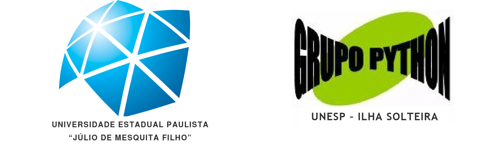

# Apresentação

Este material foi desenvolvido para apoiar os cursos da série **“Introdução a Python”** ministrados pelo **Grupo Python** para nossos mais diversos tipos de audiência. O guia inteiro é composto por três volumes que correspondem aos módulos dados nos nossos cursos: Módulo A – *Bem-vindo a Python!*, Módulo B – *Python Orientado a Objetos* e Módulo C – *Tkinter*. Todos eles podem ser encontrados na internet, nas páginas do Grupo Python (http://grupopython.cjb.net), na página do autor (http://labaki.tk) e na página da comunidade Python no Brasil (http://www.python-brasil.com.br).

Desenvolvemos este guia pensando também nos autodidatas que não participaram dos nossos cursos e baixaram este material da internet. Se você estiver nesta situação, pode tirar dúvidas por e-mail.

Lembramos que o nosso objetivo não é ensinar programação, e sim guiar você nos passos básicos em Python. Se sua intenção for aprender a programar, prefira o excelente material do prof. Luciano Ramalho em (http://www.magnet.com.br).

Recomendamos que você acompanhe e implemente os exemplos, tente entender os erros que podem ocorrer e tente resolver as questões que eventualmente aparecem ao longo deste material. Ao final, há alguns exercícios de fixação.

Mande suas dúvidas, sugestões, críticas ou comentários por e-mail! Sua opinião sobre o guia é muito importante para nós.

***Josué Labaki***

Grupo Python

Departamento de Engenharia Mecânica

UNESP – Campus de Ilha Solteira

[***labakiturbo@gmail.com***](mailto:labakiturbo@gmail.com)

[========]

**Índice**

[TOCM]

[TOC]

# Parte I — Tkinter

Tkinter é uma das ferramentas que Python oferece para desenvolvimento de interfaces gráficas. Milhares de recursos permitem criar interfaces gráficas tão complexas quanto se queira (o IDLE é o exemplo mais clássico), e outros recursos ainda podem ser encontrados na internet para download. Sua documentação é bem vasta, embora quase completamente em inglês. Outra vantagem é que a instalação do pacote básico de Python para Windows já carrega Tkinter a tiracolo – qualquer computador que tenha o interpretador de Python instalado já permite criar interfaces gráficas em Tkinter (algumas distribuições Linux requerem a instalação de módulos especiais).

## 1. Aumentando nosso vocabulário

Neste último Módulo do nosso guia, veremos alguns novos termos específicos de Tkinter. O mais usado é **widget**, uma palavra sem tradução. Ela é usada para se referir a um componente qualquer da interface gráfica (GUI – Graphic User Interface): um botão, um menu, uma caixa de texto, etc. Um clique do mouse sobre a janela da GUI, seja num widget ou num espaço vazio, ou o pressionamento de uma tecla do teclado, é chamado de **evento**.

Há também os **event handlers** (“tratadores de eventos” ), que são procedimentos programados para serem executados quando um evento específico acontece. Isto é, ao clicar num botão “Sair”, a rotina que fechará a janela (digamos que ela se chame “fecha_Janela”) é o event handler correspondente a clicar neste botão. Para que a rotina fecha_Janela seja executara a um clique no botão “Sair”, é necessário fazer **binding** deste botão com aquela rotina.

Veja na figura uma aplicação de Tkinter famosa, o IDLE. Ele se comporta como se seu programador tivesse escrito um event handler que faz o menu File (um widget) ficar saltado e tivesse ligado[^1] o evento “Parar o mouse sobre o menu file” a este event handler. Quando o evento acontece (quando alguém pára o mouse sobre esse widget), o event handler se aciona e o menu fica saltado. Na verdade, não é necessário fazer este tipo de atribuição com o widget Menu. Ele fica saltado automaticamente.

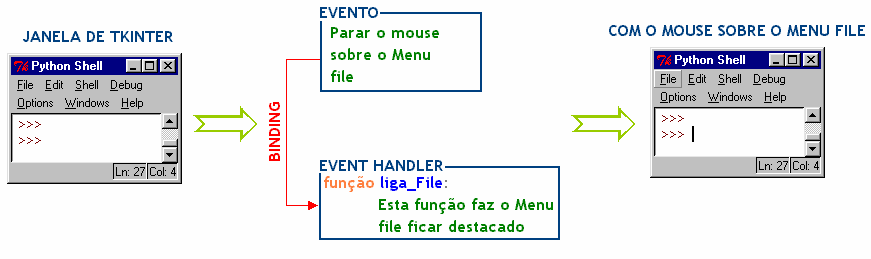

## 2. A classe Tk

Sempre que trabalharmos com Tkinter, importaremos todo o conteúdo deste módulo. A classe Tk também é importada, e é dela que conseguimos tirar os widgets com os quais montaremos nossa GUI. Nossas interfaces gráficas sempre serão estruturadas em forma de classes, e uma instância da classe Tk, que abaixo chamamos de raiz, sempre será passada como argumento do método construtor da nossa GUI. Veja tudo isso no nosso primeiro exemplo:

```Python
from Tkinter import *
class Janela:
    def __init__(self, instancia_de_Tk):
        pass
raiz = Tk()
Janela(raiz)
raiz.mainloop()
```

[^1]: *To bind*: ligar. Também nos referiremos ao processo de binding por “fazer binding”, “ligar”, “relacionar”, “atribuir”, etc.

A última linha faz com a instância o que chamamos de event loop. O método mainloop da instância raiz faz com que essa GUI fique eternamente aberta esperando pelo acontecimento de eventos. Se o evento ocorrido for, por exemplo, um clique numa área fora da GUI, nada ocorre, mas se o evento for algo como o pressionamento de um botão, o event handler correspondente será acionado. Com a aplicação do método mainloop, a janela fica aberta até que ocorra algum evento que a “destrua”, como um clique no botão **X** de fechar ou num botão “Fechar” que eventualmente possa existir.

Falando em botão **X**, veja como é cômodo trabalhar com Tkinter. Assim que você implementar nosso exemplo[^2], verá que os botões de minimizar, maximizar e fechar já são automaticamente colocados na sua GUI, além da barra de título e do símbolo característico do Tkinter – um Tk em vermelho na extrema esquerda da barra de título. Você deve ter observado o mesmo símbolo na janela do IDLE.

Aliás, como aplicação de Tkinter, o IDLE também possui seu próprio event loop que entrará em conflito com o das suas interfaces gráficas, por isso nunca rode seus programas em Tkinter no IDLE. Em vez disso, prefira clicar diretamente no ícone do programa onde você o salvou, ou simplesmente retire a sentença que impõe o mainloop às suas GUIs.

# Parte II — Montando a GUI

## 1. Hierarquia e pack

Tão importantes quando os widgets são os contêineres, que são os elementos da GUI – nem sempre visíveis – onde ajeitaremos os widgets. O mais comum é o *frame*.

[^2]: Não é necessário implementar os exemplos deste Módulo. Todos eles estão disponíveis para download a partir de [http://labaki.tk.](http://labaki.tk/)

Como pode haver uma estrutura bem complexa de contêineres (como um contêiner dentro do outro), define-se uma estrutura hierárquica para não perdermos o controle sobre esta estrutura. Digamos que na GUI o contêiner *Beta* esteja disposto dentro do contêiner *Alfa*. Ao definirmos *Beta*, o primeiro argumento será *Alfa*, o que indica que *Alfa* é “pai” (ou “mestre”) de *Beta*: contêinerBeta(*contêinerAlfa*,......).

Widgets seguem a mesma sintaxe: o primeiro argumento no instante da sua definição deve indicar quem é seu contêiner-pai – o contêiner dentro do qual o widget deverá estar situado.

O elemento máximo da hierarquia é a própria janela top-level, aquela que vem com os botões de fechar, barra de título, etc. Veja um esquema hierárquico:

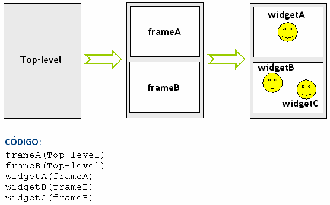

Após a definição de um contêiner ou widget, precisamos usar um gerenciador de geometria para indicar em que posição ele aparecerá dentro do seu mestre. Tkinter oferece três: *grid*, *pack* e *place*. Neste tutorial usaremos o *pack*, e bem no final falaremos sobre *grid*, mas você pode descobrir o gerenciador *place* consultando os livros recomendados ao final deste Módulo. Se nenhum gerenciador de geometria for aplicado ao widget, ele existirá, mas não será visível ao usuário! Neste caso o widget é chamado de *virtual* e serve, por exemplo, para criar uma GUI invisível que mesmo assim permitisse a atribuição de um evento a um procedimento.

## 2.    O contêiner *frame* e o widget *botão*

Criaremos um exemplo que envolverá os tipos mais comuns de contêiner e widget: *Frame* e *Button*. No exemplo, observe como o mestre do frame (a janela top- level) e do botão (o frame que chamamos de *fr1*)  são passados como primeiro argumento. A sintaxe ``self.fr1`` indica que o frame, com qualquer widget, é tratado como um atributo da instância da classe Tk. Observe também a utilização do *pack* para tornar os widgets e contêineres visíveis.

A sintaxe para criar um widget qualquer é *Nome_do_widget(mestre, opções de configuração)*. Ao longo deste Módulo conheceremos as principais opções de configuração disponíveis para alguns widgets. Por enquanto vamos configurar somente a cor e o texto do botão.

```Python
from Tkinter import *
class Janela:
    def __init__(self, toplevel):
        self.fr1 = Frame(toplevel)
        self.fr1.pack()
        self.botao = Button(self.fr1, text='Oi!', background='green')
        self.botao.pack()

raiz = Tk()
Janela(raiz)
raiz.mainloop()
```

**Resultado:**


Além desta janela, deve ter aparecido também uma janela preta do script de Python. Caso você não queira que ela seja visível, basta salvar seu arquivo com extensão *pyw*.

A  opção 'background' muda a cor de fundo do botão.  Em  vez  de  'background', poderíamos ter abreviado o nome como `bg'.

Os widgets guardam suas opções de configuração em forma de dicionários.

Por isso, também poderíamos configurar as opções do botão por meio de:

`self.botao['bg']='green'`

Um fato notável é que a janela diminuiu de tamanho em relação ao exemplo anterior. No primeiro exemplo, o tamanho da janela era o tamanho padrão de janelas sem widgets. A partir do momento em que um frame é adicionado, a janela passa a ter o tamanho do frame. Por outro lado, os frames são elásticos: seu tamanho é exatamente o tamanho dos widgets que eles contém.

Faça um teste. Use o mesmo exemplo, mas retire o botão (você não precisa apagar as linhas que o definem, basta não aplicar o método pack). A janela agora se reduz ao tamanho mínimo, não é?

Por outro lado, a adição de mais um botão faz o frame se esticar para comporta-los, como no exemplo seguinte. Neste exemplo, aproveite para observar a configuração de mais quatro opções do widget Button:

- ***height*** – serve para configurar qual é a altura do botão em número de linhas de texto;
- ***width*** – especifica a largura do botão em quantidade de letras;
- ***font*** – com esta você pode configurar a fonte do texto do botão através de uma tupla: (“tipo da fonte”, “tamanho”, “negrito”, “itálico”, ....);
- ***fg*** – o mesmo que *foreground*. Serve para configurar a cor do texto.

```Python
from Tkinter import *
class Janela:
    def __init__(self, toplevel):
        self.fr1 = Frame(toplevel)
        self.fr1.pack()

        self.botao1 = Button(self.fr1, text='Oi!')
        self.botao1['background'] = 'green'
        self.botao1['font'] = ('Verdana', '12', 'italic', 'bold')
        self.botao1['height'] = 3
        self.botao1.pack()

        self.botao2 = Button(self.fr1, bg='red', font=('Times', '16'))
        self.botao2['text'] = 'Tchau!'
        self.botao2['fg'] = 'yellow'
        self.botao2['width'] = 12
        self.botao2.pack()

raiz = Tk()
Janela(raiz)
raiz.mainloop()
```

**Resultado:**

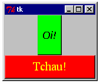

Veja como o frame ajusta seu tamanho automaticamente para comportar os dois botões. Observe a fonte do botão verde, Verdana tamanho 12 em itálico e negrito (bold), e a fonte do botão vermelho, Times New Roman tamanho 16. O botão verde possui agora três linhas de altura enquanto o vermelho têm 12 letras de largura, além do seu texto ser amarelo, como foi configurado através da opção “fg”. Antes de prosseguirmos, faça seus próprios testes com as seis opções que aprendemos até agora. Crie vários botões com várias cores, fontes e tamanhos. Será bom que você tenha traquejo nestas configurações, porque elas são muito usadas.

## 3. Posicionando widgets na GUI

O mais importante a observarmos no exemplo anterior é a disposição que os botões assumiram no frame. Quem determinou que o *botao2* se posicionasse sob o *botao1* foi o gerenciador de geometria que usamos, o *pack*.

Imagine que um frame seja uma cavidade onde encaixamos os widgets. O método pack possui um argumento *side* capaz de assumir quatro valores, LEFT (esquerda), RIGHT (direita), TOP (em cima) e BOTTOM (embaixo), que determinam em que lugar da cavidade o widget deve se posicionar.

Assim que um widget é posicionado, o espaço restante passa a ser a nova cavidade onde o próximo widget será posicionado, quando aplicarmos sobre ele o método pack. Não é tão simples observar isso porque o frame se encolhe sobre o primeiro widget, então o “espaço restante” é simplesmente imaginário. Quem sabe a figura a seguir não esclareça um pouco a questão?

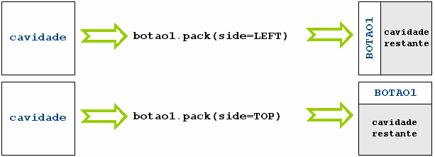

O valor padrão do argumento side é TOP. Por isso, quando aplicamos o método pack sobre os botões do exemplo anterior, o botão “Oi!” se posiciona no topo da cavidade, e o botão “Tchau!” se posiciona no topo da cavidade restante, isto é, abaixo do primeiro botão. Nunca aplique diferentes posicionamentos de widgets no mesmo frame! O efeito pode ser desastroso principalmente quando o usuário resolver redimensionar a janela (clicando no botão de maximizar, por exemplo). Em vez disso, crie vários frames, como no exemplo a seguir. Dentro de cada um deles, só um valor é aplicado à opção side, e mesmo assim conseguimos colocar os botões em posições variadas na GUI.

```Python
from Tkinter import *
class Packing:
    def __init__(self, instancia_Tk):

        self.container1 = Frame(instancia_Tk)
        self.container2 = Frame(instancia_Tk)
        self.container3 = Frame(instancia_Tk)
        self.container1.pack()
        self.container2.pack()
        self.container3.pack()

        Button(self.container1, text='B1').pack()
        Button(self.container2, text='B2').pack(side=LEFT)
        Button(self.container2, text='B3').pack(side=LEFT)
        self.b4 = Button(self.container3, text='B4')
        self.b5 = Button(self.container3, text='B5')
        self.b6 = Button(self.container3, text='B6')
        self.b6.pack(side=RIGHT)
        self.b4.pack(side=RIGHT)
        self.b5.pack(side=RIGHT)

raiz = Tk()
Packing(raiz)
raiz.mainloop()
```

**Resultado:**

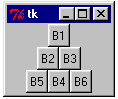

Criamos três frames, como você pôde ver. Aplicamos pack(side=TOP) sobre os três, então eles estão empilhados um sobre os outros. Como o valor padrão do argumento *side* é TOP, não precisávamos passar isso explicitamente. Novamente usando pack(side=TOP), criamos um botão posicionado no primeiro frame, que se dispõe no topo da sua cavidade. Dois outros botões são criados e posicionados no segundo frame, mas desta vez com a opção pack(side=LEFT). É por isso que o botão “B2” se posiciona à esquerda no frame e o botão “B3” se posiciona à esquerda da cavidade restante.

Agora preste atenção no que fizemos no terceiro frame. Três botões foram criados numa ordem (b4, b5, b6) e o método pack(side=RIGHT) foi aplicado sobre eles em ordem diferente. Veja que eles foram se posicionando à direita na cavidade do frame *container3* na ordem em que o método foi aplicado (b6, b4, b5).

Experimente! Crie vários botões e frames, e coloque-os em disposições diferentes na GUI; aplique o método pack em ordem diferente da que os widgets foram criados.

✎ *Há várias formas de alteração que você pode fazer no exemplo anterior de forma a deixa-lo como a figura a seguir. Eu consigo fazer isso alterando apenas dois caracteres! E você?*

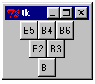

# Parte III — Binding

Já vimos que event handlers são as ações executadas em resposta a um evento. Estruturando nossa interface gráfica em classes, podemos escrever event handlers na forma de métodos – funções definidas dentro da classe.

O último passo é atribuir o evento ao event handler. Para isso usamos o método *bind* através da sintaxe *widget.bind( evento , event handler)*.

## 1. Eventos do mouse

O “evento” como um clique do mouse ou o pressionamento da tecla ENTER é passado como argumento do método *bind* como uma string. Por exemplo, se o evento é um clique com o botão esquerdo do mouse, a string é `"<Button-1>"`, e a string correspondente ao pressionamento da tecla ENTER é `"<Return>"`.

Digamos que um método chamado *muda_cor* deva ser executado quando alguém clicar com o botão esquerdo do mouse sobre o botão *botaoverde*. A sintaxe para fazer essa conexão evento/event handler seria:

`self.botaoverde.bind("<Button-1>", self.muda_cor)`

É o que fazemos no exemplo abaixo. Aproveitamos nosso poder de manipular características de widgets por meio de dicionários para alterar a cor de um botão assim que ele é clicado.

Aproveitamos a deixa para mostrar mais um tipo de *widget, Label,* com o qual podemos mostrar pequenos textos na tela. O *Label* possui todas as opções de configuração que você já conhece do Button (*text, width, etc.*).

```Python
from Tkinter import *
class Janela:
    def __init__(self, toplevel):

        self.frame = Frame(toplevel)
        self.frame.pack()

        self.texto = Label(self.frame, text='Clique para ficar amarelo')
        self.texto['width'] = 26
        self.texto['height'] = 3
        self.texto.pack()

        self.botaoverde = Button(self.frame, text='Clique')
        self.botaoverde['background'] = 'green'
        self.botaoverde.bind("<Button-1>", self.muda_cor)
        self.botaoverde.pack()

    def muda_cor(self, event):
        # Muda a cor do botao!
        if self.botaoverde['bg'] == 'green':
            self.botaoverde['bg'] = 'yellow'
            self.texto['text'] = 'Clique para ficar verde'
        else:
            self.botaoverde['bg'] = 'green'
            self.texto['text'] = 'Clique para ficar amarelo'

raiz = Tk()
Janela(raiz)
raiz.mainloop()
```

**Resultado:**

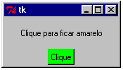

Um clique no botão verde chama o método *muda_cor* e a cor de fundo do botão muda para amarelo. Outro clique traz de volta a cor original.

Todo evento que ocorre em Tkinter gera um objeto *evento*. O objeto *evento* é um tipo especial de objeto contendo informações importantes sobre o evento ocorrido. Tais informações são fundamentais para os event handlers, por isso estes exigem que os objetos evento sejam passados como argumento, como você observa em `muda_cor(self, `**`event`**`)`.

Como só associamos o evento *`<Button-1>`* ao método, um clique com o botão direito do mouse não possui efeito sobre a GUI. Se quiséssemos o contrário, teríamos que usar a string *`<Button-3>`*, correspondente ao botão direito do mouse.

O primeiro argumento do método bind também pode ser uma tupla contendo os eventos na ordem em que eles devem ocorrer para que o event handler seja desencadeado. Se o código fosse

`self.botaoverde.bind(("<Button-1>","<Button-3>"), self.muda_cor)`

somente um clique com o botão esquerdo seguido de um clique no botão direito acionaria o método. Esta técnica é interessante se você quiser associar uma combinação de teclas a um evento.

Os widgets também são capazes de responder a eventos de mouse como simplesmente passar o ponteiro do mouse sobre o widget. Faça seus experimentos para ficar craque nisso. A string `"<ButtonRelease-X>"` corresponde a soltar o botão X do mouse (X pode ser igual a 1, 2 ou 3, mas nem todos os mouses possuem o botão do meio). A string `"<Motion>"` representa o evento de mover o ponteiro do mouse sobre o widget, enquanto `"<Leave>"` representa a retirada do ponteiro do widget.

## 2. Foco e eventos de teclado

O *foco* é o mecanismo que indica qual widget está respondendo em determinado momento pelos eventos de teclado. Dê uma olhada no gerenciador de arquivos do seu sistema operacional (Windows Explorer, por exemplo). Se você clicar no nome de um arquivo, verá que ele fica em destaque – com um retângulo pontilhado ao seu redor, talvez em azul. Este destaque é o meio escolhido pelo seu sistema operacional para indicar que aquele arquivo está em foco. Na ocasião de ocorrer o evento “pressionar DELETE”, somente o arquivo em foco será excluído. Você pode passar o foco para o arquivo seguinte pressionando TAB, ou voltar o foco para o anterior pressionando SHIFT+TAB, ou ainda clicando sobre o arquivo. Todos estes comportamentos exibidos pelos arquivos do seu sistema operacional são apresentados pelos widgets de Tkinter.

Um método importante quando se fala em foco em Tkinter é *widg1.focus_force()*, usado para passar o foco para o widget *widg1*.

Veja na tabela a string correspondente a alguns eventos comuns de teclado.

|Evento|String|
| :-: | :-: |
|ENTER|`"<Return>"`|
|DELETE|`"<Delete>"`|
|Backspace|`"<BackSpace>"`|
|ESC|`"<Escape>"`|
|Seta à esquerda|`"<Left>"`|
|Seta à direita|`"<Right>"`|
|Seta para cima|`"<Up>"`|
|Seta para baixo|`"<Down>"`|
|O widget ganha foco|`"<FocusIn>"`|
|O foco sai do widget|`"<FocusOut>"`|

Use a string `"<KeyPress-ALFA>"` para representar o pressionamento de uma tecla ALFA, e `"<KeyRelease-ALFA>"` para representar o usuário soltando esta tecla. Vale simplificar `"<KeyPress-ALFA>"` como "ALFA". Falando nisso, o interpretador também entende `"<Button-1>"` como `"<1>"`.

Há uns modificadores de evento importantes. Podemos usar os modificadores *Double* e *Triple* para representar duas ou três repetições de um evento em rápida sucessão. Isto é, podemos usar `"<Double-Button-1>"` para representar duplo clique com o botão esquerdo do mouse ou `"<Triple-KeyPress-P>"` para representar triplo pressionamento consecutivo da tecla P. O modificador *Any* serve para indicar o pressionamento de qualquer tecla ou botão do mouse; as strings correspondentes `"<Any-KeyPress>"` são e `"<Any-Button>"`, respectivamente.

Vejamos um exemplo com tudo o que acabamos de falar. Agora aprenderemos ainda três novas opções de configuração dos botões, *relief, padx e pady. Relief* serve para mudar o relevo do botão. Os valores-padrão a que estamos acostumados são SUNKEN quando o botão é pressionado e RAISED, caso contrário. Experimente os outros valores GROOVE, RIDGE e FLAT. Já *padx* e *pady* são os espaços extras que damos entre as bordas de widgets como *Button* e *Label* e o texto contido neles, veja:

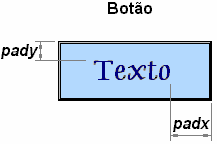

Vamos ao código... A primeira linha é adicionada para que a gente possa usar caracteres especiais, como acentos, ao longo do programa. Não deixe passar despercebido o *pack-unpack* que usamos para agilizar a determinação das características dos botões.

```Python
# -*- coding: cp1252 -*-
from Tkinter import *
class Janela:
    def __init__(self, toplevel):
        self.frame = Frame(toplevel)
        self.frame.pack()
        self.frame2 = Frame(toplevel)
        self.frame2.pack()

        self.titulo = Label(self.frame, text='VIDENTE 2005',
                            font=('Verdana', '13', 'bold'))
        self.titulo.pack()

        self.msg = Label(self.frame, width=40, height=6,
                         text='Adivinho o evento ocorrido!')
        self.msg.focus_force()
        self.msg.pack()
        # Definindo o botão 1
        self.b01 = Button(self.frame2, text='Botão 1')
        self.b01['padx'], self.b01['pady'] = 10, 5
        self.b01['bg'] = 'deepskyblue'
        self.b01.bind("<Return>", self.keypress01)
        self.b01.bind("<Any-Button>", self.button01)
        self.b01.bind("<FocusIn>", self.fin01)
        self.b01.bind("<FocusOut>", self.fout01)
        self.b01['relief'] = RIDGE
        self.b01.pack(side=LEFT)
        # Definindo o botão 2
        self.b02 = Button(self.frame2, text='Botão 2')
        self.b02['padx'], self.b02['pady'] = 10, 5
        self.b02['bg'] = 'deepskyblue'
        self.b02.bind("<Return>", self.keypress02)
        self.b02.bind("<Any-Button>", self.button02)
        self.b02.bind("<FocusIn>", self.fin02)
        self.b02.bind("<FocusOut>", self.fout02)
        self.b02['relief'] = RIDGE
        self.b02.pack(side=LEFT)

    def keypress01(self, event): self.msg['text'] = 'ENTER sobre o Botão 1'
    def keypress02(self, event): self.msg['text'] = 'ENTER sobre o Botão 2'
    def button01(self, event): self.msg['text'] = 'Clique sobre o Botão 1'
    def button02(self, event): self.msg['text'] = 'Clique sobre o Botão 2'
    def fin01(self, event): self.b01['relief'] = FLAT
    def fout01(self, event): self.b01['relief'] = RIDGE
    def fin02(self, event): self.b02['relief'] = FLAT
    def fout02(self, event): self.b02['relief'] = RIDGE

raiz = Tk()
Janela(raiz)
raiz.mainloop()
```

**Resultado:**

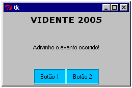

Ao definirmos o label *msg*, aplicamos sobre ele o *focus_force*. Por isso, quando o programa é iniciado, o foco é imediatamente passado para este widget. Você pode verificar que pressionar ENTER neste instante não chama event handler algum. Ao pressionarmos TAB, o foco é então passado para o widget definido logo após *msg*, que é o Botão 1. Você poderia ver isto pelo retângulo que circundaria o texto do botão. Agora sim, como relacionamos o pressionamento de ENTER sobre o Botão 1 ao event handler *keypress01*, este método será chamado, alterando o label *msg*.

Não deixe de notar que ligamos os eventos *`<FocusIn>`* e *`<FocusOut>`* ao Botão 1. É por isso que o relevo do botão muda no instante que o foco é dado ou retirado dele.

Conseguimos a disposição mostrada pela GUI (texto sobre texto e botão ao lado de botão) por meio da definição de dois frames. Lembre-se de nunca misturar a orientação do método *pack* no mesmo frame!

## 3. Command binding

Talvez você tenha percebido que quando se associa `<Button-1>` a um event handler, não é necessário soltar o botão do mouse para que o método seja executado. O pressionamento do botão do mouse já chama o event handler. Isto ocorre porque os eventos de *clicar* e *soltar* o botão do mouse num widget são eventos diferentes em Tkinter. A propósito, se você precisar associar o evento de *soltar* o botão do mouse a um event handler, a string é `"<ButtonRelease>"`.

O evento mais comum, mais esperado, quando se fala em interfaces gráficas, é o clique do mouse (desta vez, falamos de clique “completo” – clicar e soltar o botão do mouse), então deve haver uma forma mais rápida de se associar este evento corriqueiro a um event handler, sem a necessidade de aplicar o método bind... De fato, há: é o command binding. Este recurso permite associar o clique do mouse sobre um widget durante a própria definição do widget, como a seguir:

`Widget(master, ...., command = self.event_handler)`

No fim das contas, este binding se comporta como uma opção de configuração do widget, podendo ser designada através da sintaxe de dicionários:

`self.nome_do_widget['command']=self.event_handler`

Uma característica importante quando se usa este processo de associação é que desta vez o objeto *evento (event)* não precisa ser passado como argumento do event handler.

O exemplo seguinte confronta as duas maneiras de associação de eventos que agora conhecemos.

```Python
from Tkinter import *
class Janela:
    def __init__(self, toplevel):

        self.frame = Frame(toplevel)
        self.frame.pack()

        self.b1 = Button(self.frame)
        self.b1.bind("<Button-1>", self.press_b1)
        self.b1.bind("<ButtonRelease>", self.release_b1)
        self.b1['text'] = 'Clique em mim!'
        self.b1['width'], self.b1['bg'] = 20, 'brown'
        self.b1['fg'] = 'yellow'
        self.b1.pack(side=LEFT)

        self.b2 = Button(self.frame)
        self.b2['width'], self.b2['bg'] = 20, 'brown'
        self.b2['fg'] = 'yellow'
        self.b2.pack(side=LEFT)

        self.b3 = Button(self.frame, command=self.click_b3)
        self.b3['width'], self.b3['bg'] = 20, 'brown'
        self.b3['fg'] = 'yellow'
        self.b3.pack(side=LEFT)

    def press_b1(self, event):
        self.b1['text'] = ''
        self.b2['text'] = 'Errou! Estou aqui!'
    def release_b1(self, event):
        self.b2['text'] = ''
        self.b3['text'] = 'OOOpa! Mudei de novo!'
    def click_b3(self):
        self.b3['text'] = 'Ok... Você me pegou...'

instancia = Tk()
Janela(instancia)
instancia.mainloop()
```

**Resultado:**

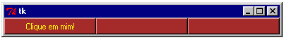

O botão da esquerda chama um event handler da forma que já conhecíamos. Clique nele sem soltar o botão do mouse e você verá que o texto do botão central já é modificado. Solte o botão do mouse e os textos mudarão novamente. O mesmo não acontece com o botão da direita. Clique nele sem soltar e você verá que nada acontece até que o botão do mouse seja solto.

# Parte IV — Campos de Dados

## 1. O widget *Entry*

O widget *Entry* é um meio de recolher entradas de dados do usuário. Os dados informados pelo usuário neste campo são captados em forma de string, exatamente como a nossa conhecida função raw_input faz. Através do método *get*, fornecido pelo Entry, podemos trabalhar com os dados de entrada dentro do código.

O Entry aceita todas as opções de configuração que já vimos com botões e labels, exceto *height* (porque a altura dos campos de dados é sempre de uma linha). Em campos de entrada de senhas, em que o texto digitado não pode aparecer na tela, podemos usar a opção *show*. Por exemplo, `show = '*' ` exibirá um asterisco na tela, em vez do caractere que o usuário está digitando.

O exemplo seguinte mostra um dispositivo para checagem de senhas. Observe como o método *get* é usado para recolher os valores fornecidos pelo usuário nos campos e a aplicação do método *show* para esconder a senha. Note que podemos usar a opção *pady* na configuração de um frame para dar um espaço extra entre suas bordas e os widgets dentro dele (caso contrário o botão ficaria colado ao campo de entrada de dados).

```Python
from Tkinter import *
class Passwords:
    def __init__(self, toplevel):

        self.frame1 = Frame(toplevel)
        self.frame1.pack()
        self.frame2 = Frame(toplevel)
        self.frame2.pack()
        self.frame3 = Frame(toplevel)
        self.frame3.pack()
        self.frame4 = Frame(toplevel, pady=10)
        self.frame4.pack()

        Label(self.frame1, text='PASSWORDS', fg='darkblue',
              font=('Verdana', '14', 'bold'), height=3).pack()

        fonte1 = ('Verdana', '10', 'bold')
        Label(self.frame2, text='Nome: ', font=fonte1, width=8).pack(side=LEFT)
        self.nome = Entry(self.frame2, width=10, font=fonte1)
        self.nome.focus_force()  # Para o foco começar neste campo
        self.nome.pack(side=LEFT)

        Label(self.frame3, text='Senha: ', font=fonte1, width=8).pack(side=LEFT)
        self.senha = Entry(self.frame3, width=10, show='*', font=fonte1)
        self.senha.pack(side=LEFT)

        self.confere = Button(self.frame4, font=fonte1, text='Conferir',
                              bg='pink', command=self.conferir)
        self.confere.pack()
        self.msg = Label(self.frame4, font=fonte1, height=3,
                         text='AGUARDANDO...')
        self.msg.pack()

    def conferir(self):
        NOME = self.nome.get()
        SENHA = self.senha.get()
        if NOME == SENHA:
            self.msg['text'] = 'ACESSO PERMITIDO'
            self.msg['fg'] = 'darkgreen'
        else:
            self.msg['text'] = 'ACESSO NEGADO'
            self.msg['fg'] = 'red'
            self.nome.focus_force()

instancia = Tk()
Passwords(instancia)
instancia.mainloop()
```

**Resultado:**

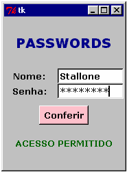

*✎ Responda rápido: o que digitei no campo de senha no caso acima?*

# Parte V — Canvas

O *Canvas* é um widget importantíssimo para a área científica e engenharia. Com ele podemos fazer simulações, plotagens, desenhos, criar nossos próprios widgets, e até mesmo <u>pequenas</u> animações, respeitando a velocidade de processamento do seu amigo PC. Imagine o canvas como uma prancheta onde você pode desenhar objetos como linhas, arcos, círculos e polígonos à vontade. Aqui veremos os principais tipos de objetos oferecidos pelo canvas do Tkinter: arco, linha, elipse, polígono, retângulo e texto.

Define-se um Canvas como se define qualquer outro widget. Ele tem as mesmas opções de configuração que botões e labels, inclusive duas que veremos no próximo exemplo: *bd* e *cursor*. Com a opção *bd* podemos especificar a espessura da borda de um widget, em pixels. *Cursor*, por sua vez, diz ao interpretador como deve aparecer o ponteiro do mouse quando ele estiver sobre o widget. Alguns valores disponíveis são *X_cursor, circle, dot, dotbox, fleur e target*. São 77 opções de cursor válidas para qualquer widget e você pode conhecer todas elas através dos livros recomendados ao final deste Módulo.

No exemplo você percebe que não somos escravos do contêiner *frame*. Já que só definimos dois widgets simples, pudemos cria-los diretamente na janela top-level. Aqui você aprende duas novas cores para enriquecer o seu vocabulário.

```Python
from Tkinter import *
class Kanvas:
    def __init__(self, raiz):
        self.canvas1 = Canvas(raiz, width=100, height=200, cursor='X_cursor',
                              bd=5, bg='dodgerblue')
        self.canvas1.pack(side=LEFT)
        self.canvas2 = Canvas(raiz, width=100, height=200, cursor='dot', bd=5,
                              bg='purple')
        self.canvas2.pack(side=LEFT)

instancia = Tk()
Kanvas(instancia)
instancia.mainloop()
```

**Resultado:**

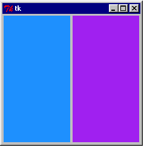

O espaço cinza que separa os cânvases e dá uma folga entre eles e a borda da janela é devido à opção *bd* que utilizamos.

É uma pena que não dê para mostrar os cursores na figura acima, mas implemente o exemplo e você verá como fica bonita a combinação – parece até um jogo, um pingue-pongue ou batalha naval...

## 1. Coordenadas

Tragicamente, o sistema de coordenadas do Canvas não é igual ao cartesiano.

Isso torna um pouco trabalhoso desenhar a maioria das figuras.

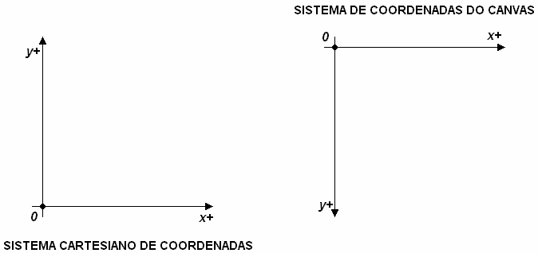

Costumo usar um recurso para contornar este problema. Ao definir um par contendo as coordenadas x e y de um desenho, lembre-se de que o par **(x, yc)** em coordenadas cartesianas corresponde a **(x, altura - yc)** em coordenadas do Canvas, sendo altura a altura do canvas. Difícil? Veja o exemplo:

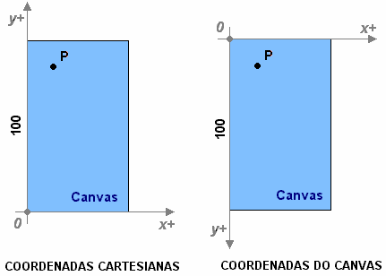

A altura desse canvas é **100**. As coordenadas cartesianas do ponto **P** são (10, 90). Assim, a conversão para coordenadas do Canvas ficará (10, **100** - 90) = (10, 10).

Usar esta forma ou simplesmente determinar as coordenadas diretamente nos termos do sistema do Canvas apresentam mais ou menos a mesma dificuldade; escolha a que mais agradar.

## 2. Linhas

A sintaxe para desenhar uma linha num canvas é

`self.nome_do_canvas.create_line(x1, y1, ...., xn, yn)`

Esta linha começa no ponto (x1, y1), segue até o ponto (x2, y2), (x3, y3) e assim por diante até terminar em (xn, yn). Os pontos podem ser passados isoladamente, ou em grupos dentro de tuplas ou listas, desse jeito:

`create_line(x1, y1, x2, y2, x3, y3, x4, y4, ......)` ou

`create_line((x1, y1), (x2, y2), (x3, y3), (x4, y4), ......)` ou

`create_line((x1, y1, x2, y2), (x3, y3, x4, y4), ......)`, e todas estas tuplas também poderiam ser listas. Isto facilita imensamente o trabalho quando os pontos de que dispomos já são tuplas ou listas. Ou seja, para desenhar uma linha entre P1 = (x1, y1) e P2 = (x2, y2), basta fazer *create_line*(P1, P2). Sem este recurso, teríamos que usar a intragável sentença *create_line*(P1[0], P1[1], P2[0], P2[1])...

Após esta seqüência de pontos dizendo por onde a linha deverá seguir, ainda podem vir algumas opções de configuração. As principais são *width*, que determina a espessura da linha e *fill*, para especificarmos sua cor.

No exemplo, há uma linha que começa no centro do canvas. Um trecho de comprimento 10 é desenhado na direção que o usuário indicar nos botões. Note que definimos um atributo para instância de Tk, *self.last*, que servirá para guardar a última posição assumida pela linha e incrementa-la mais facilmente.

Se vários widgets compartilharão as mesmas opções de configuração, você pode salva-las todas num dicionário e passa-lo como argumento na definição destes widgets. Por último, note que ordenamos que quando o ponteiro do mouse estiver sobre o canvas, deverá aparecer a ampulheta (*watch*).

```Python
from Tkinter import *
class Linhas:
    def __init__(self, raiz):
        self.canvas = Canvas(raiz, width=400, height=400, cursor='watch', bd=5)
        self.canvas.pack()
        self.frame = Frame(raiz)
        self.frame.pack()

        self.last = [200, 200]

        configs = {'fg': 'darkblue', 'bg': 'ghostwhite', 'relief': GROOVE,
                   'width': 11, 'font': ('Verdana', '8', 'bold')}
        self.b1 = Button(self.frame, configs, text='Esquerda',
                         command=self.left)
        self.b1.pack(side=LEFT)
        self.b2 = Button(self.frame, configs, text='Para cima', command=self.up)
        self.b2.pack(side=LEFT)
        self.b3 = Button(self.frame, configs, text='Para baixo',
                         command=self.down)
        self.b3.pack(side=LEFT)
        self.b4 = Button(self.frame, configs, text='Direita',
                         command=self.right)
        self.b4.pack(side=LEFT)

    def left(self):  # Desenha um segmento para a esquerda
        x, y = self.last[0] - 10, self.last[1]
        self.canvas.create_line(self.last, x, y, fill='red')
        self.last = [x, y]
    def up(self):  # Desenha um segmento para cima
        x, y = self.last[0], self.last[1] - 10
        self.canvas.create_line(self.last, x, y, fill='yellow')
        self.last = [x, y]
    def down(self):  # Desenha um segmento para baixo
        x, y = self.last[0], self.last[1] + 10
        self.canvas.create_line(self.last, x, y, fill='blue')
        self.last = [x, y]
    def right(self):  # Desenha um segmento para a direita
        x, y = self.last[0] + 10, self.last[1]
        self.canvas.create_line(self.last, x, y, fill='purple')
        self.last = [x, y]

instancia = Tk()
Linhas(instancia)
instancia.mainloop()
```

**Resultado:** a GUI resultante é grande demais para ser mostrada aqui e sua aparência não é tão instrutiva quanto seu funcionamento. Implemente este exemplo e veja quantos desenhos interessantes você pode fazer com este pequeno código (pequeno relativo aos programas em Tkinter).

Aqui não usamos nossa tática de conversão cartesiano-canvas porque este é um exemplo simples. Usaremos em outros exemplos.

## 3. Polígonos, retângulos e textos

Desenhamos um polígono num canvas como desenhamos linhas. A diferença é que o método aplicado ao canvas se chama *create_polygon* e que a linha deverá terminar no ponto em que começou. O interpretador reconhece que a área interna a esse perímetro fechado é o interior do polígono e é capaz de preenchê-lo com uma cor definida pela opção *fill*. Se o que você quer é mudar a cor e espessura da linha externa, pode usar as opções *outline* e *width*.

Retângulos são ainda mais fáceis de desenhar. Só precisamos informar as coordenadas de dois vértices opostos e pronto! O método é o *create_rectangle* e pode ser aplicado ao desenho de quadrados. As opções *fill*, *width* e *outline* também estão disponíveis.

Podemos adicionar textos aos canvas de uma maneira bem simples. Sintaxe:

`self.nome_do_canvas.create_text(x, y)`

O texto, definido pela opção *text*, será posicionado em (x,y). Imagine que o texto a ser mostrado esteja contido num retângulo, como na figura abaixo.

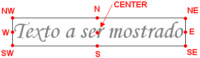

Através da opção *anchor*, podemos especificar qual destes pontos do retângulo está sobre a coordenada (x,y) que informamos. Digamos que anchor=SW e definimos a posição do texto em (100, 100). Assim, a borda esquerda inferior do texto ficará em (100, 100). O valor padrão de *anchor* é CENTER.

A opção *font* que já conhecemos dos botões e labels também pode ser aplicada aqui, e a cor do texto pode ser mudada com a opção *fill*.

A menos que seja definido um valor para a opção *width*, o texto será escrito todo em uma única linha. Com *width* determinamos o comprimento máximo que as linhas de texto podem assumir. Se necessário, a sentença é quebrada entre as palavras para cumprir esta configuração. Quando isto ocorre, pode ser interessante definir que alinhamento as linhas devem assumir entre si. A opção que determina isso é *justify*, cujos valores são LEFT (alinhadas à esquerda – o valor padrão), CENTER (centralizadas) e RIGHT (alinhadas à direita).

No próximo exemplo usamos a técnica de conversão cartesinana-canvas. Precisamos desenhar um pentágono usando *create_polygon* e nos pareceu maçante ter que pensar nas coordenadas das cinco pontas em termos do Canvas. Melhor projetar o pentágono como estamos acostumados e depois converter os valores. Veja o projeto em coordenadas cartesianas:

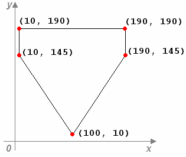

Este pentágono será desenhado num canvas de altura 200. Dessa forma, a coordenada (100, 10) terá que ser implementada como (100, 200-10) = (100, 190), e assim por diante. Claro que não fizemos todas estas continhas para cada par ordenado; simplesmente salvamos a altura 200 sob o nome *altura* e simplesmente escrevemos nossas coordenadas cartesianas como (100, *altura* – 10), por exemplo.

Neste programa é importante observar que atribuímos toda a sentença

*self.canvas.create_polygon* a um nome, pol, para agilizar o uso deste método.

```Python
from Tkinter import *
class SPFC:
    def __init__(self, raiz):
        self.canvas = Canvas(raiz, width=200, height=200, bg='dodgerblue')
        self.canvas.pack()

        altura = 200  # Altura do canvas

        pol = self.canvas.create_polygon
        ret = self.canvas.create_rectangle
        pol(100, altura - 10, 10, altura - 145, 10, altura - 190, 190,
            altura - 190, 190, altura - 145, 100, altura - 10, fill='white')
        ret(15, altura - 150, 185, altura - 185, fill='black')
        pol(20, altura - 140, 95, altura - 140, 95, altura - 30, 20,
            altura - 140, fill='red')
        pol(105, altura - 30, 105, altura - 140, 180, altura - 140, 105,
            altura - 30, fill='black')
        self.canvas.create_text(100, altura - 167.5, text='S P F C',
                                font=('Arial', '26', 'bold'), anchor=CENTER,
                                fill='white')

instancia = Tk()
SPFC(instancia)
instancia.mainloop()
```

**Resultado:**

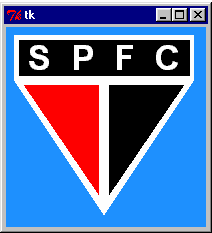

Já vou avisando que não sou são-paulino! Simplesmente o logotipo me pareceu fácil de desenhar. Aliás, acho que um torcedor de verdade não desenharia seu logotipo do coração tão desproporcional...

Note que definimos as coordenadas do texto “SPFC” como sendo o centro do retângulo branco. Ao definirmos *anchor* = CENTER (não seria necessário, já que este é o valor padrão), garantimos de uma forma simples que o texto ficasse centralizado no retângulo. Mude os valores da opção *anchor* e veja como o texto se comporta.

## 4. Elipses e arcos

Quando usamos o método *create_oval* para desenhar elipses, trabalhamos com os mesmos conceitos de *create_rectangle*. Desta vez, forneceremos as coordenadas de vértices opostos de um retângulo imaginário, dentro do qual ficará a elipse desejada, como mostra a figura seguinte.

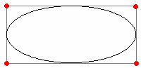

Podemos fornecer as coordenadas de dois vértices quaisquer do retângulo, desde que eles sejam opostos.

Usa-se o mesmo recurso para desenhar círculos; a diferença é que neste caso o retângulo será um quadrado.

O desenho de arcos acontece de forma semelhante. As coordenadas dos vértices do retângulo que conterão o arco devem ser informadas, mas são as opções de configuração que vão determinar a aparência do arco. Considere o centro do retângulo como o centro de curvatura do arco:

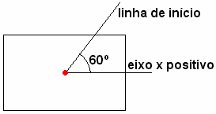

Por meio da opção *start*, dada em graus a partir do eixo x positivo e em sentido anti-horário, determinamos qual a linha a partir da qual o arco começa a ser desenhado. Exemplo: na figura acima, faríamos start=60.

A outra opção fundamental é *extent*, dada em graus a partir da linha de início e em sentido anti-horário, para determinar até que linha o arco será desenhado. Veja na próxima figura o exemplo usando *extent*=90 e o arco já desenhado.

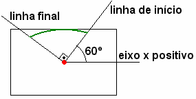

Por último, há a opção *style* para determinar o estilo do arco. Os valores podem ser ARC, CHORD e PIESLICE (o padrão).

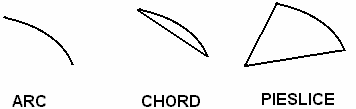

O exemplo seguinte é um programinha para crianças aprenderem porcentagens com tortas. Estamos acostumados a salvar o valor da altura do canvas num nome para facilitar nosso senso de coordenadas. Como este valor também é usado dentro de um event handler, melhor transformar esta altura num atributo da instância por meio de *self.altura*. Não deixe de notar também:

- A tupla contendo as configurações de fonte que seriam usadas em vários widgets foi salva sob um nome, só para não termos que reescreve-la toda hora;
- O valor de porcentagem *p* dado pelo usuário é convertido em termos de porcentagem do círculo (quantos graus equivalem a *p* por cento de 360º?) dentro do event handler. Para isso é necessário converter em float a string informada. Nunca se esqueça de que qualquer valor digitado no widget Entry é uma string!;
- Logo depois de o arco ser desenhado, o event handler retorna o foco para o campo de dados.

```Python
# -*- coding: cp1252 -*- 
from Tkinter import *
class Fatias:
    def __init__(self, raiz):
        self.canvas = Canvas(raiz, width=200, height=200)
        self.canvas.pack()
        self.frame = Frame(raiz)
        self.frame.pack()

        self.altura = 200  # Altura do canvas

        self.canvas.create_oval(25, self.altura - 25, 175, self.altura - 175,
                                fill='deepskyblue', outline='darkblue')
        fonte = ('Comic Sans MS', '14', 'bold')
        Label(self.frame, text='Fatia: ', font=fonte, fg='blue').pack(side=LEFT)
        self.porcentagem = Entry(self.frame, fg='red', font=fonte, width=5)
        self.porcentagem.focus_force()
        self.porcentagem.pack(side=LEFT)
        Label(self.frame, text='%', font=fonte, fg='blue').pack(side=LEFT)
        self.botao = Button(self.frame, text='Desenhar', command=self.cortar,
                            font=fonte, fg='darkblue', bg='deepskyblue')
        self.botao.pack(side=LEFT)

    def cortar(self):

        arco = self.canvas.create_arc
        fatia = float(self.porcentagem.get()) * 359.9 / 100.
        arco(25, self.altura - 25, 175, self.altura - 175, fill='yellow',
             outline='red', extent=fatia)
        self.porcentagem.focus_force()

instancia = Tk()
Fatias(instancia)
instancia.mainloop()
```

**Resultado:**

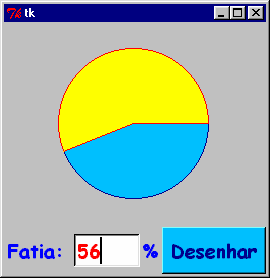

Na figura acima vemos o programa mostrando uma fatia de 56% da torta. Veja como as letras são grandes e coloridas – tudo direcionado ao público infantil que usaria esta GUI.

É uma pena que toda vez que a gente queira representar uma nova porcentagem, tenha que fechar esta janela e abrir outra. Como será que faríamos para apagar o arco que representa essa fatia de 56% e desenhar outro com porcentagem qualquer?

## 5. Gerenciamento de objetos do Canvas

Assim que um objeto é criado num canvas, recebe automaticamente um ID – um número inteiro para diferencia-lo dos demais. O *n*-ésimo objeto desenhado tem ID *n*. Quando se insere um objeto num canvas, ele se dispõe *sobre* os desenhados anteriormente. Assim, os menores IDs pertencem aos objetos que estão mais próximo do fundo do canvas (o “background”):

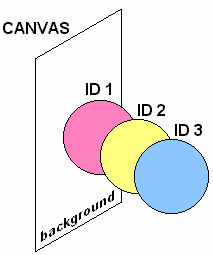

O canvas oferece dois métodos muito importantes para gerenciar seus objetos: *find_all()*, que retorna uma tupla com o ID de todos os objetos e *delete*(X1, X2, ...., Xn) que apaga do canvas os objetos de ID *X1, X2, ..., Xn*. Este último método é capaz de receber os IDs em forma de strings de inteiros, isto é, “1”, “2”, etc.

Num canvas com dezenas de objetos, algum pode ter relevância grande demais para ser identificado simplesmente com um número. Por isso, também podemos identificar os objetos por meio de strings chamadas *tags*. A rigor, *tag* se comporta como uma opção de configuração definida no instante em que os widgets são criados. Se você quer criar um círculo e chamá-lo de “bola1”, basta fazer

`self.nome_do_canvas.create_oval(coord., opções, tag = "bola1")`

A *tag* de um objeto também pode ser usada como argumento do método *delete*, além do ID.

Discussão importante: quando desenhamos uma linha, será que cada segmento recebe um ID, ou a linha toda possui a mesma identificação? Uma forma de não errar nunca este tipo de questão é lembrar-se de que cada aplicação de um método como *create_line* e *create_polygon* gera somente um ID (ou tag, se você quiser) que nomeia toda a seqüência de segmentos, por maior que seja. Por isso tome cuidado ao criar uma linha repleta de segmentos com uma única aplicação do método gerador, porque o método delete apagaria todos eles!

No próximo exemplo fazemos um relógio de verdade! Ele usa uma função do módulo *time* para saber que horas são no seu computador, e mostra isso numa simulação (feia, é verdade) de um rádio-relógio. Veja como a opção *outline* = '' é usada para determinar que a borda das figuras seja transparente.

```Python
# -*- coding: cp1252 -*- 
from Tkinter import *
from time import localtime
class Horas:
    def __init__(self,raiz):

        self.canvas=Canvas(raiz, width=200, height=100)
        self.canvas.pack()
        self.frame=Frame(raiz)
        self.frame.pack()

        self.altura = 100 # Altura do canvas

        # Desenho do relógio-----------------------------
        pol=self.canvas.create_polygon 
        ret=self.canvas.create_rectangle 
        self.texto=self.canvas.create_text 
        self.fonte=('BankGothic Md BT','20','bold') 
        pol(10, self.altura-10,40, self.altura-90,160, self.altura-90,190, self.altura-10, fill='darkblue') 
        pol(18, self.altura-15,45, self.altura-85,155, self.altura-85,182, self.altura-15, fill='dodgerblue') 
        ret(45, self.altura-35,90, self.altura-60, fill='darkblue', outline='')
        ret(110, self.altura-35,155, self.altura-60, fill='darkblue', outline='')
        self.texto(100, self.altura-50, text=':',font=self.fonte, fill='yellow')
        # Fim do desenho do relógio-----------------------

        self.mostrar=Button(self.frame, text='Que horas são?',command=self.mostra, font=('Comic Sans MS', '11', 'bold'), fg='darkblue', bg='deepskyblue')
        self.mostrar.pack(side=LEFT)

    def mostra(self):

        self.canvas.delete('digitos_HORA')
        self.canvas.delete('digitos_MIN')
        HORA = str( localtime()[3] )
        MINUTO = str( localtime()[4] )
        self.texto(67.5, self.altura-50, text=HORA, fill='yellow', font=self.fonte, tag='digitos_HORA')
        self.texto(132.5, self.altura-50, text=MINUTO, fill='yellow', font=self.fonte, tag='digitos_MIN')

instancia=Tk()
Horas(instancia)
instancia.mainloop()
```

**Resultado:**

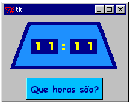

Quando perguntamos a hora, é necessário que o event handler correspondente apague o valor mostrado, senão os textos ficariam sobrepostos. Por isso, demos um nome (uma tag) aos textos correspondentes às horas e aos minutos. Dessa forma, somos capazes de apagar somente estes dois objetos, sem ter que redesenhar todo o rádio-relógio, que é composto de vários polígonos, retângulos e um texto que mostra os dois pontos entre as horas e os minutos (em amarelo na GUI).

*✎   O chato nessa GUI é que você tem que esperar um minuto para o valor mudar... Redesenhe o relógio para mostrar horas, minutos e segundos!*

*✎ Vá pensando aí como você escreveria a GUI de um relógio de ponteiros. Não precisa implementar porque há um exercício adiante que pede isso, mas vá separando na sua cabeça os ingredientes necessários!*

Os widgets como botões e entries estão para o frame assim como os objetos de desenho estão para o canvas. Isso faz do Canvas um contêiner de comportamento semelhante ao frame, inclusive o foco de teclado não passa por ele. No entanto, por meio da opção de configuração *takefocus*=1, podemos inclui-lo na lista dos widgets por onde o foco passará. Assim podemos atribuir eventos de teclado sobre um canvas, por exemplo, para mover um de seus objetos para a direita quando o usuário pressionar [→].

Quer dizer que é possível mover um objeto do Canvas??? Pois é... O Canvas possui um método, *move*(tag ou ID, incX, incY), que desloca o objeto cuja tag ou ID foi dada de uma posição (X, Y) para uma nova posição (X + incX, Y + incY).

Opa!!! Não vamos nos esquecer que o sistema de coordenadas do Canvas é de cabeça para baixo! Um incremento Y positivo faria o objeto ***descer*** no canvas e nosso cérebro cartesiano pirar. Se você quiser que o objeto ***suba*** incY em vez de descer este valor, basta informar um valor negativo para este incremento.

O próximo exemplo mostra ainda o método *focus*(tag ou ID), com o qual podemos passar o foco para um objeto do canvas. Observe também uma técnica fantástica de “agrupar” objetos: se atribuirmos a mesma tag a vários objetos, qualquer ação executada sobre a tag será sentida por todo o grupo de objetos.

```Python
from Tkinter import *
class Pacman:
    def __init__(self, raiz):
        self.canvas = Canvas(raiz, height=200, width=200, takefocus=1,
                             bg='deepskyblue', highlightthickness=0)
        self.canvas.bind('<Left>', self.esquerda)
        self.canvas.bind('<Right>', self.direita)
        self.canvas.bind('<Up>', self.cima)
        self.canvas.bind('<Down>', self.baixo)
        self.canvas.focus_force()
        self.canvas.pack()

        # Desenho da carinha----------------------------------
        self.canvas.create_oval(90, 90, 110, 110, tag='bola', fill='yellow')
        self.canvas.create_oval(93, 100, 98, 95, tag='bola', fill='blue')
        self.canvas.create_oval(102, 100, 107, 95, tag='bola', fill='blue')
        self.canvas.create_arc(92, 87, 108, 107, tag='bola', start=220,
                               extent=100, style=ARC)
        # Fim do desenho da carinha----------------------------

    def esquerda(self, event): self.canvas.move('bola', -10, 0)
    def direita(self, event): self.canvas.move('bola', 10, 0)
    def cima(self, event): self.canvas.move('bola', 0, -10)
    def baixo(self, event): self.canvas.move('bola', 0, 10)

instancia = Tk()
Pacman(instancia)
instancia.mainloop()
```

**Resultado:**

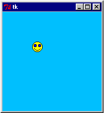

A opção *highlightthickness* pode ser aplicada a qualquer widget e serve para determinar a espessura da linha daquele retângulo que mostra que o widget está em foco. Neste canvas, dizemos que a espessura dessa linha é zero para evitar que a sua cor padrão (preto) estragasse a aparência da GUI. Embora o retângulo não apareça, o canvas aqui está sempre em foco.

Tanto a rosto amarelo quando os olhos azuis e a boca dessa carinha foram atribuídos à mesma tag “bola”. Assim, os event handlers podem mover todo o conjunto de uma vez só, simplesmente se referindo a essa tag.

Atenção! O uso continuado do command binding pode nos fazer esquecer de que quando usamos o processo de event binding (por meio do método *bind*) somos obrigados a passar o objeto evento como argumento dos event handlers. Este argumento se faz necessário neste exemplo porque atribuímos o uso das quatro teclas direcionais do teclado aos métodos.

# Parte VI — Recursos Diversos

Vejamos uma miscelânea de recursos interessantes que Tkinter oferece...

## 1. Métodos da janela *Top-level*

A janela top-level também possui opções de configuração. Por exemplo, você também pode definir que tipo de cursor deve aparecer quando o ponteiro do mouse estiver sobre ela, pode definir largura e altura da janela, ou ainda o seu relevo, tudo exatamente como estamos acostumados a fazer com widgets.

Há três métodos que dizem respeito ao tamanho da janela. Com o primeiro, *maxsize(width*=largura_máxima, *height*=altura_máxima), escolhemos qual o tamanho máximo admitido pela janela. É possível impedir, por exemplo, que um clique no botão maximizar estenda a janela pela tela toda. O contrário também vale. O método *minsize(width*=largura_mínima, *height*=altura_mínima) determina que a janela não tenha dimensões menores que as dadas. Isto pode ser útil para evitar que o usuário redimensione a janela e esconda acidentalmente algum widget. Por fim, com o método *resizable* atribuímos um booleano aos parâmetros width e height para dizer se a janela poderá ou não ser redirecionada na largura ou na altura. Por exemplo, *resizable(width=True, height=False)* determina que a janela pode ter somente sua largura (width) aumentada ou diminuída pelo usuário.

Para completar, o método *title* é o responsável pelo título da janela, que aparece tanto na barra de título quanto no rodapé do seu monitor quando a janela é minimizada. O parâmetro esperado é uma string.

O exemplo seguinte ilustra duas janelas. A primeira não pode ser redimensionada e a outra possui tamanhos máximo e mínimo. O Canvas é definido só para que o tamanho inicial da janela não seja o padrão. Note que criamos duas classes, uma para cada janela, e também duas instâncias diferentes da classe Tk. O método *mainloop* é aplicado a cada uma delas.

```Python
# -*- coding: cp1252 -*- 
from Tkinter import *
class Nao_Redimensiona:
    def __init__(self, janela):
        janela.resizable(width=False, height=False)
        janela.title('Não redimensiona!')
        Canvas(janela, width=200, height=100, bg='moccasin').pack()

class Tamanhos_Limite:
    def __init__(self, janela):
        janela.maxsize(width=300, height=300)
        janela.minsize(width=50, height=50)
        janela.title('Tamanhos limitados!')
        Canvas(janela, width=200, height=100, bg='moccasin').pack()

inst1, inst2 = Tk(), Tk()
Nao_Redimensiona(inst1)
Tamanhos_Limite(inst2)
inst1.mainloop()
inst2.mainloop()
```

**Resultado:**

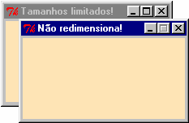

Repare: quando ordenamos que a janela não seja redimensionável para lado nenhum, o botão maximizar da barra de título sequer aparece! Por outro lado, quando clicamos no botão maximizar da outra janela, ela assume imediatamente o tamanho máximo permitido, 300 por 300.

Repare também como o Canvas se mantém impassível às mudanças de tamanho da janela top-level. É para que você notasse isso que tornamo-lo colorido.

## 2. Colorindo a GUI

Ao longo dos exemplos deste Módulo, você ficou conhecendo algumas opções de cores que o Tkinter admite para os itens da interface gráfica. São elas: white, blue, black, green, red, yellow, brown, pink, purple, darkgreen, e mesmo umas de nomes esquisitos como moccasin, deepskyblue (azul céu profundo), dodgerblue (azul “esquivo”?) e ghostwhite (branco fantasma). Experimente também *navajowhite* (parecida demais com o moccasin), *limegreen* (um verde bonito, mas muito berrante), *floralwhite* e *papayawhip*. Todas estas cores de nomes compostos podem ser escritas também como *Navajo White, navajo white* ou *NavajoWhite*. Você pode encontrar mais nomes de cores interessantes na internet.

Além destes nomes práticos, Tkinter admite que as cores sejam dadas pelo formato RGB. O sistema é um pouco chato porque a intensidade das cores vermelho, verde e azul que formarão a cor desejada tem que ser dada em números hexadecimais. Há uma tática para resolver isso apresentada pelo livro “An Introduction to Tkinter”. Simplesmente faça:

`"#%02x%02x%02x" % (intens_vermelho, intens_verde, intens_azul)`

A tupla contém a intensidade das cores básicas na forma de inteiros entre 0 e 255. A string resultante (parecida com #38c602) pode ser usada como parâmetro no lugar do nome das cores, quando você quiser definir um widget. Para produzir o branco, basta usar intensidade máxima das cores – (255, 255, 255), e o preto é formado pela intensidade mínima – (0, 0, 0).

O programa seguinte não é só um exemplo para aprendizado; ele servirá também para você fazer combinações de intensidade de cores básicas até achar uma combinação interessante para sua GUI. Nele, a cor do círculo central é calculada por meio da técnica mostrada acima, a partir da intensidade de cores informadas pelo usuário. Você pode checar se o resultado ficou agradável pelo próprio círculo. Se gostar, é só copiar a string mostrada à direita do botão e usar no seu código.

```Python
from Tkinter import *
class Palheta:
    def __init__(self,raiz):

        raiz.title("Palheta")
        self.canvas=Canvas(raiz, width=200, height=200)
        self.canvas.pack()
        self.frame=Frame(raiz)
        self.frame.pack()

        self.canvas.create_oval(15, 15, 185, 185,fill='white', tag='bola')

        Label(self.frame,text='Vermelho: ').pack(side=LEFT)
        self.vermelho=Entry(self.frame, width=4)
        self.vermelho.focus_force()
        self.vermelho.pack(side=LEFT)
        Label(self.frame,text='Verde: ').pack(side=LEFT)
        self.verde=Entry(self.frame, width=4)
        self.verde.pack(side=LEFT)
        Label(self.frame,text='Azul: ').pack(side=LEFT)
        self.azul=Entry(self.frame, width=4)
        self.azul.pack(side=LEFT)

        Button(self.frame, text='Mostrar', command=self.misturar).pack(side=LEFT)

        self.rgb=Label(self.frame, text='', width=8,font=('Verdana','10','bold'))
        self.rgb.pack()

    def misturar(self):
        cor="#%02x%02x%02x" %(int(self.vermelho.get()),int(self.verde.get()),int(self.azul.get()))
        self.canvas.delete('bola')
        self.canvas.create_oval(15, 15, 185, 185,fill=cor, tag='bola')
        self.rgb['text'] = cor
        self.vermelho.focus_force()

inst = Tk()
Palheta(inst)
inst.mainloop()
```

**Resultado:**

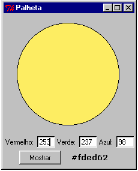

Se você gostou desse amarelo meio esverdeado com um toque (pequeno) de azul e quer coloca-lo como cor de fundo de um botão, é só fazer *bg = “#fded62”*.

*✎	Faça um tratamento de erros adequado para evitar que o usuário entre com valores fora da faixa 0-255 ou com tipos inválidos de dados.*

## 3. Como descobrir a posição do mouse

Todos os widgets possuem quatro métodos que atuando em conjunto permitem determinar a posição em que um clique ocorreu. Os exemplos serão dados através de cânvases porque nesse tipo de widgets estes procedimentos são mais úteis, mas os mesmos conceitos valem para qualquer widget.

Os métodos *winfo_rootx()* e *winfo_rooty()* retornam as coordenadas *x* e *y* do canto noroeste do canvas em relação a um sistema de coordenadas do seu mestre (um frame ou a própria janela top-level), cuja posição e orientação não vem ao caso. Os outros dois, *winfo_pointerx()* e *winfo_pointery()*, dão a posição em que ocorreu um clique em relação ao sistema “desconhecido” de coordenadas do seu mestre. O pulo do gato é que a simples subtração do resultado destes quatro métodos nos dá a posição do clique em termos do sistema de coordenadas do Canvas, nosso velho amigo.

Seja *C1* um canvas na sua aplicação gráfica. Seja

`x_absoluto = C1.winfo_pointerx()` e

`x_origem = C1.winfo_rootx()`. Então, *x_absoluto – x_origem* é o ponto em questão no sistema de coordenadas do Canvas.

Passou pela sua cabeça a utilidade de descobrir a posição em que ocorreu o clique? Se não, veja uma das utilidades mais básicas com o próximo exemplo. Nele, usamos esta técnica para permitir ao usuário desenhar linhas à vontade, simplesmente clicando em dois pontos na tela. As coordenadas de desenho da linha são retiradas da posição dos cliques do usuário.

```Python
from Tkinter import *
class AutoCADE:
    def __init__(self, raiz):
        raiz.title('AutoCADÊ')
        self.canvas = Canvas(raiz, width=300, height=300, bg='#beff8c',
                             cursor='hand2')
        self.canvas.bind('<1>', self.desenhar)
        self.canvas.pack()

    def desenhar(self, event):
        x_origem = self.canvas.winfo_rootx()
        y_origem = self.canvas.winfo_rooty()
        x_abs = self.canvas.winfo_pointerx()
        y_abs = self.canvas.winfo_pointery()
        try:
            P = (x_abs - x_origem, y_abs - y_origem)
            self.canvas.create_line(self.ultimo_P, P)
            self.ultimo_P = P
        except:
            self.ultimo_P = (x_abs - x_origem, y_abs - y_origem)

inst = Tk()
AutoCADE(inst)
inst.mainloop()
```

**Resultado:**

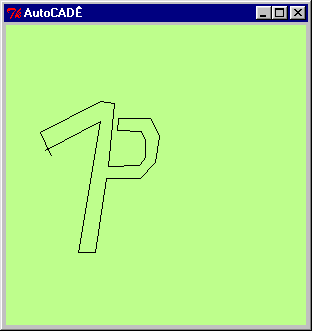

Em particular, o Canvas possui um método para determinar que objeto está mais próximo de onde houve um clique. O método é o *find_closest*, cujos argumentos são as coordenadas (x,y) e o valor retornado é o ID do objeto mais próximo de (x,y).

O próximo exemplo é uma adaptação da antiga palheta de cores que fizemos. Desta vez, o usuário deve clicar em um dos três círculos contendo as cores básicas. O método *find_closest* descobre em qual deles houve o clique. Se houve um clique num círculo de cor *x*, então a intensidade da cor *x* no círculo maior é incrementada em 10. Quando a janela é aberta, o círculo grande é preto (intensidade 0,0,0). Digamos que o usuário dê dois cliques no círculo azul e um no vermelho; o círculo maior terá tonalidade 10, 0, 20 (devidamente convertido para hexadecimais como já aprendemos).

```Python
# -*- coding: cp1252 -*- 
from Tkinter import *
class Palheta2:

    def __init__(self,raiz): 
        raiz.title('Palheta Gráfica')
        self.canvas=Canvas(raiz, width=200, height=200) 
        self.canvas.bind('<1>', self.misturar) 
        self.canvas.pack()
        bola = self.canvas.create_oval
        bola(20,180,70,130, fill='red', outline='') 
        bola(75,180,125,130, fill='green', outline='') 
        bola(130,180,180,130, fill='blue', outline='') 
        bola(45, 120, 155, 10, fill='white',outline='', tag='bola') 
        self.tom=[0,0,0]

    def misturar(self,event): 
        xo=self.canvas.winfo_rootx() 
        yo=self.canvas.winfo_rooty() 
        xa=self.canvas.winfo_pointerx() 
        ya=self.canvas.winfo_pointery() 
        cor=self.canvas.find_closest(xa-xo, ya-yo)[0] 
        self.tom[cor-1] = self.tom[cor-1]+10        
        cor="#%02x%02x%02x" %(self.tom[0],self.tom[1],self.tom[2]) 
        self.canvas.delete('bola') 
        self.canvas.create_oval(45, 120, 155, 10, fill=cor,outline='', tag='bola')

inst = Tk() 
Palheta2(inst) 
inst.mainloop()
```

**Resultado:**

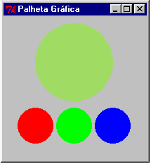

Novamente, é necessário um tratamento de erros adequado. Veja que mais de 26 cliques em qualquer dos círculos pequenos resulta um erro, porque exige intensidades inexistentes da cor em questão, maiores que 255.

Use a técnica do *find_closest* sempre que quiser permitir ao usuário mover um objeto simplesmente clicando nele. Aqui é especialmente interessante lembrar que pressionar o botão do mouse e soltá-lo são eventos diferentes. Você pode usar o evento “pressionar” para descobrir qual objeto o usuário deseja mover e o evento “soltar” para ter as coordenadas da nova posição do objeto. Qualquer aplicativo para desenho apresenta este procedimento, chamado *drag-and-drop* (arrastar-e-soltar).

## 4. Gerenciador de geometria *Grid*

Quando uma GUI contém muitos widgets e eles devem ficar alinhados verticalmente e/ou horizontalmente, o método pack não dá muita conta do recado. É bem mais fácil fazer isso com o método *grid*, outro gerenciador de geometria oferecido por Tkinter. O grid tem uma vantagem marcante que com ele podemos combinar widget empilhados com widgets lado a lado sem para isso criar diversos contêineres.

Este gerenciador funciona pela definição de células imaginárias no contêiner. Pelos argumentos *row* (linha) e *column* (coluna), determinamos em qual destas células o widgets estará disposto. Por exemplo, a aplicação de *w1.grid(column=1, row=1)* e *w2.grid(column=1, row=2)* cria imediatamente duas linhas. O widget w1 ficará na primeira linha e w2 ficará na segunda.

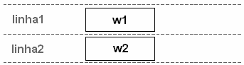

Criemos um terceiro widget que compartilhará a mesma linha de w2. Para isto, é necessária a criação de mais uma coluna: *w3.grid(column=2, row=2)*. O widget w3 ficará na linha 2, coluna 2.

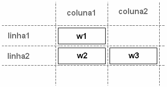

Aqui ficou feio porque *w1* só ocupa a célula onde foi definido. Para fazer com que ele ocupe também a segunda coluna, usamos o argumento *columnspan*, que determina quantas colunas ele deve ocupar. Se usássemos columnspan=2, a disposição dos widgets seria essa:

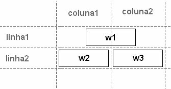

Argumento semelhante, *rowspan*, pode ser usado para dizer que um widget deve ocupar várias linhas da sua coluna.

Quando definimos as células em que um widget deverá se instalar, admite-se que seu centro esteja no centro deste espaço. Com a opção *sticky* podemos instala-lo nas diferentes posições mostradas na figura abaixo.

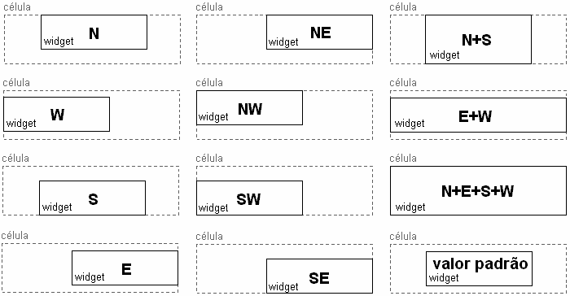

Finalmente, a disposição de vários widgets na tela não deixa espaços entre eles. Para dar uma folga horizontal entre um widget e os que estiverem à sua esquerda ou direita, use a opção *padx*. A opção *pady* determina a folga vertical.

Desejando retirar um widget de cena, simplesmente aplique o método *grid_forget()* e ele desaparecerá. O método pack também possui seu oposto: *pack_forget()*.

Nosso último exemplo ilustra o uso do método grid para dispor widgets na tela. Repare principalmente que toda a GUI é desenvolvida sobre o mesmo contêiner, a janela top-level, e que os widgets ficam mais bem comportados do que conseguiríamos com o método pack. Note também que a ordem em que o método grid é aplicado sobre a série de widgets não tem a menor influência sobre sua disposição na tela, ao contrário do que acontece com pack.

Um conceito novo que também aparece aqui é o método *W.destroy()*, que destrói o widget *W* e todos os seus subordinados. Se aplicarmos *destroy* a um frame, por exemplo, todos os widget que o têm como mestre também desaparecerão. A aplicação do mesmo método sobre a janela top-level, que é o item de máxima hierarquia na GUI, fecha toda a interface.

```Python
from Tkinter import *
class Griding:
    def __init__(self, raiz):
        self.raiz = raiz
        self.raiz.title('Tchau!')

        Label(self.raiz, text='Nome:').grid(row=1, column=1, sticky=W, pady=3)
        Label(self.raiz, text='Senha:').grid(row=2, column=1, sticky=W, pady=3)
        self.msg = Label(self.raiz, text='Descubra a senha!')
        self.msg.grid(row=3, column=1, columnspan=2)

        self.nome = Entry(self.raiz, width=10)
        self.nome.grid(row=1, column=2, sticky=E + W, pady=3)
        self.nome.focus_force()

        self.senha = Entry(self.raiz, width=5, fg='darkgray', show='l',
                           font=('Wingdings', '10'))
        self.senha.grid(row=2, column=2, sticky=E + W, pady=3)

        self.ok = Button(self.raiz, width=8, command=self.testar, text='OK')
        self.ok.grid(row=4, column=1, padx=2, pady=3)

        self.close = Button(self.raiz, width=8, command=self.fechar,
                            text='Fechar')
        self.close.grid(row=4, column=2, padx=2, pady=3)

    def testar(self):
        if self.nome.get() == self.senha.get()[::-1]:
            self.msg['text'] = 'Senha correta!'
        else:
            self.msg['text'] = 'Senha incorreta!'

    def fechar(self):
        self.raiz.destroy()

inst1 = Tk()
Griding(inst1)
inst1.mainloop()
```

**Resultado:**

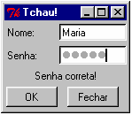

*✎	E agora? Qual foi a senha que digitei? Você consegue descobri-la facilmente olhando o código.*

# Parte VII - Exercícios

As infinitas soluções dos exercícios deste Módulo C a que você, leitor, poderá chegar, são especialmente interessantes. Por isso, gostaria que você nos mandasse sua solução para que outros leitores possam estudar e comparar com suas próprias. O e-mail para envio pode ser <labakiturbo@gmail.com> e as soluções serão oferecidas na página [http://labaki.tk.](http://labaki.tk/)

>👍	Fáceis 👉	Médios 👎	Difíceis

👍 Refine os exemplos dados neste Módulo. A maioria precisa de um tratamento de erros bem feito para evitar que o usuário cause problemas, como através da entrada de dados inválidos.

👍 Crie uma GUI que mostre teclas de um teclado musical e que toque o som da tecla quando o usuário clicar nela. Veja no Módulo A como funciona o módulo winsound.

👍	Melhore o exemplo Palheta Gráfica para que o usuário possa também diminuir a intensidade de alguma cor básica. Inclua alguns dispositivos que permitam tornar o círculo grande rapidamente preto ou branco.

👉	Fizemos um exemplo que mostra um relógio digital. Agora escreva uma GUI que mostre um relógio analógico, com ponteiros, exibição de horas, minutos e segundos, etc. Faça com que o relógio apresente ao usuário os cumprimentos de bom dia, boa tarde e boa noite, dependendo do horário.

👉	Escreva um joguinho como o Pacman. Alguns círculos coloridos devem ser exibidos em posições aleatórias na tela. Fique atento para que a posição aleatória do círculo não esteja fora da área visível da GUI! O usuário deve ser capaz de mover uma carinha como a do Pacman, e quando ele estiver sobre um dos círculos, deve tocar um sonzinho característico de congratulação e o círculo deve desaparecer.

👉	Melhore o programa de ensino de porcentagem através de tortas para que o usuário clique num botão e a fatia desenhada seja “retirada” da torta, como na figura a seguir.

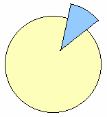

Reescreva também os trechos necessários para que o usuário não tenha que abrir outra janela sempre que quiser entrar uma porcentagem diferente.

👉 Escreva uma interface gráfica na qual o usuário possa informar uma função simples e seu gráfico seja plotado na tela. Adicione recursos como mais zoom e menos zoom, possibilidade de escolher o intervalo de valores de x em que a função deverá ser exibida, e outros que a sua criatividade indicar. Você precisará usar a função eval que aprendemos no Módulo A.

👎	Crie um programa que permita a criação de desenhos por meio de cliques na tela. Deve haver uma barra de botões por meio dos quais o usuário escolha que objeto deseja desenhar: retângulos, círculos ou linhas, e outra barra para o usuário escolher a cor do próximo objeto a ser desenhado. Para complicar um pouco, o desenho de círculos deve ser feito assim: no ponto da tela onde houve o primeiro clique do mouse deve estar o centro do círculo, e o segundo clique deve determinar por onde a circunferência passará. Não se esqueça das ferramentas para apagar um objeto clicado e outras para limpar toda a tela.

👎	Escreva uma GUI na qual algumas letras estejam espalhadas aleatoriamente pela tela. A correta organização destas letras é capaz de formar uma palavra, e quando isto ocorrer, deverá tocar uma música de congratulação. O usuário selecionará uma letra que deseja mover, e clicará na posição onde deseja que ela fique. Claro que deve haver um banco de dados grande de diferentes palavras, senão o jogo não terá a menor graça. Lembre-se de implementar dispositivos para reiniciar o jogo sem ter que fechar a janela.

👎	A prova de fogo será o desenho de um tabuleiro de xadrez em que as peças possam se mover. Não é necessário escrever o código do jogo – para que o usuário jogue contra o computador – simplesmente crie a interface para que duas pessoas possam jogar. Lembre-se que um jogo de xadrez possui somente seis peças diferentes! Não é necessário desenhar uma a uma em suas posições. Simplesmente crie funções que desenhem as peças e tomem como argumento a posição em que a peça ficará e sua cor (branca ou preta). Observe que o programa não deve admitir movimentos consecutivos do mesmo jogador. Não se esqueça de implementar o evento da captura de uma peça: quando o jogador mover uma peça para uma casa onde já há outra, a que originalmente ocupava o lugar deve sumir do tabuleiro.

# Últimas Palavras...

Veja só! Com o que aprendemos neste Módulo, somos capazes de desenvolver até mesmo um tabuleiro de xadrez! Mesmo assim, Tkinter oferece centenas de outros recursos que, com os conceitos aprendidos aqui, você saberá como usar fácil, fácil. Para conhecer todos eles, recomendamos dois livros que são excelentes se usados como dicionários de widgets: *“An Introduction to Tkinter”* de Fredrik Lundh e *“Tkinter Reference: A GUI for Python”* do New México Tech Computer Center (opinião pessoal: prefiro este). Lá está uma relação completa dos setenta e tantos tipos de cursores e de todos os eventos possíveis de teclado e mouse, há widgets para criar menus, barras de rolagem, escalas, listboxes (que são caixas com texto rolante como o campo onde você determina o tamanho da fonte no seu processador de texto), há a definição de absolutamente todas as opções de configuração de todos os widgets, há instruções para uso de dezenas de métodos que podem ser aplicados a um Canvas, etc. Procure por estes livros no Google e tenha-os sempre à mão para consultar alguma opção de widgets.

Como já dizemos desde o Módulo A, sua participação é muito importante para a constante melhoria deste material. Para você ter uma idéia, o Módulo A era um guia de 89 páginas e continha dois capítulos sobre Classes e Tkinter. Os comentários e sugestões valiosíssimos de muitas pessoas, principalmente do pessoal da lista Python- Brasil, causaram uma verdadeira revolução que transformou estes dois capítulos em dois volumes à parte – os Módulos B e este que você acaba de ler, além do fato de que o Módulo A pulou para 113 páginas. Por toda essa imensa ajuda, muito obrigado!

Vocês todos também estão contribuindo para êxodo do software, do conhecimento e da documentação proprietários.

Obrigado também aos leitores que tiram dúvidas por e-mail, que contribuem mesmo sem saber para que certos pontos do texto sejam mais bem explicados. Também aprendo muito com vocês!

Um agradecimento especial ao meu orientador, Prof. Dr. Emanuel Rocha Woiski, pela paciência, incentivo e pelas oportunidades de aprendizado multidisciplinares.

E não poderia deixar de agradecer meu novo parceiro na produção de documentação livre, o Douglas Andrade, que foi o revisor deste Módulo e estreante da seção de exercícios resolvidos da minha página.

Finalmente, cabe um pequeno comentário quanto às capas dos Módulos deste guia. No primeiro, o *Hulk* representa a programação procedural como um herói poderosíssimo, mas com desvios de humor e comportamentos às vezes imprevisíveis. O *Batman* do Módulo B alude à Orientação a Objetos como um poder igual ao do Hulk, mas desta vez racional, capaz de trabalhar em conjunto e com um cinto de utilidades. Por fim, a *Super-Moça* que fecha a série, representando Tkinter, possui o poder e a inteligência dos anteriores, mas é muito mais bonita, simpática e charmosa que aquele morcego feioso e o monstrengo verde.

***J. Labaki***

[*labakiturbo@gmail.com*](mailto:labakiturbo@gmail.com)

[*http://labaki.tk*](http://labaki.tk/)


**Este documento pode ser distribuído livremente, desde que mantidos os créditos do autor.**
